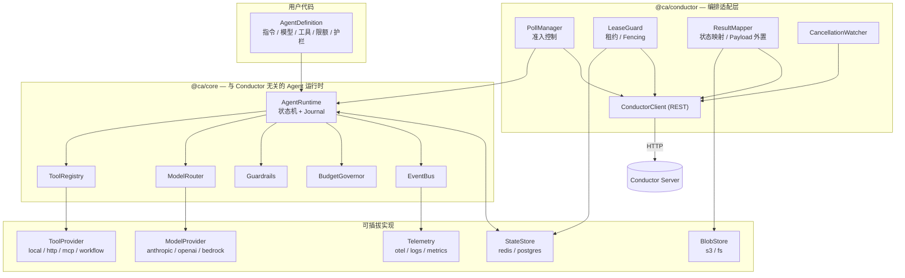

# Conductor AI Agent Worker SDK — 技术架构设计

> 状态：Draft v0.1 ｜ 语言：TypeScript (Node.js ≥ 20) ｜ 编排引擎：Conductor OSS (Netflix Conductor / Orkes Conductor 兼容)

---

## 1. 目标与非目标

### 1.1 目标

让一个 AI Agent 能够作为一等公民出现在 Conductor 工作流中：工作流里放一个 task，
它背后就是一次完整的、可观测、可恢复、有预算约束的 Agent 运行。

具体地：

1. **声明式定义 Agent**：一个 `AgentDefinition`（指令 + 模型 + 工具 + 限额 + 护栏）即可注册为 Conductor task worker。
2. **Worker 内闭环**：ReAct / tool-calling 推理循环在 worker 进程内完成，一个 Conductor task = 一次完整 Agent 运行。Conductor 负责调度、重试、超时、编排与可视化。
3. **长时任务安全**：Agent 运行动辄数十秒到数十分钟，SDK 必须解决租约（lease）、重复投递、进程崩溃恢复这三件事。
4. **副作用可控**：at-least-once 投递语义下，不允许因为重试而重复下单、重复发邮件、重复扣费。
5. **工具生态开放**：本地函数、HTTP/OpenAPI、MCP server、以及「另一个 Conductor 工作流」都能作为 Agent 的工具。
6. **可观测**：OpenTelemetry GenAI 语义约定 + Conductor Task Log + 事件流，能回答「这次运行花了多少 token、调了哪些工具、为什么失败」。
7. **可测试**：不连真实 Conductor、不连真实 LLM 也能跑完整回归，并能对「崩溃—恢复」做确定性测试。

### 1.2 非目标（v1 明确不做）

| 不做 | 原因 / 替代方案 |
|---|---|
| 自研编排引擎、状态机 DSL | Conductor 已经是编排层，SDK 只做 worker 侧 |
| 多 Agent 协作的拓扑编排（handoff / group chat） | 用 Conductor 工作流本身表达（sub-workflow / fork-join），SDK 只提供 `ConductorWorkflowTool` 桥接 |
| 向量库 / RAG 的实现 | 只定义 `MemoryStore` / `Retriever` 接口，实现放独立包或用户自带 |
| 训练、微调、评测平台 | 超出 worker SDK 范畴 |
| Prompt 管理后台 | 只提供 `PromptSource` 接口（可对接 Conductor 的 prompt template） |

### 1.3 白盒模式的位置

「Conductor 全编排」（把每次 LLM 调用、每次工具调用都拆成独立 task）不是 v1 目标，但**架构必须为它留口**：
核心循环的每一步都建模成显式的 `Step`，白盒模式只是「把 Step 的执行委派给 Conductor」而不是「在进程内执行」。
见 §5.4 与 §14 路线图 M5。

---

## 2. 关键约束：Conductor 语义 vs. AI Agent 的天然冲突

这一节是整个设计的地基。SDK 的绝大多数复杂度都来自下面 7 条冲突。

| # | Conductor 的语义 | Agent 的现实 | 冲突 | 本 SDK 的对策 |
|---|---|---|---|---|
| C1 | 任务被 poll 走后，若 `responseTimeoutSeconds` 内没有收到任何 task update，就认为 worker 失联并重新入队 | 一次 Agent 运行可能跑 10 分钟以上，且时长不可预测 | 租约到期 → 同一次运行被两个 worker 同时执行 | §5.3 两种租约策略 + Fencing Token |
| C2 | 投递语义是 **at-least-once** | LLM 调用花钱、工具调用有副作用 | 重复执行 = 重复花钱 / 重复下单 | §5.1 Journaled Replay + 工具幂等性契约 |
| C3 | 无「取消推送」通道；workflow terminate 不会主动通知 worker | Agent 可能还在烧 token | 已被终止的工作流仍在消耗成本 | §6.5 CancellationWatcher（轮询 workflow 状态 → AbortSignal） |
| C4 | 任务 input/output 是 JSON，且有体积上限（默认外部存储阈值 ~3MB，硬上限更低的部署常见） | 完整对话 transcript 轻松几 MB | 输出写不进去 / 拖垮 Conductor 存储 | §6.4 Payload 外置（BlobStore + Ref） |
| C5 | 无流式输出通道 | 用户要看 token 流 | 无法在 Conductor 内做 streaming UI | §10.3 旁路 StreamSink（Redis Stream / SSE），Conductor 只存最终结果 |
| C6 | 重试由 TaskDef 的 `retryCount` / `retryLogic` 决定，重试即「重新执行」 | 有的失败该重跑（429、超时），有的重跑毫无意义（输入非法、护栏拦截） | 无脑重试放大成本 | §6.3 错误分类 → `FAILED` vs `FAILED_WITH_TERMINAL_ERROR` |
| C7 | 并发由 poll 的 `count` 与 worker 线程数决定 | 真正的瓶颈是 LLM 的 RPM / TPM 配额 | 拉了任务却卡在限流上，占着租约不干活 | §6.2 准入控制：poll 数量由令牌预算反压决定 |

> **待验证项（实现前需在目标 Conductor 版本上实测）**
> Conductor 中把任务 update 为 `IN_PROGRESS` 时：(a) 是否重置 `responseTimeoutSeconds` 计时；(b) `callbackAfterSeconds > 0` 是否使任务重新进入队列并在延迟后可被**任意** worker poll 到。
> 我们的设计假设 (a) 为是、(b) 为是——即 Conductor **没有**「不释放任务的纯心跳」原语。这一假设直接决定了 §5.3 只能在「长租约」与「主动 yield」之间二选一。如果实测结论不同，`LeaseStrategy` 会多出一个 `heartbeat` 选项，但上层接口不变。

---

## 3. 总体架构

### 3.1 分层



**核心约束：`@ca/core` 不依赖 `@ca/conductor`。** Agent 运行时可以脱离 Conductor 单独跑（本地 CLI、单测、HTTP 服务），
Conductor 只是驱动它的宿主之一。这保证了可测试性，也保证了 §1.3 的白盒模式可以在不改核心的前提下加上。

### 3.2 包划分（pnpm monorepo）

| 包 | 职责 | 依赖 |
|---|---|---|
| `@ca/core` | Agent 定义、执行状态机、Journal、工具注册、护栏、预算、事件 | 零运行时重依赖（仅 zod） |
| `@ca/conductor` | Conductor REST 客户端、poll/update 循环、租约、结果映射、TaskDef 生成 | `@ca/core` |
| `@ca/providers-anthropic` | Claude 适配（默认推荐 `claude-opus-5` / `claude-sonnet-5`） | `@ca/core`, `@anthropic-ai/sdk` |
| `@ca/providers-openai` | OpenAI 兼容适配（含自建网关） | `@ca/core` |
| `@ca/tools-mcp` | MCP server → Tool 的桥接（stdio / streamable HTTP） | `@ca/core`, MCP SDK |
| `@ca/memory` | `StateStore` / `MemoryStore` 接口 + memory / redis / postgres 实现 | `@ca/core` |
| `@ca/observability` | OpenTelemetry 接线、指标、日志格式 | `@ca/core` |
| `@ca/testing` | Conductor 假服务、脚本化模型、Journal 断言、崩溃注入 | `@ca/core`, `@ca/conductor` |
| `@ca/cli` | 脚手架、TaskDef/Workflow 注册、本地跑 Agent、Journal 查看 | 全部 |

---

## 4. 核心抽象

以下签名是设计契约，实现见各包 `src/`。

### 4.1 Agent 定义

```ts
interface AgentDefinition<I = unknown, O = unknown> {
  /** 唯一名，默认映射为 Conductor task type `agent_<name>` */
  name: string;
  version?: number;

  /** 系统指令；可按输入动态生成 */
  instructions: string | ((input: I, ctx: RunContext) => string | Promise<string>);

  /** 模型选择，支持主备链 */
  model: ModelRef | ModelRef[];

  tools?: ToolRef[];

  /** 结构化 I/O。输出 schema 会驱动「强制结构化收尾」 */
  input?: Schema<I>;
  output?: Schema<O>;

  limits?: AgentLimits;
  guardrails?: Guardrail[];
  memory?: MemoryRef;

  /** 覆盖默认的 Conductor 任务参数（不填则由 limits 推导，见 §6.6） */
  conductor?: Partial<ConductorTaskOptions>;
}

interface AgentLimits {
  maxSteps?: number;        // 默认 12
  maxToolCalls?: number;
  maxInputTokens?: number;
  maxTotalTokens?: number;
  maxCostUsd?: number;
  wallClockMs?: number;     // 默认 300_000
  perToolTimeoutMs?: number;
}
```

### 4.2 运行上下文

```ts
interface RunContext {
  readonly runKey: string;          // 见 §5.2，恢复的锚点
  readonly runId: string;           // 单次物理执行的 id（恢复后会变）
  readonly attempt: number;
  readonly tenantId?: string;

  /** 来自 Conductor 的溯源信息；非 Conductor 宿主时为 undefined */
  readonly source?: {
    workflowInstanceId: string;
    workflowName: string;
    taskId: string;
    taskReferenceName: string;
    correlationId?: string;
    retryCount: number;
  };

  readonly deadline: number;        // epoch ms
  readonly signal: AbortSignal;     // 取消 / 超时 / 预算耗尽统一走这里

  readonly logger: Logger;
  readonly budget: BudgetView;      // 已用 token / 成本 / 剩余额度
  readonly secrets: SecretProvider;

  emit(event: AgentEvent): void;
  /** 主动挂起：写入 journal 并交还控制权，等待外部信号后恢复（§7.4） */
  suspend(req: SuspendRequest): never;
}
```

### 4.3 工具

```ts
interface Tool<I = unknown, O = unknown> {
  name: string;
  description: string;
  parameters: Schema<I>;

  /**
   * 幂等性契约 —— 决定崩溃恢复时的行为（§5.5）
   * 'pure'      : 无副作用，可自由重放
   * 'idempotent': 有副作用但可安全重复（携带幂等键）
   * 'effectful' : 不可重复，恢复时按 onAmbiguousReplay 策略处理
   */
  effect?: 'pure' | 'idempotent' | 'effectful';

  timeoutMs?: number;
  retry?: RetryPolicy;
  /** 并发闸门，例如同一外部系统限流 */
  concurrencyKey?: string;

  execute(input: I, ctx: ToolContext): Promise<O>;
}
```

工具来源（`ToolProvider`）：

- `localTool()` — 本地函数
- `httpTool()` / `openApiTools()` — HTTP 与 OpenAPI 描述
- `mcpTools()` — 连接 MCP server，自动发现并命名空间化（`<server>.<tool>`）
- `conductorWorkflowTool()` — 启动一个 Conductor 子工作流并等待结果（§7.3）
- `humanApprovalTool()` — 人工审批（§7.4）

### 4.4 模型

```ts
interface ModelProvider {
  readonly id: string;
  generate(req: ModelRequest, ctx: ModelCallContext): Promise<ModelResponse>;
  stream?(req: ModelRequest, ctx: ModelCallContext): AsyncIterable<ModelDelta>;
  countTokens?(req: ModelRequest): Promise<number>;
}
```

统一的消息表示（provider-agnostic）：`Message { role, content: Part[] }`，
`Part = TextPart | ToolUsePart | ToolResultPart | ImagePart | ThinkingPart`。
各 provider 适配器负责与自身 wire format 互转，**核心循环只认这一套**。

`ModelRouter` 在其上提供：主备切换、按错误类型的退避重试、per-model 限流器、
prompt cache 提示透传、以及测试期的响应录制/回放。

### 4.5 事件

```ts
type AgentEvent =
  | { type: 'run.started';  runKey: string; input: unknown }
  | { type: 'step.started'; index: number; kind: StepKind }
  | { type: 'model.request' | 'model.response' | 'model.delta'; ... }
  | { type: 'tool.started' | 'tool.succeeded' | 'tool.failed'; name: string; ... }
  | { type: 'guardrail.blocked'; rule: string; stage: GuardrailStage }
  | { type: 'budget.exceeded'; metric: 'tokens' | 'cost' | 'time' | 'steps' }
  | { type: 'run.suspended'; reason: string; resumeToken: string }
  | { type: 'run.finished'; outcome: 'ok' | 'error'; ... };
```

事件是可观测性、流式输出、审计三者的**唯一数据源**，避免三套埋点各写各的。

---

## 5. 执行模型

### 5.1 Journaled Replay（日志重放）

Agent 循环不是一个不透明的 `while` 循环，而是一个**把每一步写进 append-only journal 的状态机**：

```
INIT ──▶ PLAN(模型调用) ──▶ ACT(工具调用, 可并行) ──▶ OBSERVE ──┐
           ▲                                                    │
           └────────────────── 未终止 ◀─────────────────────────┘
                                │终止
                                ▼
                          FINALIZE(结构化收尾) ──▶ DONE
```

每一步产生一条 `JournalEntry`：

```ts
type JournalEntry =
  | { seq: number; kind: 'model'; stepId: string; request: Hash; response: ModelResponse; usage: Usage }
  | { seq: number; kind: 'tool.intent'; stepId: string; tool: string; input: unknown; effect: EffectClass }
  | { seq: number; kind: 'tool.result'; stepId: string; output: unknown }
  | { seq: number; kind: 'tool.error';  stepId: string; error: SerializedError }
  | { seq: number; kind: 'suspend'; resumeToken: string }
  | { seq: number; kind: 'resume';  payload: unknown }
  | { seq: number; kind: 'final'; output: unknown };
```

**恢复 = 重放**：重新执行同一个循环，但每到一个 step 先查 journal——
命中则直接取历史结果（不再调 LLM、不再调工具），未命中才真正执行。
这与 Temporal 的 deterministic replay 是同一思路，只不过作用域被压缩在一个 Conductor task 内，
因此不需要沙箱化整个用户代码，只需要保证**所有非确定性都经由 `ModelRouter` / `ToolRegistry` / `ctx.now()` / `ctx.random()` 这几个受管入口**。这一条会由 lint 规则 + 运行时告警共同约束。

`stepId = sha256(runKey | seq | kind | 归一化输入)`：既是 journal 主键，也是工具的幂等键，还是模型响应缓存键。

### 5.2 runKey：恢复的锚点

```
runKey = `${workflowInstanceId}:${taskReferenceName}:${epoch}`
```

`epoch` 的取法由 `resumePolicy` 决定，这是一个**必须显式选择**的语义：

| resumePolicy | epoch | 效果 | 适用 |
|---|---|---|---|
| `on-lease-loss`（默认） | 恒为 `0` | Conductor 任何形式的重投递都会**接着上次跑**，不重复付费 | 绝大多数 Agent |
| `fresh-per-retry` | `task.retryCount` | Conductor 的业务重试 = 从头重跑（换个随机种子再试一次） | 「重试也许就成功了」的创作类任务 |
| `never` | — | 不落 journal，崩溃即失败 | 极短、纯只读的 Agent |

> 已知模糊点：Conductor 对「租约超时重投」和「业务失败重试」都会推进 `retryCount`，
> 两者在 worker 侧不可严格区分。`on-lease-loss` 默认值意味着我们优先保护成本与副作用，代价是「重试换随机性」的语义要显式开启。这是权衡，不是遗漏。

### 5.3 租约策略（LeaseStrategy）

针对 C1，SDK 提供两种模式，由 `AgentDefinition.conductor.leaseStrategy` 选择：

#### (a) `long-lease` — 默认，适合 < 5 分钟的 Agent

- SDK 由 `limits.wallClockMs` 推导 `responseTimeoutSeconds = ceil(wallClockMs/1000 * 1.5)` 并写入 TaskDef（§6.6），从源头消除「租约短于运行时长」。
- 运行期间只发 Task Log（用于 UI 可见的进度），运行结束一次性 update。
- 崩溃后：等租约到期 → Conductor 重投 → 新 worker 用同一 `runKey` 从 journal 恢复。
- 优点：简单、无额外存储要求（journal 可选）。缺点：崩溃到恢复之间有一个租约时长的空窗。

#### (b) `yield` — 适合长时、含人工介入、含长子工作流的 Agent

- 每到一个 checkpoint 边界（默认：每完成一个 step，或累计运行超过 `leaseSliceMs`，默认 60s），
  worker 持久化 journal，并以 `IN_PROGRESS + callbackAfterSeconds` 交还任务、**释放本地槽位**。
- 下一次 poll（可能是别的 worker）读到同一 `runKey`，从 journal 继续。
- 天然支持挂起：等待审批 = 一次 `callbackAfterSeconds` 很长的 yield。
- 代价：**必须**配置 `StateStore`；且因为任务被释放后可能被并发 poll，需要 Fencing。

#### Fencing Token（两种模式都启用）

`StateStore` 中为每个 `runKey` 维护一条租约记录 `{ owner, fenceToken, expiresAt }`：

1. worker 拿到任务后 CAS 抢占：`fenceToken += 1`，写入自己的 `owner`。
2. 每次写 journal、每次向 Conductor update 结果，都携带 `fenceToken`；
   `StateStore` 拒绝小于当前值的写入。
3. 抢占失败或 fence 落后 → 立即放弃（不 update Conductor），交给新 owner。

这把「同一 runKey 被两个 worker 同时执行」的后果从「重复副作用」降级为「浪费一次 LLM 调用后自我放弃」，
配合工具幂等契约（§5.5）达到实际意义上的 effectively-once。

### 5.4 为白盒模式预留

`StepExecutor` 是一个接口：

```ts
interface StepExecutor {
  runModelStep(req: ModelRequest, ctx): Promise<ModelResponse>;
  runToolStep(tool: Tool, input: unknown, ctx): Promise<unknown>;
}
```

- v1 的 `InProcessStepExecutor`：直接在 worker 内执行（本文档主线）。
- 未来的 `ConductorStepExecutor`：把每个 step 变成一次 sub-workflow / dynamic task 调度，
  由 Conductor 记录与重试。**核心状态机与 journal 结构完全不变**，只是执行器换掉。

### 5.5 副作用与幂等

| Tool.effect | 重放时 | 说明 |
|---|---|---|
| `pure` | 直接重放（若 journal 有结果则复用，无则重跑） | 查询类 |
| `idempotent` | 重跑，但注入 `ctx.idempotencyKey = stepId` | 下游用它去重 |
| `effectful` | 见 `onAmbiguousReplay` | 发邮件、支付、写外部单据 |

`effectful` 工具在恢复时若发现只有 `tool.intent` 而无 `tool.result`（即「执行到一半崩了，不知道有没有生效」）：

- `onAmbiguousReplay: 'fail'`（默认）→ 整个 task 以 `FAILED_WITH_TERMINAL_ERROR` 结束，把决策权交给人/工作流的补偿分支。
- `'retry'` → 重跑（要求调用方自己确信可重复）。
- `'probe'` → 调用工具可选实现的 `probe(idempotencyKey)` 查询是否已生效，最干净但要求工具方支持。

**默认选 `fail` 而不是 `retry`**：宁可让工作流走补偿分支，也不要静默重复副作用。

---

## 6. Conductor 适配层

### 6.1 ConductorClient

不直接依赖官方 JS SDK，而是自带一个极薄的 REST 客户端（`HttpConductorClient`），只覆盖 6 个端点：

| 用途 | 端点 |
|---|---|
| 批量拉取任务 | `GET /api/tasks/poll/batch/{taskType}?workerid&domain&count&timeout` |
| 回写任务结果 | `POST /api/tasks` |
| 任务日志 | `POST /api/tasks/{taskId}/log` |
| 查工作流状态（取消检测） | `GET /api/workflow/{workflowId}?includeTasks=false` |
| 注册 TaskDef | `POST /api/metadata/taskdefs` |
| 启动子工作流（工具用） | `POST /api/workflow/{name}` |

理由（ADR-0002）：OSS Conductor 与 Orkes 在鉴权（无认证 / Basic / API Key + JWT）和路径前缀上有差异，
自持一个 6 端点的客户端比适配 SDK 差异更省事；同时保留 `ConductorClient` 接口，
允许注入 `OrkesSdkConductorClient` 以复用官方 SDK 的鉴权与重试。

### 6.2 PollManager：由预算反压驱动的准入控制

```
可用槽位 = min(
    maxConcurrentRuns - 运行中,
    模型限流器可承诺的并发（按 RPM/TPM 估算）,
    进程资源闸门（内存 / 事件循环延迟）
)
poll count = clamp(可用槽位, 0, batchSize)
```

- 槽位为 0 时**不 poll**（而不是 poll 完排队），避免占着租约排队。
- 长轮询 `timeout` 默认 100ms～1s（Conductor 端 long-poll），空轮询指数退避到上限。
- 支持多 task type / 多 domain 并行订阅，按权重轮转。
- 优雅停机：收到 SIGTERM → 停止 poll → 等待运行中的任务收敛（或按 `yield` 策略主动交还）→ 退出。

### 6.3 状态映射（ResultMapper）

| Agent 结果 | Conductor status | 说明 |
|---|---|---|
| 正常产出结构化输出 | `COMPLETED` | `outputData = { ok: true, result, usage, steps, traceId, transcriptRef }` |
| Agent 判定「做不到 / 需要人」但流程该继续 | `COMPLETED` + `ok: false, reason` | 让工作流用 `SWITCH` 分支处理，**不是**失败 |
| 瞬时错误（429 / 5xx / 网络 / 租约丢失） | `FAILED` | 交给 TaskDef 的 retry 策略 |
| 终局错误（输入 schema 非法、护栏拦截、预算硬上限、模糊副作用） | `FAILED_WITH_TERMINAL_ERROR` | 不重试，直接进补偿分支 |
| 挂起等待外部信号 | `IN_PROGRESS` + `callbackAfterSeconds` | 仅 `yield` 策略 |

所有失败都填 `reasonForIncompletion`（截断到安全长度）并附一条 Task Log，保证 Conductor UI 上能直接看懂。

### 6.4 Payload 治理（对应 C4）

- **入参**：支持 Conductor 的 `externalInputPayloadStoragePath`，自动拉取。
- **出参**：`outputData` 有硬预算（默认 256KB）。超出时按 `payloadStrategy` 处理：
  - `externalize`（默认）：完整 transcript / 大结果写入 `BlobStore`，output 里只留 `{ transcriptRef, resultRef, bytes, sha256 }`。
  - `truncate`：保留头尾 + 摘要。
  - `fail`：显式失败（适合对下游契约严格的场景）。
- transcript 默认**始终**外置（即使不超限），因为它是审计与调试的主要材料，不该挤占编排存储。

### 6.5 CancellationWatcher（对应 C3）

- 仅对运行时长超过阈值（默认 20s）的 run 启用。
- 每 `cancelPollMs`（默认 15s）查一次所属 workflow 状态；命中 `TERMINATED / TIMED_OUT / FAILED / COMPLETED / PAUSED(可选)` → `abort()`。
- 查询按 `workflowInstanceId` 去重合并，一个进程内 N 个同工作流的 run 只发一次请求。
- `AbortSignal` 会一路传到 ModelProvider（中断 HTTP 流）与 Tool（工具须尊重 signal）。

### 6.6 TaskDef 生成：限额是唯一真相源

`AgentDefinition.limits` 直接推导 Conductor TaskDef，避免「代码里 5 分钟、TaskDef 里 60 秒」这类经典事故：

```
responseTimeoutSeconds = ceil(wallClockMs/1000 × 1.5)   // long-lease
                       = leaseSliceSeconds × 3          // yield
timeoutSeconds         = ceil(wallClockMs/1000 × 3)
retryCount             = 3, retryLogic = EXPONENTIAL_BACKOFF
concurrentExecLimit / rateLimitPerFrequency  ← 由模型配额配置推导
```

`ca register` 命令做 diff-and-apply，并在启动时校验线上 TaskDef 与本地定义是否漂移，
漂移则**告警但不阻塞**（可配置为 fail-fast）。

### 6.7 Task Domain 路由

`domain` 用于把同名 task type 路由到不同 worker 池：按租户（`tenant-a`）、按模型能力（`vision`）、
按环境（`canary`）。SDK 支持一个进程订阅多个 `(taskType, domain)` 组合并分别配限额。

---

## 7. 工具体系

### 7.1 注册与命名

`ToolRegistry` 负责：命名空间（`mcp.github.create_issue`）、schema 校验（入参出参双向）、
超时与重试、并发闸门（`concurrencyKey`）、以及**工具级护栏**（允许清单、参数脱敏、成本预检）。

模型看到的工具描述由 registry 统一渲染，保证不同 provider 下描述一致。

### 7.2 MCP 集成

`mcpTools({ transport, allow, deny, namespace })`：
连接 MCP server（stdio / streamable HTTP），发现工具与资源，映射为 `Tool`。
关键设计点：MCP server 生命周期**绑定 worker 进程**而非单次 run（连接池化），
但 stdio 型 server 的会话状态必须视为不可跨 run 复用，因此 run 级隔离通过独立会话或显式 reset 实现。

### 7.3 ConductorWorkflowTool —— 黑盒里的编排出口

```ts
conductorWorkflowTool({
  name: 'run_credit_check',
  workflowName: 'credit_check',
  version: 2,
  waitMode: 'yield',   // 'yield' | 'poll' | 'fire-and-forget'
})
```

Agent 调用它 → 启动子工作流 → 把 `subWorkflowId` 写入 journal：

- `yield`（推荐）：立即以 `IN_PROGRESS + callbackAfterSeconds` 交还 Conductor 任务，
  恢复时先查子工作流状态；未完成则再 yield。**不占用 worker 槽位，不烧租约。**
- `poll`：在 run 内阻塞轮询（仅适合秒级子流程）。
- `fire-and-forget`：只返回 id。

这是「Worker 内闭环」与「Conductor 编排」的正式桥梁：需要可观测、需要复用、需要人工介入的重活，
交给工作流；轻量决策留在 Agent 内。

### 7.4 人工介入（HITL）

`humanApprovalTool()` 走 §4.2 的 `ctx.suspend()`：

```
Agent 调用 request_approval
  → 写 suspend journal entry + resumeToken
  → （可选）创建 Conductor HUMAN/WAIT 任务或调用外部审批系统
  → task update: IN_PROGRESS + callbackAfterSeconds
  → 审批系统回调 SDK 的 resume 端点 / 直接写 StateStore
  → 下次 poll 命中 resume entry，循环带着审批结果继续
```

`resumeToken` 是签名过的、带过期时间的字符串，包含 `runKey + seq + fenceToken`，
防止伪造与重放。

---

## 8. 模型层

- **统一消息与工具调用格式**（§4.4），provider 差异（thinking block、并行 tool call、cache control、stop reason 语义）在适配器内消化。
- **ModelRouter**：`model: ['claude-opus-5', 'claude-sonnet-5']` 表示主备；按错误类别决定「重试同一个」还是「切下一个」（429 → 退避后同一个；5xx/超时 → 切换；400 → 不切，直接终局失败）。
- **限流器**：per-model 的 RPM/TPM 令牌桶，同时作为 §6.2 准入控制的输入信号。
- **成本核算**：价格表可配置，`usage → cost` 统一计算，进 `BudgetGovernor` 与指标。
- **缓存**：(1) 透传 provider 的 prompt cache 提示；(2) 可选的响应缓存（键 = `stepId`），主要服务于测试与重放，生产默认关闭。
- **结构化输出**：`AgentDefinition.output` 存在时，收尾阶段强制走 tool-calling / structured output，校验失败最多重试 N 次（默认 2），仍失败则终局错误。

---

## 9. 状态、记忆与存储

三种存储职责必须分清，不要混为一谈：

| 抽象 | 存什么 | 生命周期 | 默认实现 |
|---|---|---|---|
| `StateStore` | Journal、租约/fence、resume 记录 | 一次 run（保留 TTL 用于排障，默认 7 天） | memory（仅 long-lease+单机）/ redis / postgres |
| `BlobStore` | Transcript、大 payload、工具产物 | 与审计要求一致（默认 30 天） | fs / s3 |
| `MemoryStore` | 跨 run 的长期记忆（会话历史、用户画像、向量检索） | 业务定义 | 接口 + 参考实现，不内置向量库 |

`yield` 策略、`resumePolicy != 'never'`、HITL 三者任一启用时，`StateStore` 必须是持久化实现，
SDK 在启动时做配置校验并**直接拒绝启动**（而不是运行到一半才暴露）。

---

## 10. 可观测性

### 10.1 Trace

OpenTelemetry，遵循 GenAI 语义约定：

```
span: agent.run            (agent.name, run_key, workflow_id, task_id, tenant)
 ├─ span: agent.step[0]    (step.kind)
 │   └─ span: gen_ai.chat  (gen_ai.system, gen_ai.request.model,
 │                          gen_ai.usage.input_tokens/output_tokens, cost_usd)
 ├─ span: agent.step[1]
 │   ├─ span: tool.execute (tool.name, tool.effect, idempotency_key)
 │   └─ span: tool.execute
 └─ span: agent.finalize
```

trace context 从 Conductor 任务输入的约定字段（`_traceparent`）继承，实现跨工作流的端到端串联；
`traceId` 同时写回 `outputData`，Conductor UI 上一键跳转 APM。

### 10.2 指标

runs（按 outcome）、E2E 延迟、每步延迟、token & cost（按 model/tenant/agent）、
工具成功率与延迟、护栏拦截率、恢复次数、租约丢失次数、poll 空转率、队列滞留时间。

### 10.3 流式与进度

- Conductor 侧：关键节点写 Task Log（步数、当前工具、累计 token），运维在 Conductor UI 即可看进度。
- 用户侧：`StreamSink` 把 `model.delta` / `tool.started` 事件推到 Redis Stream 或 SSE 网关，
  channel key = `workflowInstanceId:taskReferenceName`。Conductor 本身不参与流式（C5）。

---

## 11. 安全

- **密钥**：`SecretProvider` 抽象（env / 文件 / Vault / Conductor Secrets），禁止把密钥放进 task input。
- **提示注入**：所有工具返回值与外部检索内容在消息中标记为 `untrusted`，
  护栏可在 `onAfterTool` 阶段扫描；**系统指令永不由工具输出拼接而成**。
- **工具授权**：per-agent 的工具允许清单 + per-tenant 覆盖；敏感工具强制走 §7.4 审批。
- **输出过滤**：`onAfterRun` 护栏做 PII / 敏感词 / schema 校验。
- **多租户**：`tenantId` 贯穿 RunContext → 密钥选择、预算、限流、存储前缀、指标维度。
- **沙箱**：本地代码执行类工具不在 v1 内置；文档明确要求下沉到独立进程/容器。

---

## 12. 测试策略

| 层次 | 手段 |
|---|---|
| 单元 | 纯函数状态机 + `ScriptedModelProvider`（按序返回预设响应）+ 假工具 |
| 契约 | Provider 适配器录制/回放（真实 wire format 快照） |
| 恢复 | `@ca/testing` 的崩溃注入：在第 N 条 journal entry 后杀进程 → 恢复 → 断言「无重复副作用、最终输出一致」 |
| 并发 | 双 worker 抢同一 runKey → 断言 fence 生效、只有一个 update 成功 |
| 集成 | `FakeConductorServer`（内存队列实现 6 端点）驱动完整 poll→run→update；CI 默认跑这个 |
| E2E | docker-compose 起真实 Conductor OSS + 示例工作流，nightly 跑 |

「恢复」与「并发」两类测试是本 SDK 的核心资产，必须在 M2 之前建立。

---

## 13. 目录结构

```
.
├── docs/
│   ├── architecture.md          ← 本文
│   └── adr/                     ← 关键决策记录
├── packages/
│   ├── core/                    @ca/core
│   ├── conductor/               @ca/conductor
│   ├── providers-anthropic/
│   ├── providers-openai/
│   ├── tools-mcp/
│   ├── memory/
│   ├── observability/
│   ├── testing/
│   └── cli/
├── examples/
│   ├── minimal-agent/           单 Agent task，long-lease
│   └── hitl-approval/           yield + 人工审批 + 子工作流工具
├── pnpm-workspace.yaml
└── tsconfig.base.json
```

工程约定：pnpm workspace ｜ tsup 构建（ESM + CJS 双产物）｜ vitest ｜ Node ≥ 20 ｜
changesets 管版本 ｜ 所有包 `sideEffects: false`。

---

## 14. 路线图

| 里程碑 | 内容 | 出口标准 |
|---|---|---|
| **M0** 骨架 | monorepo、构建、CI、本文档 | `pnpm build` 通过 |
| **M1** 最小可用 | core 状态机（无 journal）+ Anthropic provider + 本地工具 + conductor 适配（`long-lease`）+ TaskDef 生成 | 示例工作流在真实 Conductor 上端到端跑通 |
| **M2** 可靠性 | Journal + StateStore(redis) + Fencing + `yield` 策略 + 错误分类 + 取消检测 | 崩溃注入与并发抢占测试全绿 |
| **M3** 生态 | MCP 工具、ConductorWorkflowTool、HITL/suspend、Payload 外置 | `hitl-approval` 示例跑通 |
| **M4** 生产化 | OTel、指标、预算治理、多租户、CLI 完善、文档站 | 压测报告 + 运维手册 |
| **M5** 白盒（可选） | `ConductorStepExecutor`：step 下沉为 Conductor task | 同一 Agent 定义可在两种模式间切换 |

---

## 15. 关键决策与遗留问题

已记录的决策见 `docs/adr/`：

- ADR-0001 Worker 内闭环 vs. Conductor 全编排
- ADR-0002 自持 REST 客户端而非依赖官方 JS SDK
- ADR-0003 Journaled Replay 作为恢复机制
- ADR-0004 `long-lease` 与 `yield` 双租约策略
- ADR-0005 `effectful` 工具默认 `fail` 而非重试

**待验证 / 待决**

1. §2 的「Conductor 无纯心跳原语」假设需在目标版本上实测确认。
2. `retryCount` 无法区分「租约超时重投」与「业务重试」，`resumePolicy` 的默认值是否合适，需真实业务验证。
3. Orkes 托管版与 OSS 版在鉴权、`callbackAfterSeconds` 上限、外部 payload 存储上的差异清单尚未穷尽。
4. `yield` 策略下的 journal 写放大与 Redis 成本，需在 M2 压测中量化，决定是否引入「仅在 step 边界写」之外的批量策略。
