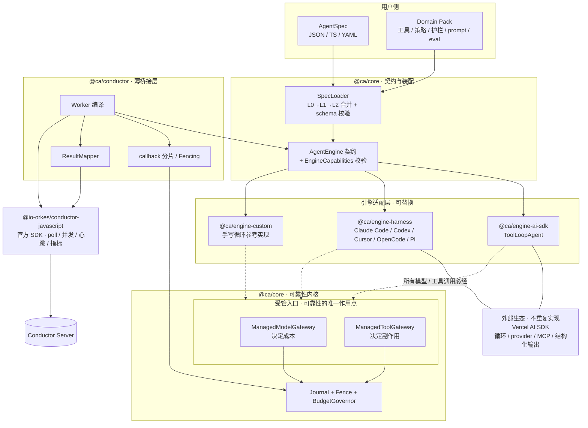

# Conductor AI Agent Worker SDK — 技术架构设计

> 状态：Draft v0.4 ｜ 语言：TypeScript (Node.js ≥ 20) ｜ 编排引擎：Conductor OSS ≥ 3.x
>
> **v0.4 变更（Agent 层重构；Conductor 对接层已对齐，本轮不动）**
> 1. `@ca/core` 从「拥有循环的厚运行时」重构为「**薄契约层 + 可靠性内核**」（§3、§4）。
> 2. 自研的 `AgentStrategy` 循环范式**取消**，改为可插拔 `AgentEngine` 适配现成 SDK
>    （[ADR-0011](adr/0011-agent-engine-over-strategy.md)）。
> 3. 可靠性改由**拦截**实现而非拥有循环：`ManagedModelGateway` + `ManagedToolGateway`
>    （[ADR-0012](adr/0012-reliability-by-interception.md)）。
> 4. 新增可 JSON 序列化的 `AgentSpec` 与 L0/L1/L2 三层配置组合，支撑「通用配置化 + 领域定制」
>    （[ADR-0013](adr/0013-agent-spec-and-domain-packs.md)）。
> 5. 删除 `@ca/providers-*` 与 `@ca/tools-mcp` 三个包——AI SDK 的 provider 生态与 `@ai-sdk/mcp` 已覆盖。

---

## 1. 目标与非目标

### 1.1 目标

让**任意技术栈构建的** AI Agent 都能作为一等公民出现在 Conductor 工作流中：
工作流里放一个 task，背后就是一次完整的、可观测、可恢复、有预算约束的 Agent 运行。

1. **不自建 Agent 能力，只做能力的宿主**。推理循环、上下文管理、工具定义、结构化输出、
   模型 provider 生态——全部由外部 Agent SDK 提供（Vercel AI SDK 为首选参考实现），
   本 SDK 通过 `AgentEngine` 适配它们。
2. **薄 core**。`@ca/core` 只有四件事：`AgentSpec` 契约、`AgentEngine` 契约、
   两个受管入口（模型 / 工具）、可靠性内核（Journal / 幂等 / 预算 / Fencing）。
3. **通用配置化 + 领域定制**。`AgentSpec` 是纯数据，可来自 TS / JSON / YAML / 远程配置；
   L0 通用默认 → L1 领域包（Domain Pack）→ L2 实例，逐层覆盖。
4. **可靠性与引擎解耦**。任何引擎只要能让我们包住模型与工具两个入口，
   就自动获得崩溃恢复、effectively-once、预算治理、OTel 埋点。
5. **诚实的能力边界**。不同引擎能力不同（如 sandbox 内执行的 harness 拦截不到工具），
   用 `EngineCapabilities` 显式建模并在启动时校验，不假装统一（§4.4）。
6. **Conductor 对接**：`callback` 分片执行 + Journal + Fencing（§5、§6，v0.3 已对齐，本轮未改动）。

### 1.2 非目标

| 不做 | 由谁做 |
|---|---|
| 推理循环 / 上下文压缩 / 停止条件 / 工具定义 DSL | Agent SDK（AI SDK 的 `ToolLoopAgent`、`stopWhen`、`prepareStep`、`pruneMessages`、`tool()`） |
| 模型 provider 适配 | Agent SDK 的 provider 生态 |
| MCP 客户端 | `@ai-sdk/mcp`（`createMCPClient` + stdio / Streamable HTTP） |
| 统一消息格式 | 引擎自己的格式；core 只把它当作**不透明可序列化载荷**（§4.5） |
| 自研 Conductor 客户端 / poll / 心跳 | 官方 `@io-orkes/conductor-javascript`（[ADR-0006](adr/0006-build-on-official-sdk.md)） |
| 编排引擎、向量库、训练评测平台 | Conductor 本身 / 用户自选 |

### 1.3 与官方 Conductor agents 层的关系

已决议不采用（[ADR-0008](adr/0008-relation-to-official-agent-layer.md)）：它把 Agent 编译成 workflow 交服务端执行，
受其 agent schema 约束，且模型凭据与上下文在服务端。本项目要的是 worker 内闭环 + 任意技术栈。
官方 SDK 的**传输层**仍全量复用。

---

## 2. 关键约束：Conductor 语义 vs. AI Agent

> 本节在 v0.3 已依据 Conductor OSS **v3.21.21 服务端源码**核实并对齐，v0.4 未改动，此处保留结论。

### 2.1 七条冲突

| # | Conductor 的语义 | Agent 的现实 | 对策 |
|---|---|---|---|
| C1 | `responseTimeoutSeconds` 内无 update 就判 `TIMED_OUT` 并**消耗一次重试** | 一次运行可能数十分钟 | §5.3 `callback` 分片 + Fencing |
| C2 | **at-least-once** 投递 | LLM 花钱、工具有副作用 | §5.1 Journaled Replay + 幂等契约 |
| C3 | 无取消推送 | Agent 还在烧 token | §6.4 CancellationWatcher |
| C4 | payload 有体积上限 | transcript 几 MB | §6.3 Payload 外置 |
| C5 | 无流式通道 | 要看 token 流 | §7.3 旁路 StreamSink |
| C6 | 重试由 `retryCount` 决定 | 有的失败重跑无意义 | §6.2 错误分类 |
| C7 | 并发由 worker 并发数决定 | 瓶颈是 LLM 配额 | §6.5 令牌预算反压 |

### 2.2 服务端语义（v3.21.21 源码核实结论）

- **responseTimeout 超时 = `task.setStatus(TIMED_OUT)` 并消耗一次 `retryCount`**，不是「重新入队」。
  因此 `retryCount` **不可为 0**。
- 该路径直接调 `timeoutTask()`，**绕过 `timeoutPolicy`**（`ALERT_ONLY` 对它无效，只作用于 `timeoutSeconds`）。
- `adjustedResponseTimeout = responseTimeoutSeconds + callbackAfterSeconds` ——
  等待时间被计入容忍窗口，故 `callbackAfterSeconds` **无需**小于 `responseTimeoutSeconds`。
- `timeoutSeconds` 从 `startTime` 起算且**不加** callbackTime → 真正约束是
  **Σ(所有分片执行 + 所有等待) < `timeoutSeconds`**。
- 检查在 `decide()` 内由 `WorkflowSweeper` 周期触发，检测有粒度延迟。
- `extendLease` 真心跳自 **v3.10.7** 起可用（v3.10.6 无）；`callbackAfterSeconds` 3.x 全系可用。

---

## 3. 总体架构

### 3.1 核心洞察：可靠性不需要拥有循环

v0.3 的 core 自建了推理循环（`AgentStrategy`），因为「要写 journal、要幂等、要扣预算，就得掌控每一步」。
**这个前提是错的。**

可靠性只依赖两个受管入口：

1. **模型调用** —— 决定成本，且是重放时最该被 journal 短路的部分。
2. **工具执行** —— 决定副作用，且是幂等契约的作用点。

只要能包住这两个入口，循环归谁都无所谓。而现成 Agent SDK 恰好都提供了这两个包装点，
以 Vercel AI SDK 为例：

| 受管入口 | AI SDK 的包装点 |
|---|---|
| 模型调用 | `wrapLanguageModel({ model, middleware })` 的 `wrapGenerate` / `wrapStream` / `transformParams` |
| 工具执行 | 包装 `tool({ execute })` 的 `execute`；另有 `onToolExecutionStart/End` 回调 |

于是 core 可以变得很薄：**它不写循环，它写拦截器。**

### 3.2 分层



> 图例：实线为装配与数据流；**虚线为引擎对受管入口的调用** —— 引擎适配器的唯一硬性义务。

四条结构性约束：

1. **`@ca/core` 不依赖任何 Agent SDK，也不依赖 Conductor**。它只认自己的契约。
2. **`@ca/core` 不定义统一消息格式**。引擎的消息/状态对 core 是**不透明的可序列化载荷**（§4.5）。
3. **引擎必须让模型与工具调用经过受管入口**，否则其 `EngineCapabilities` 必须如实声明能力缺失，
   core 据此降级或拒绝启动（§4.4）。
4. **Conductor 对接层（§5、§6）与引擎无关**：换引擎不影响租约、journal、fencing、结果映射。

### 3.3 包划分

| 包 | 职责 | v0.4 变化 |
|---|---|---|
| `@ca/core` | `AgentSpec`、`AgentEngine` 契约、两个受管入口、Journal/Fence/预算、能力校验、SpecLoader | **大幅变薄** |
| `@ca/engine-ai-sdk` | 适配 AI SDK `ToolLoopAgent`：模型中间件注入、工具包装、审批映射 | **新增** |
| `@ca/engine-harness` | 适配 AI SDK `HarnessAgent`（Claude Code / Codex / Cursor / OpenCode / Pi 等） | **新增** |
| `@ca/engine-custom` | 最小手写循环参考实现，兼作契约基线与一致性测试样本 | **新增** |
| `@ca/conductor` | 官方 SDK 之上的薄桥接层 | 不变 |
| `@ca/memory` | `StateStore` / `BlobStore` / `MemoryStore` | 不变 |
| `@ca/observability` | OTel GenAI span 与 Agent 语义指标 | 不变 |
| `@ca/testing` | 引擎一致性测试套件、脚本化模型、崩溃/并发/分片注入 | 职责扩展 |
| `@ca/cli` | 脚手架、TaskDef 注册、spec 校验与 diff、Journal 查看、插件/包列表 | 增加 spec 能力 |
| ~~`@ca/providers-anthropic`~~ / ~~`@ca/providers-openai`~~ | — | **删除**：AI SDK provider 生态已覆盖 |
| ~~`@ca/tools-mcp`~~ | — | **删除**：`@ai-sdk/mcp` 已覆盖本地 stdio / Streamable HTTP |

> 删掉三个包是本轮最实在的收益：它们都是在重复外部生态已经做好、且做得更好的事。

---

## 4. 核心抽象（`@ca/core`）

### 4.1 `AgentSpec` —— 纯数据的 Agent 描述

```ts
interface AgentSpec {
  name: string;
  version?: number;

  /** 引擎标识，如 'ai-sdk/tool-loop' | 'ai-sdk/harness' | 自定义注册名 */
  engine: string;
  /** 透传给引擎的原生配置（不透明，由引擎自行校验） */
  engineOptions?: JsonValue;

  /** 工具的**可靠性策略**（不是工具实现，实现在引擎侧） */
  toolPolicies?: Record<string, ToolPolicy>;

  limits?: AgentLimits;
  guardrails?: GuardrailRef[];
  conductor?: Partial<ConductorTaskOptions>;

  /** 领域包与预设的引用，由 SpecLoader 解析合并 */
  extends?: string[];
}
```

**为什么是纯数据**：这是「通用配置化」的地基。Spec 可以来自 TS 常量、JSON、YAML、
或远程配置中心；可以被 diff、被审计、被灰度、被非工程角色改。
引擎原生配置放在 `engineOptions` 里透传，core 不试图统一它们——统一它们就等于重新发明每个 SDK。

### 4.2 `AgentEngine` —— 一轮执行的契约

```ts
interface AgentEngine<TState = JsonValue> {
  readonly id: string;
  readonly capabilities: EngineCapabilities;

  /** 由 spec 构建可复用的引擎实例（进程级，跨 run 复用） */
  build(spec: AgentSpec, deps: EngineDeps): Promise<BuiltAgent<TState>>;
}

interface BuiltAgent<TState> {
  /**
   * 跑一轮。一轮 = 一个 Conductor 分片能完成的工作量。
   * 引擎必须把所有模型调用经 deps.model、所有工具执行经 deps.tools。
   */
  run(args: {
    input: JsonValue;
    /** 上一分片交还的状态；首片为 undefined */
    state?: TState;
    ctx: RunContext;
  }): Promise<EngineTurn<TState>>;
}

type EngineTurn<TState> =
  /** 整体完成 */
  | { kind: 'done'; output: JsonValue; state?: TState }
  /** 本轮做完但未完成（步数/时间切片到了），下一分片继续 */
  | { kind: 'continue'; state: TState }
  /** 等待外部信号（人工审批、子工作流），附恢复所需信息 */
  | { kind: 'suspended'; state: TState; awaiting: AwaitingSpec };

interface EngineDeps {
  /** 受管模型入口。引擎把它注入自己的 provider 位置（AI SDK 用 wrapLanguageModel） */
  model: ManagedModelGateway;
  /** 受管工具入口。引擎用它包装每个工具的 execute */
  tools: ManagedToolGateway;
  logger: Logger;
}
```

契约只有 3 个成员（`build` / `run` / `capabilities`），刻意做到「任何 Agent SDK 都能在几十行内适配」。

### 4.3 两个受管入口

```ts
/** 引擎的所有模型调用必须经过这里 */
interface ManagedModelGateway {
  /**
   * @param call 引擎原生的请求载荷（不透明，但必须可 JSON 序列化以便 hash）
   * @param invoke 真正的模型调用，仅在 journal 未命中时被调用
   */
  guard<T>(call: JsonValue, invoke: () => Promise<{ result: T; usage: Usage }>): Promise<T>;
}

/** 引擎的所有工具执行必须经过这里 */
interface ManagedToolGateway {
  guard<T>(
    toolName: string,
    input: JsonValue,
    invoke: () => Promise<T>,
  ): Promise<T>;   // 可能抛 SuspendSignal / GuardrailBlocked / BudgetExceeded
}
```

`guard` 内部依次做：**journal 命中检查 → 护栏 → 预算 → 幂等键注入 → 执行 → 写 journal → 记 span/指标**。

这就是全部。引擎作者只需要保证「调用走这两个函数」，其余可靠性机制自动获得
（[ADR-0012](adr/0012-reliability-by-interception.md)）。

以 AI SDK 为例，适配器大致是：

```ts
// @ca/engine-ai-sdk（示意）
const model = wrapLanguageModel({
  model: userModel,
  middleware: {
    wrapGenerate: ({ doGenerate, params }) =>
      deps.model.guard(params as JsonValue, async () => {
        const r = await doGenerate();
        return { result: r, usage: toUsage(r.usage) };
      }),
  },
});

const tools = mapValues(userTools, (t, name) => ({
  ...t,
  execute: (input, opts) => deps.tools.guard(name, input, () => t.execute!(input, opts)),
}));
```

### 4.4 `EngineCapabilities` —— 诚实的能力边界

不同引擎能力差异很大，core 显式建模而不是假装统一：

```ts
interface EngineCapabilities {
  /** 跨分片的状态如何保存 */
  state: 'messages' | 'snapshot' | 'engine-session' | 'replay';
  /** 挂起机制 */
  suspend: 'native-approval' | 'replay-signal' | 'none';
  /** 能否拦截模型调用 —— 决定 journal 能否覆盖 LLM 成本 */
  interceptModel: boolean;
  /** 能否拦截工具执行 —— 决定幂等与副作用保护是否有效 */
  interceptTools: boolean;
  /** journal 与恢复的粒度 */
  granularity: 'step' | 'turn';
  streaming: boolean;
  structuredOutput: boolean;
}
```

启动时做**能力—配置一致性校验**，不满足则拒绝启动或显式降级并告警。几个真实例子：

| 引擎 | 能力实况 | core 的处理 |
|---|---|---|
| `ai-sdk/tool-loop` | 全绿，`state: 'messages'`，`granularity: 'step'`，`suspend: 'native-approval'` | 完整能力 |
| `ai-sdk/harness`（Claude Code / Codex 等） | 工具在 **sandbox 内**执行 → `interceptTools: false`，`granularity: 'turn'`，`state: 'engine-session'` | **拒绝**声明了 `effectful` 工具策略的 spec；journal 退化到 turn 级；恢复改用 harness 自己的 session resume state |
| 自定义引擎未接受管入口 | `interceptModel: false` | 拒绝启动——否则 journal 形同虚设，用户会误以为有成本保护 |

> 这条是本设计里最容易被省略、也最不该省略的部分。宣称"支持任意 SDK"而不说清能力差异，
> 会让用户在 sandbox 型 harness 上误以为拿到了 effectively-once。

### 4.5 core 不定义统一消息格式

v0.3 的 core 有一套 `Message` / `Part`（text / tool_use / tool_result / image / thinking）联合类型。
**v0.4 删除。**

core 对引擎状态与模型载荷只有两个要求：**可 JSON 序列化**、**可稳定哈希**。
`ModelCallRecord` 里的 `response` 是 `JsonValue`，core 不解释它。

理由：统一消息格式意味着为每个 provider 写双向转换、追每个新特性（thinking block、
并行 tool call、cache control、多模态），这正是 AI SDK 已经做完、且做得更好的事。
代价是 core 无法对消息做语义级操作（如通用的上下文压缩）——但那本来就该由引擎做
（AI SDK 的 `prepareStep` + `pruneMessages`）。

### 4.6 工具策略 vs 工具实现

工具**实现**用引擎的原生写法（AI SDK 的 `tool({ inputSchema, execute })`），core 不发明第二套。
core 只按名字附加**可靠性策略**：

```ts
interface ToolPolicy {
  /** 幂等契约，决定崩溃恢复时的行为（ADR-0005） */
  effect: 'pure' | 'idempotent' | 'effectful';
  onAmbiguousReplay?: 'fail' | 'retry' | 'probe';
  timeoutMs?: number;
  concurrencyKey?: string;
  /** 需要人工审批 —— 映射到引擎的原生审批或 replay-signal（§4.7） */
  approval?: 'never' | 'always' | 'policy';
  /** 返回值是否标记为不可信（提示注入防护，§9） */
  trust?: 'trusted' | 'untrusted';
}
```

未在 `toolPolicies` 中声明的工具默认按 `pure` 处理并发出运行时告警；
`strictPolicies: true` 下拒绝注册未声明策略的工具。

### 4.7 挂起（HITL / 等待外部）的两条通用路径

跨引擎的难点：**我们无法暂停别人的循环**。core 支持两种机制，由 `capabilities.suspend` 决定：

**A. `native-approval`（首选）** —— 引擎自己支持两段式审批。
AI SDK 的 tool approval 正是如此：第一次 `generate()` 返回 `tool-approval-request` 并结束本轮，
外部决策后把 `tool-approval-response` 追加进 messages 再跑一次。

```
engine.run()  → { kind:'suspended', state: messages, awaiting: { approvalId, ... } }
  → core 持久化 state 到 StateStore
  → 桥接层 IN_PROGRESS + callbackAfterSeconds 交还任务（释放槽位）
  → 审批系统写回决定
  → 下次 poll：core 载入 state + 决定 → engine.run({ state })
```

**这与 Conductor 的 callback 分片是同构的**——AI SDK 的两段式审批天然落在我们的分片边界上，
不需要任何 hack。

**B. `replay-signal`（兜底）** —— 引擎不支持原生审批时。
`ManagedToolGateway.guard` 抛出 `SuspendSignal`，异常冒泡出引擎循环，core 在边界捕获、
持久化 journal、交还任务；恢复时重放到同一工具调用，这次从 journal / 审批存储**直接返回结果**而不再抛出。

代价：引擎循环内不在 journal 中的中间状态会丢失，靠重放重建。因此 B 要求 `state: 'replay'`
且引擎循环相对纯净。**能用 A 就不要用 B。**

### 4.8 `RunContext`

```ts
interface RunContext {
  readonly runKey: string;          // §5.2 恢复锚点
  readonly runId: string;
  readonly attempt: number;
  readonly sliceIndex: number;      // callback 分片序号
  readonly tenantId?: string;
  readonly source?: ConductorSource;
  readonly deadline: number;
  readonly signal: AbortSignal;
  readonly budget: BudgetView;
  readonly secrets: SecretProvider;
  emit(event: AgentEvent): void;
}
```

---

## 5. 执行模型

### 5.1 Journaled Replay（作用点变了，机制未变）

v0.3：core 拥有循环，每步主动写 journal。
v0.4：**core 拦截两个入口**，在 `guard` 内写 journal。恢复时 `guard` 命中 journal 直接返回历史结果，
引擎的循环照跑一遍，但不产生任何真实的模型调用或工具副作用。

```
恢复 = 重跑引擎循环，但每个受管入口都被 journal 短路
```

`stepId = sha256(runKey | seq | kind | 归一化输入)`：journal 主键 + 工具幂等键 + 模型响应缓存键。

**对引擎的隐含要求**：给定相同输入与相同的 guard 返回值，循环走过的调用序列必须一致。
对 `ToolLoopAgent` 这类纯粹的「模型输出 → 工具 → 再问模型」循环天然成立；
引擎若在循环里读时钟、掷随机数、或读外部状态，就会漂移——由引擎一致性测试（§10）暴露。

### 5.2 runKey

```
runKey = `${workflowInstanceId}:${taskReferenceName}:${epoch}`
```

`resumePolicy`：`on-lease-loss`（默认，epoch 恒为 0）/ `fresh-per-retry`（epoch = `retryCount`）/ `never`。

### 5.3 租约策略（v0.3 已对齐，未改动）

默认 **`callback`** 分片执行：每轮 `engine.run()` 结束后持久化状态，
`IN_PROGRESS + callbackAfterSeconds` 交还任务、释放槽位，下次 poll 继续。

`lease-extend`（需 Conductor ≥ v3.10.7）与 `hybrid` 保留为可选。三者都启用 **Fencing Token**：
`StateStore` 中 `runKey` 的租约记录带单调递增 `fenceToken`，journal 写入与 Conductor 回写都需携带，
落后者被拒绝并自我放弃。

> `callback` 与 `EngineTurn` 的 `continue` / `suspended` 是同一件事的两面：
> 引擎交还一轮，桥接层就交还一个 Conductor 分片。这是 v0.4 契约设计的核心对齐点。

### 5.4 副作用与幂等

| `ToolPolicy.effect` | 重放时 |
|---|---|
| `pure` | 自由重放 |
| `idempotent` | 重跑，注入 `idempotencyKey = stepId` |
| `effectful` | 只有 `tool.intent` 无 `tool.result` 时按 `onAmbiguousReplay`：`fail`（默认）/ `retry` / `probe` |

⚠️ `interceptTools: false` 的引擎（sandbox 型 harness）**无法提供这层保护**，
core 在启动时拒绝这类 spec 声明 `effectful` 策略（§4.4）。

---

## 6. Conductor 桥接层（v0.3 已对齐，本轮未改动）

要点回顾，细节见 v0.3 记录与 `packages/conductor/src/*`：

- **6.1 Worker 编译**：`AgentSpec` → 官方 `ConductorWorker`，交给官方 `TaskManager` 托管。
- **6.2 状态映射**：完成 → `COMPLETED`；「做不到但流程该继续」→ `COMPLETED` + `ok:false`（走 SWITCH 分支）；
  瞬时错误 → `FAILED`；终局错误 → `NonRetryableException`；分片未完 / 等待 → `IN_PROGRESS + callbackAfterSeconds`。
- **6.3 Payload 治理**：`outputData` 默认 256KB 预算，transcript 始终外置到 `BlobStore`；
  分片中间态放 `StateStore`，不塞 Conductor。
- **6.4 CancellationWatcher**：轮询 workflow 状态 → `AbortSignal`（Conductor 不推送取消）。
- **6.5 准入控制**：令牌预算反压动态调节官方 `TaskManager` 的 concurrency。
- **6.6 TaskDef 推导**：`retryCount` 不可为 0；`timeoutSeconds` 必须覆盖「所有分片执行 + 所有等待」。
- **6.7 Domain 路由**：透传官方 `domain`。

---

## 7. 配置化与领域定制

### 7.1 三层组合

| 层 | 内容 | 提供者 |
|---|---|---|
| **L0 通用默认** | 引擎默认、限额默认、基础护栏、Conductor 参数推导 | SDK 内置 |
| **L1 领域包（Domain Pack）** | 领域工具、领域护栏、prompt 模板、spec 片段、eval 数据集、领域 schema/词表 | `@acme/ca-pack-<domain>` |
| **L2 实例** | 具体 agent 的 spec，覆盖前两层 | 使用方 |

```ts
// L1：领域包
export default definePack({
  name: '@acme/ca-pack-insurance',
  version: '2.1.0',
  tools: { lookupPolicy, checkCoverage, openClaim },   // AI SDK tool() 定义
  toolPolicies: { openClaim: { effect: 'effectful', approval: 'always' } },
  guardrails: [piiRedaction, policyNumberValidation],
  prompts: { triage: 'prompts/triage.md' },
  specs: { claimsTriageBase },
  evals: 'evals/claims-triage.jsonl',
});
```

```jsonc
// L2：实例 spec（可以是 JSON / YAML / TS）
{
  "name": "claims_triage",
  "extends": ["@acme/ca-pack-insurance#claimsTriageBase"],
  "engine": "ai-sdk/tool-loop",
  "engineOptions": { "model": "claude-sonnet-5", "stopWhen": { "isStepCount": 30 } },
  "toolPolicies": { "openClaim": { "effect": "effectful", "onAmbiguousReplay": "probe" } },
  "limits": { "maxCostUsd": 2, "wallClockMs": 900000 },
  "conductor": { "leaseStrategy": "callback", "domain": "insurance" }
}
```

### 7.2 SpecLoader

合并顺序 L0 → L1（按 `extends` 顺序）→ L2，**后者覆盖前者**；数组字段的合并策略显式声明
（`guardrails` 追加、`toolPolicies` 按键覆盖）。合并后用 JSON Schema 校验，
并输出**有效配置快照**（effective spec）写入 journal 与 `outputData`，
使「这次运行到底用的什么配置」可追溯——配置化系统里这一条比什么都重要。

`ca spec diff` 比较两个 spec 的有效配置；`ca spec explain <field>` 说明某字段来自哪一层。

### 7.3 领域定制的扩展位

Domain Pack 可贡献：工具、工具策略、护栏、prompt、引擎预设、spec 片段、eval 数据集、领域 schema。
**不可贡献**：受管入口的实现、Journal / Fence 语义、Conductor 映射——这些是 core 的不变量。

> ⚠️ 信任边界：Pack 与引擎适配器都运行在 worker 进程内，具备完整权限，应按依赖审计对待（§9）。

---

## 8. 状态、记忆与存储

| 抽象 | 存什么 | 生命周期 |
|---|---|---|
| `StateStore` | Journal、引擎跨分片状态、租约/fence、resume 记录 | 一次 run（排障 TTL 默认 7 天） |
| `BlobStore` | Transcript、大 payload、工具产物 | 与审计要求一致（默认 30 天） |
| `MemoryStore` | 跨 run 的长期记忆 | 业务定义 |

默认 `callback` 策略下 `StateStore` 必须是持久化实现（redis / postgres），SDK 启动时校验；
`memory` 实现仅供本地开发。

引擎状态（AI SDK 的 `messages`、HarnessAgent 的 session resume state）作为不透明 blob 存入 `StateStore`；
超过阈值时自动外置到 `BlobStore` 并留 ref。

---

## 9. 安全

- **密钥**：`SecretProvider`；禁止把密钥放进 task input。
- **提示注入**：`ToolPolicy.trust = 'untrusted'` 标记外部来源返回值；**系统指令永不由工具输出拼接而成**。
- **工具授权**：per-spec 允许清单 + per-tenant 覆盖；`approval` 策略走 §4.7。
- **多租户**：`tenantId` 贯穿 → 密钥、预算、限流、存储前缀、指标维度、Conductor domain。
- **引擎与 Pack 的信任边界**：同进程、完整权限。`ca packs list` 展示每个包贡献的扩展位。
- **sandbox 型 harness**：工具在沙箱内执行，我们的护栏与幂等**够不着**（§4.4）。
  这既是限制也是收益（隔离更强），必须在文档中写明取舍。

---

## 10. 可观测性

### 10.1 Trace

```
span: agent.run             (spec.name, engine.id, run_key, workflow_id, tenant)
 ├─ span: agent.slice[0]    ← 每个 callback 分片一个，经 journal 中保存的 traceparent 串联
 │   ├─ span: gen_ai.chat   ← ManagedModelGateway 产生（含 replay 标记）
 │   └─ span: tool.execute  ← ManagedToolGateway 产生（tool.effect, idempotency_key）
 └─ span: agent.slice[1]
```

**两个受管入口天然就是埋点位置** —— 不需要引擎配合，换引擎不丢埋点。
引擎若另有原生回调（AI SDK 的 `onStepFinish` / `onToolExecutionStart`），适配器可补充更细的 span。

### 10.2 指标

worker 侧指标用官方 SDK 的 Prometheus 采集。本项目补 Agent 语义指标：
token & cost（按 model / tenant / spec / **engine**）、分片数分布、replay 命中率、
工具成功率、护栏拦截率、fence 抢占次数、预算触顶次数、能力降级次数。

### 10.3 流式

`StreamSink` 把模型 delta 与工具事件推到 Redis Stream / SSE 网关，
channel key = `workflowInstanceId:taskReferenceName`（跨分片稳定）。
AI SDK 的 `streamText` / `useChat` 流可直接桥接到这里。

---

## 11. 测试策略

| 层次 | 手段 |
|---|---|
| **引擎一致性套件** | `@ca/testing` 导出，对**每个** `AgentEngine`（含用户自建）跑同一套契约测试：受管入口是否真的被全部调用、replay 是否幂等、`suspended` → 恢复是否正确、声明的 `capabilities` 是否与实际行为一致 |
| 单元 | 脚本化模型 + 假工具（**不需要装任何 Agent SDK**） |
| 恢复 | 崩溃注入：第 N 条 journal entry 后杀进程 → 恢复 → 断言无重复副作用、输出一致 |
| 并发 | 双 worker 抢同一 runKey → 断言 fence 生效 |
| 分片 | 强制大量分片 → 断言与单片执行结果一致 |
| Spec | 合并语义快照测试；effective spec 的黄金文件 |
| 集成 | docker-compose 起真实 Conductor OSS（3.21.x，另跑 3.10.6 验证版本探测降级） |

**引擎一致性套件是本轮最重要的新增测试资产**：它把「支持任意 SDK」从口号变成可验证的契约。
其中「声明的 capabilities 与实际行为一致」一项尤其关键——它防止适配器谎报能力导致用户误以为有保护。

---

## 12. 目录结构

```
.
├── docs/
│   ├── architecture.md          ← 本文
│   └── adr/                     ← 决策记录 0001-0013
├── packages/
│   ├── core/                    @ca/core            薄契约层 + 可靠性内核
│   ├── engine-ai-sdk/           AI SDK ToolLoopAgent 适配
│   ├── engine-harness/          AI SDK HarnessAgent 适配（Claude Code / Codex / …）
│   ├── engine-custom/           手写循环参考实现 + 契约基线
│   ├── conductor/               官方 Conductor SDK 之上的薄桥接层
│   ├── memory/
│   ├── observability/
│   ├── testing/                 引擎一致性套件 + 崩溃/并发/分片注入
│   └── cli/
├── examples/
│   ├── minimal-agent/           ai-sdk/tool-loop + callback 分片
│   ├── hitl-approval/           native-approval → Conductor callback 的同构映射
│   └── domain-pack/             L1 领域包 + L2 实例 spec
├── pnpm-workspace.yaml
└── tsconfig.base.json
```

---

## 13. 路线图

| 里程碑 | 内容 | 出口标准 |
|---|---|---|
| **M1** 最小可用 | `@ca/core` 契约 + 两个受管入口 + Journal + StateStore(redis) + `callback` 租约 + `@ca/engine-ai-sdk` + Conductor 桥接 | `minimal-agent` 在 Conductor OSS 3.21.21 上端到端跑通，含跨分片恢复 |
| **M2** 可靠性 | Fencing + 错误分类 + 取消检测 + 崩溃/并发/分片三类测试 + **引擎一致性套件** | 三类测试全绿；一致性套件能抓出故意谎报 capabilities 的假引擎 |
| **M3** 多引擎 | `@ca/engine-harness`（sandbox 型能力降级路径）+ `@ca/engine-custom` + 能力校验 | 同一个 spec 换引擎跑通；harness 的能力缺失被正确拒绝/降级 |
| **M4** 配置化与领域定制 | `AgentSpec` 全量 + SpecLoader 三层合并 + Domain Pack 机制 + `ca spec diff/explain` | `domain-pack` 示例跑通；effective spec 可追溯 |
| **M5** 生态与交互 | HITL（native-approval 全链路）、ConductorWorkflowTool、MCP 接线、StreamSink | `hitl-approval` 示例跑通 |
| **M6** 生产化 | OTel、Agent 语义指标、预算治理、多租户、CLI 完善、文档站 | 压测报告 + 运维手册 |

M1 只做一个引擎（AI SDK ToolLoopAgent）。**多引擎推迟到 M3**：
先用一个真实引擎把契约打磨对，再谈通用——反过来做必然设计出架空的抽象。

---

## 14. 决策记录

| ADR | 主题 | 状态 |
|---|---|---|
| [0001](adr/0001-worker-closed-loop.md) | Worker 内闭环 vs. Conductor 全编排 | Accepted |
| [0002](adr/0002-own-rest-client.md) | 自持 REST 客户端 | **Superseded by 0006** |
| [0003](adr/0003-journaled-replay.md) | Journaled Replay | Accepted（作用点由 0012 调整） |
| [0004](adr/0004-lease-strategy.md) | 双租约策略 | **Revised by 0007** |
| [0005](adr/0005-effectful-tool-default.md) | `effectful` 工具默认 `fail` | Accepted |
| [0006](adr/0006-build-on-official-sdk.md) | 构建在官方 Conductor SDK 之上 | Accepted |
| [0007](adr/0007-lease-strategies-revised.md) | 三租约策略 | Accepted（默认值由 0009 改写） |
| [0008](adr/0008-relation-to-official-agent-layer.md) | 与官方 agents 层的边界 | Resolved：不采用 |
| [0009](adr/0009-default-callback-strategy.md) | 默认 `callback` 策略 | Accepted |
| [0010](adr/0010-pluggable-agent-strategy.md) | 可插拔 `AgentStrategy` | **Superseded by 0011** |
| [0011](adr/0011-agent-engine-over-strategy.md) | `AgentEngine` 取代自研 `AgentStrategy` | Accepted |
| [0012](adr/0012-reliability-by-interception.md) | 可靠性通过拦截实现，而非拥有循环 | Accepted |
| [0013](adr/0013-agent-spec-and-domain-packs.md) | `AgentSpec` 与 L0/L1/L2 领域定制 | Accepted |

---

## 15. 遗留问题

1. **`EngineTurn.continue` 的切分时机由谁决定**：core 传 `sliceBudget` 给引擎自行判断，
   还是 core 通过受管入口的调用计数强制中断（对 AI SDK 可用 `stopWhen` 注入）？倾向后者，M1 验证。
2. **AI SDK 版本演进节奏很快**（`ToolLoopAgent`、`HarnessAgent`、tool approval 均较新）。
   适配器应声明支持的版本范围并纳入 CI 矩阵；`@ca/core` 不受影响是这套分层的主要防护。
3. **sandbox 型 harness 的成本归集**：`interceptModel` 亦可能为 false（模型调用发生在 sandbox 内），
   届时预算治理只能靠 harness 自身上报，需逐个适配器核实并如实声明。
4. **`replay-signal` 挂起路径的适用范围**需真实引擎验证；若普遍不可靠，应收窄为「仅支持 native-approval 的引擎才允许 HITL」。
5. **Domain Pack 的版本兼容**：Pack 依赖引擎原生工具格式，引擎换代时 Pack 会破。
   是否需要在 Pack 里声明兼容的引擎与版本范围，M4 决定。
6. ~~TanStack 的定位~~ —— **已定案（2026-09-05）：现阶段不纳入**。
   其生态（Query / Store / Pacer / Router）以前端为主，Pacer 官方文档亦说明目前主要面向客户端，
   不适合进 worker 运行时依赖。将来若需要**运行观测台 / 人工审批界面**，
   独立为 `@ca/console` 应用，通过 §10.3 的 StreamSink 与 StateStore 读取，与 worker 运行时解耦。
