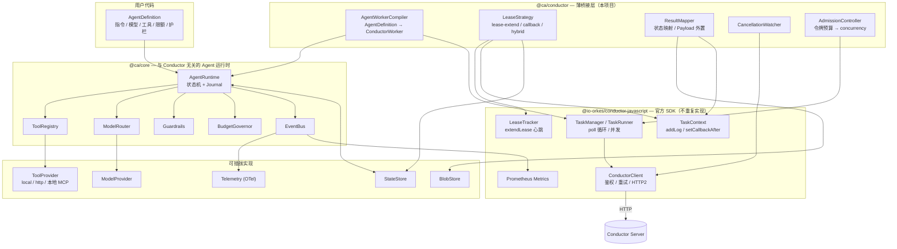

# Conductor AI Agent Worker SDK — 技术架构设计

> 状态：Draft v0.2 ｜ 语言：TypeScript (Node.js ≥ 20) ｜ 编排引擎：Conductor OSS
> v0.2 变更：不再自研 Conductor 对接层，改为构建在官方 `@io-orkes/conductor-javascript` 之上；
> 租约策略由 2 种改为 3 种（引入官方的 `extendLease` 真心跳）；新增与官方 agents 层的定位边界（§1.4）。
> 变更依据见 [ADR-0006](adr/0006-build-on-official-sdk.md)、[ADR-0007](adr/0007-lease-strategies-revised.md)、[ADR-0008](adr/0008-relation-to-official-agent-layer.md)。

---

## 1. 目标与非目标

### 1.1 目标

让一个 AI Agent 能够作为一等公民出现在 Conductor 工作流中：工作流里放一个 task，
它背后就是一次完整的、可观测、可恢复、有预算约束的 Agent 运行。

具体地：

1. **声明式定义 Agent**：一个 `AgentDefinition`（指令 + 模型 + 工具 + 限额 + 护栏）即可注册为 Conductor task worker。
2. **Worker 内闭环**：ReAct / tool-calling 循环在 **worker 进程内**完成，一个 Conductor task = 一次完整 Agent 运行。
   模型凭据、对话上下文、工具执行全部留在自己的进程里，Conductor 负责调度、重试、超时、编排与可视化。
3. **长时任务安全**：Agent 运行动辄数十秒到数十分钟，必须解决租约、重复投递、进程崩溃恢复三件事。
4. **副作用可控**：at-least-once 投递语义下，不允许因为重试而重复下单、重复发邮件、重复扣费。
5. **站在官方 SDK 上**：传输、鉴权、poll 循环、心跳续租、worker 指标一律复用 `@io-orkes/conductor-javascript`，不重复造。
6. **可观测**：OpenTelemetry GenAI 语义约定 + Conductor Task Log + 事件流。
7. **可测试**：不连真实 Conductor、不连真实 LLM 也能跑完整回归，并能对「崩溃—恢复」做确定性测试。

### 1.2 非目标

| 不做 | 原因 / 替代方案 |
|---|---|
| **自研 Conductor 客户端 / poll 循环 / 心跳** | 官方 SDK 已提供且质量更高（ADR-0006） |
| 自研编排引擎、状态机 DSL | Conductor 已经是编排层 |
| 多 Agent 协作的拓扑编排（handoff / group chat） | 用 Conductor 工作流表达，或直接用官方 agents 层的 `handoff` |
| 向量库 / RAG 的实现 | 只定义 `MemoryStore` / `Retriever` 接口 |
| 训练、微调、评测平台 | 超出 worker SDK 范畴 |

### 1.3 白盒模式的位置

「Conductor 全编排」（把每次 LLM 调用、每次工具调用都拆成独立 task）不是本项目的目标——
**官方 agents 层已经做了这件事**（§1.4）。但核心循环仍把每一步建模成显式的 `Step`，
以便未来把执行委派出去（§5.4、路线图 M5）。

### 1.4 与官方 agents 层的定位边界 ⚠️

`@io-orkes/conductor-javascript` 自 v3.x 起内置了一个完整的 **durable agent 层**
（`import ... from '@io-orkes/conductor-javascript/agents'`），能力包括：

`Agent` / `AgentRuntime`（`run` / `start` / `stream` / `deploy` / `serve` / `plan`）、
本地工具 `tool()`、服务端工具 `httpTool` / `mcpTool` / `apiTool` / `agentTool` / `humanTool`、
guardrails、handoff、memory、liveness 监控、streaming + HITL、结构化输出、
`plan_execute` 策略与静态 Plan builder、调度 API，
以及 LangChain / LangGraph / OpenAI Agents / Google ADK / Vercel AI 的框架桥接。

**它的执行模型与本项目不同，这是选型的核心分歧点：**

| | 官方 agents 层 | 本项目 |
|---|---|---|
| Agent 循环在哪跑 | **Conductor 服务端**（`plan()` 把 Agent 编译成 workflow definition，服务端执行） | **worker 进程内** |
| 本地进程负责什么 | 只跑 `tool()` 工具 worker（`serve()`） | 跑完整 Agent 循环 |
| LLM 凭据在哪 | 服务端集成（`model: 'anthropic/claude-sonnet-4-6'`） | 本地进程 |
| 对话上下文存在哪 | Conductor 存储 | 本地 + 自管 BlobStore |
| MCP 在哪执行 | 服务端（`mcpTool` 是 serverTool） | 本地进程 |
| 循环逻辑可编程性 | 受 agent schema 约束 | 任意 TypeScript |

**因此，先做选型判断，再决定是否需要本项目：**

> 如果服务端 durable agent 满足需求 —— 你能接受把模型凭据与对话上下文交给 Conductor 服务端，
> 且 Agent 行为能用官方 schema 表达 —— **直接用官方 agents 层，不要用本项目**。
> 它更成熟、有官方维护、还白送了服务端可观测性与框架桥接。

本项目只在下列约束成立时才有存在价值：

1. **数据与凭据不出域**：模型 API key、对话上下文、工具执行必须留在自己进程内（合规、私有模型网关、内网工具）。
2. **循环逻辑需要任意代码**：自研的规划/反思/多轮校验逻辑无法用 agent schema 表达。
3. **本地 MCP / 本地副作用工具**：官方 `mcpTool` 由服务端连接，内网 MCP server 与本地文件系统工具够不着。
4. **对 Conductor 服务端版本/形态有约束**：目标部署是纯 OSS Conductor，不便依赖服务端 agent 能力的可用性。

这四条任何一条都不成立时，本项目是纯粹的重复建设。**这个判断应该在 M1 之前做完。**

---

## 2. 关键约束：Conductor 语义 vs. AI Agent 的天然冲突

这一节是整个设计的地基。SDK 的绝大多数复杂度都来自下面 7 条冲突。

| # | Conductor 的语义 | Agent 的现实 | 冲突 | 本 SDK 的对策 |
|---|---|---|---|---|
| C1 | 任务被 poll 走后，若 `responseTimeoutSeconds` 内没有收到 task update，就重新入队 | 一次运行可能跑 10 分钟以上，时长不可预测 | 租约到期 → 同一次运行被两个 worker 同时执行 | §5.3 三种租约策略（官方 `extendLease` 心跳为主）+ Fencing Token |
| C2 | 投递语义是 **at-least-once** | LLM 调用花钱、工具调用有副作用 | 重复执行 = 重复花钱 / 重复下单 | §5.1 Journaled Replay + 工具幂等契约 |
| C3 | 无「取消推送」通道；workflow terminate 不通知 worker | Agent 可能还在烧 token | 已终止的工作流仍在消耗成本 | §6.4 CancellationWatcher |
| C4 | 任务 input/output 是 JSON 且有体积上限 | 完整 transcript 轻松几 MB | 输出写不进去 / 拖垮 Conductor 存储 | §6.3 Payload 外置（BlobStore + Ref） |
| C5 | 无流式输出通道 | 用户要看 token 流 | 无法在 Conductor 内做 streaming UI | §10.3 旁路 StreamSink |
| C6 | 重试由 TaskDef 的 `retryCount` / `retryLogic` 决定 | 有的失败该重跑（429、超时），有的重跑毫无意义 | 无脑重试放大成本 | §6.2 错误分类 → `FAILED` vs `FAILED_WITH_TERMINAL_ERROR` |
| C7 | 并发由 poll `count` 与 worker 并发数决定 | 真正的瓶颈是 LLM 的 RPM / TPM 配额 | 拉了任务却卡在限流上，占着租约不干活 | §6.5 用令牌预算反压去调官方 TaskManager 的 concurrency |

### 2.1 v0.1 的错误假设已修正

v0.1 曾假设「Conductor 没有不释放任务的纯心跳原语」，据此把租约策略限制为二选一。**该假设是错的。**

Conductor 提供 `updateTask` 上的 `extendLease: true`：它**只重置 `responseTimeoutSeconds` 计时器，
不把任务放回队列**，是货真价实的心跳。官方 SDK 已封装为 `leaseExtendEnabled` 开关与可独立使用的 `LeaseTracker`：

| 官方实现细节 | 值 |
|---|---|
| 心跳间隔 | `responseTimeoutSeconds × 0.8`（`LEASE_EXTEND_DURATION_FACTOR`） |
| 检查节拍 | 100ms `setInterval`（`HEARTBEAT_CHECK_INTERVAL_MS`），**独立于 poll 循环**，并发槽位占满时仍会心跳 |
| 心跳失败重试 | 3 次（`LEASE_EXTEND_RETRY_COUNT`），间隔 500ms；全失败只记日志，不失败任务 |
| 生效门槛 | `responseTimeoutSeconds ≥ 1.25`（算出的间隔 < 1000ms 则跳过） |
| 追踪窗口 | poll 时 `track`，`worker.execute()` resolve 时立刻 `untrack`（早于最终结果提交） |

这条修正带来一个**反直觉但重要的结论**（§6.6）：有了心跳之后，`responseTimeoutSeconds` 应该设**短**而不是设长。

---

## 3. 总体架构

### 3.1 分层



两条结构性约束：

1. **`@ca/core` 不依赖 `@ca/conductor`**，也不依赖官方 SDK。Agent 运行时可脱离编排引擎独立跑（本地 CLI、单测、HTTP 服务）。
2. **`@ca/conductor` 不重新实现官方 SDK 已有的东西**。它只做一件事：把 `AgentDefinition` 编译成官方的
   `ConductorWorker`（`{ taskDefName, execute, leaseExtendEnabled, concurrency, pollInterval, domain }`），
   交给官方 `TaskManager` 托管，并在 `execute` 内外接上 journal、租约语义、结果映射、取消检测。

### 3.2 包划分（pnpm monorepo）

| 包 | 职责 | 依赖 |
|---|---|---|
| `@ca/core` | Agent 定义、执行状态机、Journal、工具注册、护栏、预算、事件 | 仅 zod |
| `@ca/conductor` | **薄桥接层**：Worker 编译、租约策略、结果映射、取消检测、TaskDef 推导 | `@ca/core`, `@io-orkes/conductor-javascript` |
| `@ca/providers-anthropic` | Claude 适配（默认推荐 `claude-opus-5` / `claude-sonnet-5`） | `@ca/core`, `@anthropic-ai/sdk` |
| `@ca/providers-openai` | OpenAI 兼容适配（含自建网关） | `@ca/core` |
| `@ca/tools-mcp` | **本地** MCP 客户端 → Tool（官方 `mcpTool` 由服务端执行，够不着内网） | `@ca/core`, MCP SDK |
| `@ca/memory` | `StateStore` / `BlobStore` / `MemoryStore` 接口与实现 | `@ca/core` |
| `@ca/observability` | OTel GenAI span 与指标（worker 侧指标复用官方 Prometheus 采集） | `@ca/core` |
| `@ca/testing` | 脚本化模型、崩溃注入、Journal 断言、官方 SDK 的测试装配 | `@ca/core`, `@ca/conductor` |
| `@ca/cli` | 脚手架、TaskDef 注册、本地跑 Agent、Journal 查看 | 全部 |

> v0.1 曾计划自研 `HttpConductorClient` 与 `PollManager`，v0.2 已删除（ADR-0006）。
> v0.1 的 `@ca/testing` 曾计划 `FakeConductorServer`；既然传输层不再自持，改为直接使用官方 SDK 的测试装配 + 本地 Conductor 容器。

---

## 4. 核心抽象

### 4.1 Agent 定义

```ts
interface AgentDefinition<I = unknown, O = unknown> {
  name: string;                        // 默认映射为 Conductor task type `agent_<name>`
  version?: number;
  instructions: string | ((input: I, ctx: RunContext) => string | Promise<string>);
  model: ModelRef | ModelRef[];        // 单个模型或主备链
  tools?: ToolRef[];
  input?: Schema<I>;
  output?: Schema<O>;
  limits?: AgentLimits;
  guardrails?: Guardrail[];
  conductor?: Partial<ConductorTaskOptions>;
}

interface AgentLimits {
  maxSteps?: number;        // 默认 12
  maxToolCalls?: number;
  maxInputTokens?: number;
  maxTotalTokens?: number;
  maxCostUsd?: number;
  wallClockMs?: number;     // 默认 300_000；推导 TaskDef 的 timeoutSeconds（硬上限）
  perToolTimeoutMs?: number;
}
```

`RunContext`、`Tool`、`ModelProvider`、`Guardrail`、`AgentEvent` 的签名见
`packages/core/src/*.ts`，v0.2 未改动。

### 4.2 与官方 SDK 的类型边界

`@ca/core` 的类型**不引用**官方 SDK 类型；`@ca/conductor` 负责两侧互转：

```ts
// @ca/conductor
import type { ConductorWorker, Task, TaskResult } from '@io-orkes/conductor-javascript';

/** 把一个 AgentDefinition 编译成官方 SDK 认识的 worker */
declare function compileAgentWorker(def: AgentDefinition, deps: BridgeDeps): ConductorWorker;
```

好处是 `@ca/core` 的单测与本地运行完全不需要装官方 SDK，也避免官方 SDK 的
OpenAPI 生成类型（会随服务端 spec 变动）渗透进核心抽象。

---

## 5. 执行模型

### 5.1 Journaled Replay（日志重放）

Agent 循环是一个把每一步写进 append-only journal 的状态机：

```
INIT ──▶ PLAN(模型调用) ──▶ ACT(工具调用, 可并行) ──▶ OBSERVE ──┐
           ▲                                                    │
           └────────────────── 未终止 ◀─────────────────────────┘
                                │终止
                                ▼
                          FINALIZE(结构化收尾) ──▶ DONE
```

`JournalEntry` 定义见 `packages/core/src/journal.ts`。

**恢复 = 重放**：重新执行同一个循环，但每到一步先查 journal —— 命中则直接取历史结果
（不再调 LLM、不再调工具），未命中才真正执行。

`stepId = sha256(runKey | seq | kind | 归一化输入)`：既是 journal 主键，也是工具幂等键，也是模型响应缓存键。

正确性依赖「所有非确定性都经由受管入口」（`ModelRouter` / `ToolRegistry` / `ctx.now()` / `ctx.random()`），
由 lint 规则 + 运行时告警约束，不做沙箱。

### 5.2 runKey：恢复的锚点

```
runKey = `${workflowInstanceId}:${taskReferenceName}:${epoch}`
```

| resumePolicy | epoch | 效果 | 适用 |
|---|---|---|---|
| `on-lease-loss`（默认） | 恒为 `0` | Conductor 任何形式的重投递都接着上次跑，不重复付费 | 绝大多数 Agent |
| `fresh-per-retry` | `task.retryCount` | Conductor 的业务重试 = 从头重跑 | 「重试换个随机性」的创作类任务 |
| `never` | — | 不落 journal，崩溃即失败 | 极短、纯只读的 Agent |

> 已知模糊点：Conductor 对「租约超时重投」与「业务失败重试」都会推进 `retryCount`，worker 侧不可严格区分。
> 默认值优先保护成本与副作用。

### 5.3 租约策略（LeaseStrategy）—— v0.2 修订

针对 C1，提供三种模式，由 `AgentDefinition.conductor.leaseStrategy` 选择：

#### (a) `lease-extend` —— **新默认**，覆盖绝大多数场景

直接开启官方 SDK 的 `leaseExtendEnabled: true`：

```ts
const worker: ConductorWorker = {
  taskDefName: 'agent_research',
  execute: compiledExecute,
  leaseExtendEnabled: true,      // 官方 LeaseTracker 在 responseTimeoutSeconds×0.8 心跳
};
```

- 整个 Agent 循环在一次 `execute()` 内跑完，占用一个并发槽位；心跳独立于 poll 循环，槽位占满也照常发。
- **journal 变成可选**（由 `resumePolicy` 决定），没有写放大压力；崩溃恢复靠 Conductor 重投 + 重放。
- 心跳只重置 `responseTimeoutSeconds`，**不延长 `timeoutSeconds`**——总执行上限仍由 `limits.wallClockMs` 推导（§6.6）。

#### (b) `callback` —— 适合「等待外部」

用 `IN_PROGRESS + callbackAfterSeconds` 交还任务、**释放并发槽位**：

```ts
getTaskContext()?.setCallbackAfter(30);
return { status: 'IN_PROGRESS', callbackAfterSeconds: 30 };
```

- 交还前必须把 journal 持久化到 `StateStore`；下次 poll（可能是另一个 worker）从 journal 继续。
- 适用：人工审批、等待 Conductor 子工作流、等待外部长作业。
- **⚠️ 硬约束：`callbackAfterSeconds` 不得超过 TaskDef 的 `timeoutSeconds`，否则任务会被判 `TIMED_OUT`。**
  SDK 在编译期与运行期各校验一次，运行期发现超限则夹到 `timeoutSeconds` 的 80% 并告警。

#### (c) `hybrid` —— 推荐给长时 + 有等待的 Agent

默认按 `lease-extend` 运行（计算期间保持槽位、避免 journal 写放大）；
一旦进入「等待外部信号」状态（`ctx.suspend()`、`conductorWorkflowTool`、人工审批）就切换为 `callback` 交还任务。

**计算时占槽、等待时让位** —— 这是本 SDK 对长时 Agent 的推荐配置。

| | lease-extend | callback | hybrid |
|---|---|---|---|
| 长时计算 | ✅ 槽位常驻 | ⚠️ 每片都要写 journal | ✅ |
| 长时等待 | ❌ 白占槽位 | ✅ 让出槽位 | ✅ |
| StateStore | 可选 | **必需** | 必需（仅等待路径写） |
| journal 写放大 | 无 | 高 | 低 |

#### Fencing Token（三种模式都启用）

心跳降低了重复投递的概率，**但没有消除它**：网络分区、心跳连续 3 次失败后仍在跑、
`callback` 交还后被两个 worker 抢到，都会导致同一 `runKey` 被并发执行。

`StateStore` 为每个 `runKey` 维护 `{ owner, fenceToken, expiresAt }`：

1. worker 拿到任务后 CAS 抢占，`fenceToken += 1`。
2. 每次写 journal、每次向 Conductor 回写结果都携带 `fenceToken`，落后的写入被拒绝。
3. 抢占失败或 fence 落后 → 立即放弃，不回写 Conductor。

把「同一 runKey 被并发执行」的后果从「重复副作用」降级为「浪费一次 LLM 调用后自我放弃」，
配合工具幂等契约（§5.5）达到实际意义上的 effectively-once。

> `resumePolicy: 'never'` + `lease-extend` 是唯一不需要 `StateStore` 的组合，此时无 fencing，
> 需自行接受重复执行风险。SDK 在启动时明确告警。

### 5.4 为白盒模式预留

`StepExecutor` 接口把「执行一步」抽象出来。v1 只有 `InProcessStepExecutor`；
未来若要把 step 下沉为 Conductor task，核心状态机与 journal 结构不变（路线图 M5）。

### 5.5 副作用与幂等

| `Tool.effect` | 重放时 | 说明 |
|---|---|---|
| `pure` | 自由重放 | 查询类 |
| `idempotent` | 重跑，注入 `ctx.idempotencyKey = stepId` | 下游用它去重 |
| `effectful` | 见 `onAmbiguousReplay` | 发邮件、支付、写外部单据 |

`effectful` 工具恢复时若只有 `tool.intent` 而无 `tool.result`（执行到一半崩了，不知道有没有生效）：

- `'fail'`（默认）→ `FAILED_WITH_TERMINAL_ERROR`，把决策权交给工作流的补偿分支。
- `'retry'` → 重跑（调用方自证可重复）。
- `'probe'` → 调用工具的 `probe(idempotencyKey)` 查询是否已生效。

宁可让工作流走补偿分支，也不要静默重复副作用。

---

## 6. Conductor 桥接层（`@ca/conductor`）

### 6.1 Worker 编译与装配

用户入口：

```ts
import { createAgentWorker } from '@ca/conductor';

const worker = createAgentWorker({
  agents: [researchAgent],
  // 连接配置直接复用官方 SDK 的约定：
  //   CONDUCTOR_SERVER_URL (默认 http://localhost:8080/api)
  //   CONDUCTOR_AUTH_KEY / CONDUCTOR_AUTH_SECRET
  stateStore: redisStateStore({ url: process.env.REDIS_URL! }),
});
await worker.start();   // 内部创建官方 TaskManager 并 startPolling
```

`createAgentWorker` 做的事：

1. 校验配置（`callback`/`hybrid` 必须有持久化 `StateStore`，否则**拒绝启动**）。
2. 每个 `AgentDefinition` 编译为一个官方 `ConductorWorker`：
   `{ taskDefName, execute, leaseExtendEnabled, concurrency, pollInterval, domain }`。
3. `execute` 内部依次接上：runKey 计算 → fence 抢占 → journal 载入 → `@ca/core` 运行 →
   结果映射 → payload 外置 → fence 校验 → 返回官方 `TaskResult`。
4. 交给官方 `TaskManager` / `TaskHandler` 托管 poll、并发、心跳、指标、优雅停机。

也支持官方的 `@worker` 装饰器风格（`scanForDecorated`），供已有 worker 工程渐进接入。

### 6.2 状态映射（ResultMapper）

| Agent 结果 | Conductor status | 说明 |
|---|---|---|
| 正常产出结构化输出 | `COMPLETED` | `outputData = { ok: true, result, usage, steps, traceId, transcriptRef }` |
| Agent 判定「做不到 / 需要人」但流程该继续 | `COMPLETED` + `ok: false, reason` | 让工作流用 `SWITCH` 分支处理，**不是**失败 |
| 瞬时错误（429 / 5xx / 网络 / 租约丢失） | `FAILED` | 交给 TaskDef 的 retry 策略 |
| 终局错误（schema 非法、护栏拦截、预算硬上限、模糊副作用） | `FAILED_WITH_TERMINAL_ERROR` | 直接进补偿分支 |
| 挂起等待外部信号 | `IN_PROGRESS` + `callbackAfterSeconds` | `callback` / `hybrid` 策略 |

终局错误优先使用官方 SDK 的 `NonRetryableException`，与 SDK 既有语义对齐。
所有失败都填 `reasonForIncompletion` 并通过 `getTaskContext()?.addLog()` 写一条 Task Log。

### 6.3 Payload 治理（对应 C4）

- **入参**：支持 `externalInputPayloadStoragePath`，自动拉取。
- **出参**：`outputData` 硬预算默认 256KB，超出按 `payloadStrategy` 处理：
  - `externalize`（默认）：完整 transcript / 大结果写 `BlobStore`，output 只留 `{ transcriptRef, resultRef, bytes, sha256 }`。
  - `truncate`：保留头尾 + 摘要。
  - `fail`：显式失败。
- transcript **始终**外置（即使不超限）：它是审计与调试的主要材料，不该挤占编排存储。

### 6.4 CancellationWatcher（对应 C3）

Conductor 不推送取消，官方 SDK 也不提供，这部分仍是本项目自持：

- 仅对运行超过阈值（默认 20s）的 run 启用；每 15s 查一次所属 workflow 状态。
- 命中 `TERMINATED / TIMED_OUT / FAILED / COMPLETED`（`PAUSED` 可选）→ `abort()`。
- 按 `workflowInstanceId` 去重合并，同工作流的多个 run 只发一次请求。
- `AbortSignal` 一路传到 `ModelProvider`（中断 HTTP 流）与 `Tool`。

### 6.5 准入控制（对应 C7）

官方 `TaskManager` 的并发是静态 `concurrency`。本项目在其上加一层动态调节：

```
目标并发 = min(
    配置的 maxConcurrentRuns,
    模型限流器可承诺的并发（按 RPM/TPM 估算）,
    进程资源闸门（内存 / 事件循环延迟）
)
```

令牌预算耗尽时把 concurrency 调到 0，让官方 poll 循环自然停拉，避免「拉了任务却卡在限流上占着租约」。

### 6.6 TaskDef 推导：限额是唯一真相源（公式已按心跳修正）

```
# lease-extend / hybrid（有心跳）
responseTimeoutSeconds = 60                       # 故意设短！见下方说明，且必须 ≥ 1.25
timeoutSeconds         = ceil(wallClockMs/1000 × 1.2)   # 真正的硬上限

# callback（无心跳，靠 callbackAfterSeconds 交还）
responseTimeoutSeconds = ceil(leaseSliceMs/1000 × 3)
timeoutSeconds         = ceil(wallClockMs/1000 × 1.2)   # 且必须 > 任何一次 callbackAfterSeconds

retryCount = 3, retryLogic = EXPONENTIAL_BACKOFF
concurrentExecLimit / rateLimitPerFrequency ← 由模型配额推导
```

**为什么有了心跳反而要把 `responseTimeoutSeconds` 设短？**

v0.1 的做法（`responseTimeoutSeconds = wallClock × 1.5`）有个糟糕的性质：worker 进程崩溃后，
任务要**等满整个租约**才会被重投——Agent 跑 30 分钟就意味着崩溃后卡 45 分钟。

有了心跳之后，两件事解耦了：

- `responseTimeoutSeconds`（短，如 60s）= **崩溃检测灵敏度**。进程死了心跳就停，60s 内重投。
- `timeoutSeconds`（长，覆盖 `wallClockMs`）= **总执行上限**。心跳不会延长它。

`ca register` 做 diff-and-apply，启动时校验线上 TaskDef 是否漂移（默认告警不阻塞）。

### 6.7 Task Domain 路由

`domain` 把同名 task type 路由到不同 worker 池：按租户、按模型能力、按环境（canary）。
直接透传官方 SDK 的 `domain` 配置，支持一个进程订阅多个 `(taskType, domain)` 组合。

---

## 7. 工具体系

### 7.1 注册与命名

`ToolRegistry` 负责命名空间、schema 双向校验、超时与重试、并发闸门、工具级护栏。
模型看到的工具描述由 registry 统一渲染，保证跨 provider 一致。

### 7.2 本地 MCP（`@ca/tools-mcp`）

官方 SDK 的 `mcpTool` 是 **serverTool** —— 由 Conductor 服务端连接 MCP server，不产生本地 worker。
这对内网 MCP server、本地文件系统工具、需要本地凭据的 MCP 够不着，因此本项目保留自己的**本地** MCP 客户端：

- stdio / streamable HTTP transport，连接池绑定 worker 进程生命周期。
- 工具发现与命名空间化（`<server>.<tool>`）。
- 会话状态不跨 run 复用：独立会话或显式 reset。
- MCP 返回值统一标记 `trust: 'untrusted'`（§11）。

> 若目标 MCP server 是公网可达的、且可以让 Conductor 服务端持有其凭据，
> 应优先用官方 `mcpTool`，不要用本包。

### 7.3 ConductorWorkflowTool —— 黑盒里的编排出口

```ts
conductorWorkflowTool({
  name: 'run_credit_check',
  workflowName: 'credit_check',
  version: 2,
  waitMode: 'callback',   // 'callback' | 'poll' | 'fire-and-forget'
})
```

Agent 调用它 → 用官方 `WorkflowClient` 启动子工作流 → 把 `subWorkflowId` 写入 journal：

- `callback`（推荐，需 `hybrid`/`callback` 策略）：立即交还任务，恢复时先查子工作流状态；未完成则再交还。
  **不占用 worker 槽位。**
- `poll`：在 run 内阻塞轮询（仅适合秒级子流程，靠心跳保活）。
- `fire-and-forget`：只返回 id。

这是「Worker 内闭环」与「Conductor 编排」的正式桥梁：需要可观测、需要复用、需要人工介入的重活交给工作流。

### 7.4 人工介入（HITL）

`humanApprovalTool()` 走 `ctx.suspend()`：

```
Agent 调用 request_approval
  → 写 suspend journal entry + resumeToken
  →（可选）创建 Conductor HUMAN/WAIT 任务或调用外部审批系统
  → setCallbackAfter(n) + return IN_PROGRESS      ← 必须 n < timeoutSeconds
  → 审批系统回调 SDK 的 resume 端点 / 直接写 StateStore
  → 下次 poll 命中 resume entry，循环带着审批结果继续
```

`resumeToken` 是签名的、带过期时间的字符串，包含 `runKey + seq + fenceToken`，防伪造与重放。

> 官方 agents 层有更完整的 HITL（`humanTool` + `AgentHandle.approve()` + SSE 流）。
> 若 HITL 是核心诉求且不受 §1.4 四条约束限制，应优先评估官方方案。

---

## 8. 模型层

- **统一消息与工具调用格式**，provider 差异（thinking block、并行 tool call、cache control、stop reason 语义）在适配器内消化。
- **ModelRouter**：`model: ['claude-opus-5', 'claude-sonnet-5']` 表示主备；按错误类别决定「重试同一个」还是「切下一个」
  （429 → 退避后同一个；5xx/超时 → 切换；400 → 不切，直接终局失败）。
- **限流器**：per-model 的 RPM/TPM 令牌桶，同时作为 §6.5 准入控制的输入信号。
- **成本核算**：价格表可配置，`usage → cost` 统一计算，进 `BudgetGovernor` 与指标。
- **缓存**：透传 provider 的 prompt cache 提示；可选响应缓存（键 = `stepId`），主要服务测试与重放，生产默认关闭。
- **结构化输出**：`output` schema 存在时，收尾强制走 tool-calling / structured output，校验失败最多重试 2 次，仍失败则终局错误。

---

## 9. 状态、记忆与存储

| 抽象 | 存什么 | 生命周期 | 默认实现 |
|---|---|---|---|
| `StateStore` | Journal、租约/fence、resume 记录 | 一次 run（排障 TTL 默认 7 天） | memory（仅 `lease-extend` + 单机）/ redis / postgres |
| `BlobStore` | Transcript、大 payload、工具产物 | 与审计要求一致（默认 30 天） | fs / s3 |
| `MemoryStore` | 跨 run 的长期记忆 | 业务定义 | 接口 + 参考实现，不内置向量库 |

`callback` / `hybrid` 策略、`resumePolicy != 'never'`、HITL 三者任一启用时，
`StateStore` 必须是持久化实现，SDK 启动时校验并**直接拒绝启动**。

---

## 10. 可观测性

### 10.1 Trace

OpenTelemetry，遵循 GenAI 语义约定：

```
span: agent.run            (agent.name, run_key, workflow_id, task_id, tenant)
 ├─ span: agent.step[0]    (step.kind)
 │   └─ span: gen_ai.chat  (gen_ai.system, gen_ai.request.model,
 │                          gen_ai.usage.input_tokens/output_tokens, cost_usd)
 ├─ span: agent.step[1]
 │   ├─ span: tool.execute (tool.name, tool.effect, idempotency_key)
 │   └─ span: tool.execute
 └─ span: agent.finalize
```

trace context 从任务输入的约定字段（`_traceparent`）继承；`traceId` 写回 `outputData`，Conductor UI 可一键跳转 APM。

### 10.2 指标

**worker 侧指标（poll 延迟、执行时长、队列滞留、心跳）直接用官方 SDK 的 Prometheus 采集**
（`CanonicalMetricsCollector` / `MetricsServer`），不重复实现。

本项目只补 Agent 语义的指标：token & cost（按 model/tenant/agent）、步数分布、
工具成功率与延迟、护栏拦截率、恢复次数、fence 抢占次数、预算触顶次数。

### 10.3 流式与进度

- Conductor 侧：关键节点用 `getTaskContext()?.addLog()` 写 Task Log（步数、当前工具、累计 token），运维在 Conductor UI 直接看进度。
- 用户侧：`StreamSink` 把 `model.delta` / `tool.started` 事件推到 Redis Stream 或 SSE 网关，
  channel key = `workflowInstanceId:taskReferenceName`。Conductor 本身不参与流式（C5）。

---

## 11. 安全

- **密钥**：`SecretProvider` 抽象（env / 文件 / Vault），禁止把密钥放进 task input。
- **提示注入**：工具返回值与外部检索内容在消息中标记 `untrusted`；**系统指令永不由工具输出拼接而成**。
- **工具授权**：per-agent 允许清单 + per-tenant 覆盖；敏感工具强制走 §7.4 审批。
- **输出过滤**：`onAfterRun` 护栏做 PII / 敏感词 / schema 校验。
- **多租户**：`tenantId` 贯穿 RunContext → 密钥选择、预算、限流、存储前缀、指标维度、Conductor domain。
- **沙箱**：本地代码执行类工具不在 v1 内置，文档明确要求下沉到独立进程/容器。

---

## 12. 测试策略

| 层次 | 手段 |
|---|---|
| 单元 | 纯函数状态机 + `ScriptedModelProvider` + 假工具（**不需要官方 SDK**） |
| 契约 | Provider 适配器录制/回放（真实 wire format 快照） |
| 恢复 | 崩溃注入：在第 N 条 journal entry 后杀进程 → 恢复 → 断言「无重复副作用、最终输出一致」 |
| 并发 | 双 worker 抢同一 runKey → 断言 fence 生效、只有一个回写成功 |
| 租约 | `responseTimeoutSeconds` 设为秒级 + 长任务，断言心跳生效、任务未被重投 |
| 集成 | docker-compose 起真实 Conductor OSS，跑官方 `TaskManager` + 示例工作流 |

「恢复」「并发」「租约」三类测试是本 SDK 的核心资产，必须在 M2 之前建立。
传输层不再自持，`FakeConductorServer` 相应取消——集成测试直接打真实 Conductor 容器。

---

## 13. 目录结构

```
.
├── docs/
│   ├── architecture.md          ← 本文
│   └── adr/                     ← 关键决策记录（0001-0008）
├── packages/
│   ├── core/                    @ca/core          与 Conductor 无关的运行时
│   ├── conductor/               @ca/conductor     官方 SDK 之上的薄桥接层
│   ├── providers-anthropic/
│   ├── providers-openai/
│   ├── tools-mcp/               本地 MCP（区别于官方 serverTool）
│   ├── memory/
│   ├── observability/
│   ├── testing/
│   └── cli/
├── examples/
│   ├── minimal-agent/           单 Agent task，lease-extend
│   └── hitl-approval/           hybrid + 人工审批 + 子工作流工具
├── pnpm-workspace.yaml
└── tsconfig.base.json
```

工程约定：pnpm workspace ｜ tsup（ESM + CJS）｜ vitest ｜ Node ≥ 20 ｜ changesets ｜ `sideEffects: false`。

---

## 14. 路线图

| 里程碑 | 内容 | 出口标准 |
|---|---|---|
| **M0** 骨架 | monorepo、构建、CI、本文档 | `pnpm build` 通过 |
| **M0.5 选型验证** ⚠️ | 按 §1.4 四条判据评估官方 agents 层能否直接满足需求；在目标 Conductor 上实测 `extendLease`、`callbackAfterSeconds` 与 `timeoutSeconds` 的交互 | **书面结论：继续做 / 改用官方 agents 层** |
| **M1** 最小可用 | core 状态机（无 journal）+ Anthropic provider + 本地工具 + `lease-extend` 桥接 + TaskDef 推导 | 示例在真实 Conductor OSS 上端到端跑通 |
| **M2** 可靠性 | Journal + StateStore(redis) + Fencing + `callback`/`hybrid` + 错误分类 + 取消检测 | 恢复 / 并发 / 租约三类测试全绿 |
| **M3** 生态 | 本地 MCP、ConductorWorkflowTool、HITL/suspend、Payload 外置 | `hitl-approval` 示例跑通 |
| **M4** 生产化 | OTel、Agent 语义指标、预算治理、多租户、CLI、文档站 | 压测报告 + 运维手册 |
| **M5** 白盒（可选） | `ConductorStepExecutor`：step 下沉为 Conductor task | 同一 Agent 定义可在两种模式间切换 |

M0.5 是新增的**卡点**：在写 M1 代码之前先回答「这个项目该不该存在」。

---

## 15. 关键决策与遗留问题

- [ADR-0001](adr/0001-worker-closed-loop.md) Worker 内闭环 vs. Conductor 全编排
- [ADR-0002](adr/0002-own-rest-client.md) 自持 REST 客户端 —— **已被 ADR-0006 推翻**
- [ADR-0003](adr/0003-journaled-replay.md) Journaled Replay 作为恢复机制
- [ADR-0004](adr/0004-lease-strategy.md) 双租约策略 —— **已被 ADR-0007 修订**
- [ADR-0005](adr/0005-effectful-tool-default.md) `effectful` 工具默认 `fail` 而非重试
- [ADR-0006](adr/0006-build-on-official-sdk.md) 构建在官方 `@io-orkes/conductor-javascript` 之上
- [ADR-0007](adr/0007-lease-strategies-revised.md) 三租约策略：`lease-extend` / `callback` / `hybrid`
- [ADR-0008](adr/0008-relation-to-official-agent-layer.md) 与官方 agents 层的定位边界

**待验证 / 待决**

1. **§1.4 的选型判断**（M0.5 卡点）：官方 agents 层是否已满足需求。这是最高优先级的未决问题。
2. 官方 agents 层对**纯 OSS Conductor**（非 Orkes）的支持完备度：其 e2e 用的是 pinned release server JAR，
   但服务端 LLM 集成、prompt 管理、`serverTool` 在 OSS 部署上的可用性需在目标环境实测。
3. `extendLease` 在目标 Conductor 版本上的行为需实测确认：心跳是否确实不把任务放回队列、是否确实不延长 `timeoutSeconds`。
4. `retryCount` 无法区分「租约超时重投」与「业务重试」，`resumePolicy` 默认值需真实业务验证。
5. `callbackAfterSeconds` 的服务端上限、以及与 `timeoutSeconds` 的精确交互（是否包含已 callback 的等待时间）需实测。
6. `hybrid` 策略下 journal 写放大与 Redis 成本，需在 M2 压测中量化。
