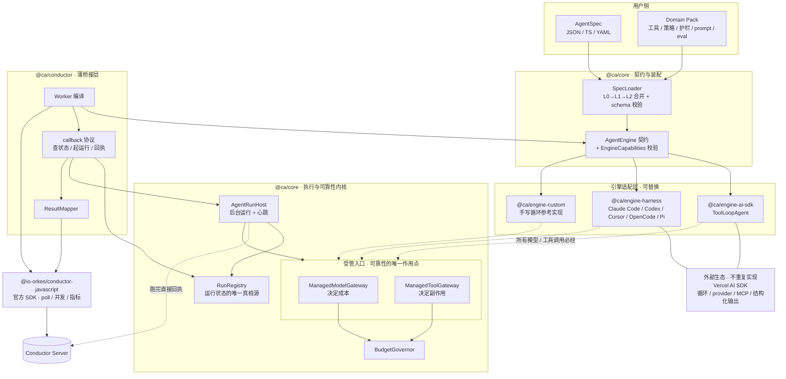

# Conductor AI Agent Worker SDK — 技术架构设计

> 状态：Draft v0.7 ｜ 语言：TypeScript (Node.js ≥ 20) ｜ 编排引擎：Conductor OSS ≥ 3.x
> 上游基线（实装核实）：**`ai@7.0.93`**、**`@io-orkes/conductor-javascript@4.0.0`**
>
> ## v0.7：执行模型换了
>
> v0.6 及以前把 agent **切片塞进 Conductor 任务的执行窗口**里跑：一次 `execute()` 跑一个分片，
> 跑不完就带着状态交还，下次 callback 再续。这个模型带来了一长串本不必要的机制 ——
> 跨分片状态持久化、journal 重放、租约与 fencing、交还预算校验。
>
> v0.7 改成 **agent 与编排任务解耦**（[ADR-0019](adr/0019-async-agent-execution.md)）：
>
> - `execute()` **毫秒级返回**，只回答「这个 taskId 的运行现在怎么样了」
> - agent 在**后台**从头跑到完成，状态全程在这一次运行的内存里
> - 运行结束时**直接** `updateTask` 把任务推向终态，不等下一次 callback
> - callback 退化成**心跳检查**：只用来发现后台运行的宿主是不是没了
>
> 由此**删除**：分片（`sliceMs` / `SliceBudget` / `stopWhen` 预算）、跨分片状态恢复、
> journal 与重放、租约与 fencing token、交还预算校验、`resumePolicy` / `leaseStrategy`。
> **新增**：运行注册表（`RunRegistry`）与后台运行宿主（`AgentRunHost`），
> 以及「同一次执行的多次 callback vs 不同任务」的身份判据 ——
> 就是 Conductor 的 **taskId**（[ADR-0020](adr/0020-runid-is-taskid.md)）。
>
> 同时纠正了四条 v0.6 的服务端语义偏差，见 §2.2。
>
> **实装状态**：`@ca/core` / `@ca/engine-ai-sdk` / `@ca/memory` / `@ca/conductor` / `@ca/testing`
> 已按 v0.7 重写，**76 个测试**（73 通过 + 3 个端到端待真机）。
> 端到端验证清单见 [verification.md](verification.md)。

---

## 1. 目标与非目标

### 1.1 目标

让**任意技术栈构建的** AI Agent 都能作为一等公民出现在 Conductor 工作流中：
工作流里放一个 task，背后就是一次完整的、可观测、可恢复、有预算约束的 Agent 运行。

1. **不自建 Agent 能力，只做能力的宿主**。推理循环、上下文管理、工具定义、结构化输出、
   模型 provider 生态——全部由外部 Agent SDK 提供（Vercel AI SDK 为首选参考实现），
   本 SDK 通过 `AgentEngine` 适配它们。
2. **薄 core**。`@ca/core` 只有四件事：`AgentSpec` 契约、`AgentEngine` 契约、
   两个受管入口（模型 / 工具）、执行内核（后台运行宿主 / 运行注册表 / 预算 / 超时）。
3. **通用配置化 + 领域定制**。`AgentSpec` 是纯数据，可来自 TS / JSON / YAML / 远程配置；
   L0 通用默认 → L1 领域包（Domain Pack）→ L2 实例，逐层覆盖。
4. **可靠性与引擎解耦**。任何引擎只要能让我们包住模型与工具两个入口，
   就自动获得崩溃恢复、effectively-once、预算治理、OTel 埋点。
5. **诚实的能力边界**。不同引擎能力不同（如 sandbox 内执行的 harness 拦截不到工具），
   用 `EngineCapabilities` 显式建模并在启动时校验，不假装统一（§4.4）。
6. **Conductor 对接**：异步化执行 + callback 心跳协议 + 运行注册表（§5、§6）。

### 1.2 非目标

| 不做 | 由谁做 |
|---|---|
| 推理循环 / 上下文压缩 / 停止条件 / 工具定义 DSL | Agent SDK（AI SDK 的 `ToolLoopAgent`、`stopWhen`、`prepareStep`、`pruneMessages`、`tool()`） |
| 模型 provider 适配 | Agent SDK 的 provider 生态 |
| MCP 客户端 | `@ai-sdk/mcp`（`createMCPClient` + stdio / Streamable HTTP） |
| 统一消息格式 | 引擎自己的格式；core 只把它当作**不透明可序列化载荷**（§4.5） |
| 自研 Conductor 客户端 / poll / 心跳 | 官方 `@io-orkes/conductor-javascript`（[ADR-0006](adr/0006-build-on-official-sdk.md)） |
| 编排引擎、向量库、训练评测平台 | Conductor 本身 / 用户自选 |

### 1.3 与官方 Conductor agents 层的关系

已决议不采用（[ADR-0008](adr/0008-relation-to-official-agent-layer.md)）：它把 Agent 编译成 workflow 交服务端执行，
受其 agent schema 约束，且模型凭据与上下文在服务端。本项目要的是 worker 内闭环 + 任意技术栈。
官方 SDK 的**传输层**仍全量复用。

---

## 2. 关键约束：Conductor 语义 vs. AI Agent

### 2.1 冲突与对策

| # | Conductor 的语义 | Agent 的现实 | 对策 |
|---|---|---|---|
| C1 | 任务被 worker 持有期间受 `responseTimeoutSeconds` 约束；队列还有 **60 秒 unack 窗口** | 一次运行可能数十分钟 | §5 异步化：`execute()` 毫秒返回，agent 在后台跑 |
| C2 | **at-least-once** 投递 | LLM 花钱、工具有副作用 | §5.3 运行注册表的原子占位；工具幂等键 |
| C3 | 无取消推送 | Agent 还在烧 token | §6.4 CancellationWatcher，经心跳传导到 `ctx.signal` |
| C4 | payload 有体积上限（3072 KB 外置 / 10240 KB 失败） | transcript 几 MB | §6.3 Payload 外置 |
| C5 | 无流式通道 | 要看 token 流 | §10.3 旁路 StreamSink |
| C6 | 重试由 `retryCount` 决定 | 有的失败重跑无意义 | §6.2 错误分类：终局错误走 `NonRetryableException` |
| C7 | 并发由 worker 并发数决定 | 瓶颈是 LLM 配额 | §4.3 受管入口上的预算闸门 |

### 2.2 服务端语义（v3.21.21 源码核实结论）

以下每一条都读过源码。**加粗的四条是 v0.7 对 v0.6 的纠正**，它们直接改变了配置取值。

**任务生命周期**

| 阶段 | 服务端行为 |
|---|---|
| 调度 | `SimpleTaskMapper` 建 `TaskModel(SCHEDULED)`，入队 `taskType[:domain][@ns][-isolation]` |
| poll | `queueDAO.pop` → 状态置 `IN_PROGRESS`、**`callbackAfterSeconds` 重置为 0**、`startTime`（仅首次）、`pollCount++` |
| 交还 `IN_PROGRESS` | **状态实际存为 `SCHEDULED`**；`outputData` **整体覆盖**；`queueDAO.postpone` 重置 `deliver_on` |
| 等待期 | 状态是 `SCHEDULED` → `isResponseTimedOut` 不判定（它要求 `IN_PROGRESS`）→ 可以等任意久 |
| 再次 poll | **同一 taskId**；`inputData` 冻结；`outputData` 是上次写的；`startTime` / `retryCount` 不变 |
| 终态回执 | `queueDAO.remove` → callback 循环**立即停止** |
| 重试 | **新 taskId**；`task.copy()` **原样携带上次 `outputData`**；`inputData` 重新求值；`startTime=0`；`retryCount+1` |

**四条纠正**

1. ⚠️ **队列有 60 秒 unack 窗口，两个后端都写死、不可配。**
   ```sql
   -- PostgresQueueDAO.processUnacks，每 60 秒跑一次（UNACK_SCHEDULE_MS = 60_000L）
   UPDATE queue_message SET popped = false
   WHERE popped = true AND (current_timestamp - interval '60 seconds') > deliver_on
   ```
   Redis/dyno-queues 同样：`new RedisQueues(..., 60_000, 60_000, ...)`。
   **worker 持有任务超过约 60 秒不回执，消息会被放回队列、被另一个 worker 并发取走。**
   这是 `execute()` 必须毫秒级返回的硬理由 —— 也是 v0.6 的分片模型贴着红线跑而不自知的地方。

2. **`IN_PROGRESS` 回执会被存成 `SCHEDULED`**（`WorkflowExecutorOps.updateTask`：
   `if (!isSystemTask && status == IN_PROGRESS) task.setStatus(SCHEDULED)`）。
   连带推论：等待期间 `responseTimeout` **根本不参与判定**；而 poll 时
   `setCallbackAfterSeconds(0)`，所以 v0.6 反复引用的
   `adjustedResponseTimeout = responseTimeout + callbackAfterSeconds`
   **对 SIMPLE worker 任务是条死代码**。

3. **`timeoutSeconds` 每次 attempt 重新起算**，且要扣 `startDelayInSeconds`：
   `elapsedTime = now - (startTime + startDelayInSeconds × 1000)`，而 `retry()` 会
   `setStartTime(0)`，`startTime` 只在本次 attempt 首次 poll 时设置。
   另外 `checkTaskTimeout` 首行即 `if (… || taskDef.getTimeoutSeconds() <= 0 || …) return;`
   —— **`timeoutSeconds = 0` 时任务永不因总时长超时**，这是长任务的正确配置（§6.6）。

4. **`outputData` 是整体覆盖，不是合并**（`task.setOutputData(taskResult.getOutputData())`）。
   分片间无法靠增量写入累积；每次回执都必须是完整快照。

**其余已核实结论**

- `responseTimeout` 超时 = `setStatus(TIMED_OUT)` 并消耗一次 `retryCount`，直接调 `timeoutTask()`
  **绕过 `timeoutPolicy`**。因此 `retryCount` 不可为 0，且 `responseTimeoutSeconds`
  **不该调小** —— 调小会抢在队列 unack 之前把一次廉价的同 taskId 重投变成一次昂贵的重试。
- `callbackAfterSeconds` **没有服务端上限**：`ExecutionService.requeue()` 只做下限钳制。
- `WorkflowSweeper.unack()` 把 decider 队列的 unack 设为 `responseTimeoutSeconds + 1`
  （上限 `maxPostponeDurationSeconds`，默认 3600s）—— 该值同时决定工作流的重扫频率。
- `updateTask` **没有**「必须是 poll 到它的那个 worker」的校验，且 `SCHEDULED` 不是终态。
  **任何持有 taskId 的进程都能把任务推向终态** —— §5.2 的主动回执正是基于这一点。
- **没有 worker 亲和机制。** 队列名只由 `taskType[:domain][@ns][-isolation]` 构成，
  `workerId` 只用于日志、`setWorkerId` 记录与 `updateTaskLastPoll` 指标；
  全库 grep `sticky|affinit|preferredWorker` 无任何结果。
  SDK 用的 `POST /api/tasks/update-v2` 是「更新完顺手替这个 worker poll 一次同队列」的
  **链式优化**，返回队首任务，不保证是刚交还的那个。
  → **多实例部署必须用共享的运行注册表**（§5.3）。
- `TaskDef` 的 `inputKeys` / `outputKeys` 在全库**没有任何读取点**（纯 UI 文档）；
  `inputSchema` / `outputSchema` / `enforceSchema` 只有 proto 映射、**没有校验逻辑**。
  唯一真正流到 worker 的定义态字段是 `inputTemplate`，而它由服务端在调度那一刻
  `putIfAbsent` 合并进 `inputData` —— worker 看到的已经是合并后的结果。
- 输入超过 `taskInputPayloadSizeThreshold`（默认 3072 KB）会被外置：
  `externalizeInput()` 把 `inputData` **清空**只留 `externalInputPayloadStoragePath`，
  而官方 JS SDK **完全不处理这个字段**。不显式取回就会静默拿到 `{}`（§6.5）。
- `extendLease` 真心跳自 **v3.10.7** 起可用。v0.7 不再使用它 —— 异步化之后 worker
  从不长时间持有任务，没有续租的必要。
- ⚠️ `3.21.21` 在 Docker Hub 上**没有发布镜像**（3.21.x 只有 `3.21.24-rc.1`，
  最近的稳定版是 `3.22.x`）。本节结论均据 3.21.21 源码核实。

### 2.3 谁关注什么超时

超时是**引擎的事**，worker 一个字都不读（[ADR-0020](adr/0020-runid-is-taskid.md)）。

| 超时 | 归谁 | 来源 |
|---|---|---|
| 单次模型调用 | **worker** | `spec.limits.modelCallTimeoutMs` |
| 单次工具执行 | **worker** | `spec.limits.toolCallTimeoutMs` / `ToolPolicy.timeoutMs` |
| 一次 agent 运行的总时长 | **worker** | `spec.limits.wallClockMs` |
| 任务总时长 / 响应超时 / 重试策略 | **引擎** | TaskDef，注册期写入，运行期不读 |

## 3. 总体架构

### 3.1 两条核心洞察

**其一：可靠性不需要拥有循环。**

v0.3 的 core 自建了推理循环，因为「要幂等、要扣预算，就得掌控每一步」。这个前提是错的。
可靠性只依赖两个受管入口：

1. **模型调用** —— 决定成本，是预算闸门的作用点。
2. **工具执行** —— 决定副作用，是幂等契约与超时的作用点。

只要能包住这两个入口，循环归谁都无所谓。而现成 Agent SDK 恰好都提供了这两个包装点，
以 Vercel AI SDK 为例：

| 受管入口 | AI SDK 的包装点 |
|---|---|
| 模型调用 | `wrapLanguageModel({ model, middleware })` 的 `wrapGenerate` / `wrapStream` |
| 工具执行 | 包装 `tool({ execute })` 的 `execute` |

于是 core 可以变得很薄：**它不写循环，它写拦截器。**

**其二：agent 不该被塞进任务的执行窗口。**

v0.6 及以前把 agent 切片，让它在 `execute()` 里跑一片就交还。这引入了整条不必要的机制链 ——
跨分片状态持久化、journal 重放、租约、fencing、交还预算校验 —— 而且它贴着服务端
**60 秒 unack 窗口**的红线跑（§2.2）。

v0.7 反过来：**`execute()` 只是一个查询接口**，agent 在它之外的后台跑。
callback 从「继续执行的机会」退化成「心跳检查」。整条机制链随之消失。

### 3.2 分层



> 图例：实线为装配与数据流；**虚线为引擎对受管入口的调用**（引擎适配器的唯一硬性义务），
> 以及后台运行结束时**绕过 callback 直接回执**的那条路径。

四条结构性约束：

1. **`@ca/core` 不依赖任何 Agent SDK，也不依赖 Conductor**。它只认自己的契约。
2. **`@ca/core` 不定义统一消息格式**。引擎的消息/状态对 core 是**不透明的可序列化载荷**（§4.5）。
3. **引擎必须让模型与工具调用经过受管入口**，否则其 `EngineCapabilities` 必须如实声明能力缺失，
   core 据此降级或拒绝启动（§4.4）。
4. **Conductor 对接层（§5、§6）与引擎无关**：换引擎不影响 callback 协议、注册表、结果映射。

### 3.3 包划分

| 包 | 职责 | v0.4 变化 |
|---|---|---|
| `@ca/core` | `AgentSpec`、`AgentEngine` 契约、两个受管入口、运行注册表与后台宿主、预算/超时、能力校验、SpecLoader | v0.7 再度变薄 |
| `@ca/engine-ai-sdk` | 适配 AI SDK `ToolLoopAgent`：模型中间件注入、工具包装、审批映射 | **新增** |
| `@ca/engine-harness` | 适配 AI SDK `HarnessAgent`（Claude Code / Codex / Cursor / OpenCode / Pi 等） | **新增** |
| `@ca/engine-custom` | 最小手写循环参考实现，兼作契约基线与一致性测试样本 | **新增** |
| `@ca/conductor` | 官方 SDK 之上的薄桥接层 | 不变 |
| `@ca/memory` | `RedisRunRegistry` / `BlobStore` / `MemoryStore` | v0.7 从 `StateStore` 收缩为运行注册表 |
| `@ca/observability` | OTel GenAI span 与 Agent 语义指标 | 不变 |
| `@ca/testing` | 引擎一致性套件、注册表一致性套件、脚本化模型、失联/并发注入 | 职责扩展 |
| `@ca/cli` | 脚手架、TaskDef 注册、spec 校验与 diff、运行状态查看、插件/包列表 | 增加 spec 能力 |
| ~~`@ca/providers-anthropic`~~ / ~~`@ca/providers-openai`~~ | — | **删除**：AI SDK provider 生态已覆盖 |
| ~~`@ca/tools-mcp`~~ | — | **删除**：`@ai-sdk/mcp` 已覆盖本地 stdio / Streamable HTTP |

> 删掉三个包是本轮最实在的收益：它们都是在重复外部生态已经做好、且做得更好的事。

---

## 4. 核心抽象（`@ca/core`）

### 4.1 `AgentSpec` —— 纯数据的 Agent 描述

```ts
interface AgentSpec {
  name: string;
  version?: number;

  /** 引擎标识，如 'ai-sdk/tool-loop' | 'ai-sdk/harness' | 自定义注册名 */
  engine: string;
  /** 透传给引擎的原生配置（不透明，由引擎自行校验） */
  engineOptions?: JsonValue;

  /** 工具的**可靠性策略**（不是工具实现，实现在引擎侧） */
  toolPolicies?: Record<string, ToolPolicy>;

  limits?: AgentLimits;
  guardrails?: GuardrailRef[];
  conductor?: Partial<ConductorTaskOptions>;

  /** 领域包与预设的引用，由 SpecLoader 解析合并 */
  extends?: string[];
}
```

**为什么是纯数据**：这是「通用配置化」的地基。Spec 可以来自 TS 常量、JSON、YAML、
或远程配置中心；可以被 diff、被审计、被灰度、被非工程角色改。
引擎原生配置放在 `engineOptions` 里透传，core 不试图统一它们——统一它们就等于重新发明每个 SDK。

### 4.2 `AgentEngine` —— 一次完整运行的契约

```ts
interface AgentEngine {
  readonly id: string;
  /** 暴露给领域包的契约版本（ADR-0017），与上游 SDK 的版本号无关 */
  readonly contractVersion: number;
  readonly capabilities: EngineCapabilities;
  /** 引擎自带的内建工具名，供 §4.4 的 host-declared-only 规则校验 */
  readonly builtinTools?: readonly string[];
  /** 由 spec 构建可复用的引擎实例（进程级，跨 run 复用） */
  build(spec: AgentSpec, deps: EngineBuildDeps): Promise<BuiltAgent>;
}

interface BuiltAgent {
  /**
   * **从头跑到完成。** 返回最终输出；失败就抛。
   * 引擎必须把所有模型调用经 gateways.model、所有工具执行经 gateways.tools。
   */
  run(args: EngineRunArgs): Promise<JsonValue>;
}

interface EngineRunArgs {
  input: JsonValue;
  /**
   * 上一次 attempt 的 outputData —— Conductor 在重试时**原生携带**（§2.2）。
   * 首次执行为 undefined。要不要参考、怎么参考是**业务判断**，引擎不猜。
   */
  previousAttempt?: JsonValue;
  /** 本次运行的预算，由引擎翻译成原生停止条件 */
  budget: RunBudget;
  ctx: RunContext;
  gateways: { model: ManagedModelGateway; tools: ManagedToolGateway };
}
```

契约只有 3 个成员（`build` / `run` / `capabilities`），刻意做到「任何 Agent SDK 都能在几十行内适配」。

**v0.7 删掉了 `EngineTurn` 联合类型。** 一次 run 从头跑到完成，没有 `continue`（分片没了），
也没有 `suspended`（等待改在运行内部完成，§4.7）。只剩两种结局：返回结果，或者抛。
失败的可重试性由 `CaError.retryable` 表达 —— 桥接层据此决定走 `FAILED` 还是
`NonRetryableException`（§6.2）。

### 4.3 两个受管入口

```ts
/** 引擎的所有模型调用必须经过这里 */
interface ManagedModelGateway {
  /**
   * @param call 引擎原生的请求载荷（不透明，但必须可 JSON 序列化以便算幂等键）
   */
  guard<T>(call: JsonValue, invoke: () => Promise<{ result: T; usage: Usage }>): Promise<T>;
}

/** 引擎的所有工具执行必须经过这里 */
interface ManagedToolGateway {
  guard<T>(
    toolName: string,
    input: JsonValue,
    invoke: (opts: { idempotencyKey: string }) => Promise<T>,
  ): Promise<T>;   // 可能抛 GuardrailBlockedError / BudgetExceededError / CallTimeoutError
}
```

`guard` 内部依次做：**取消检查 → 预算闸门 → 超时闸门 → 幂等键注入 → 执行 → 记账 → 事件**。

关键在于闸门的**位置**：预算是在**调用之前**拦住，不是事后统计。
超预算时下一次模型调用根本不会发出去 —— 这是「预算」和「账单」的区别。

这就是全部。引擎作者只需要保证「调用走这两个函数」，其余可靠性机制自动获得
（[ADR-0012](adr/0012-reliability-by-interception.md)）。

以 AI SDK 为例，适配器大致是：

```ts
// @ca/engine-ai-sdk（示意）
const model = wrapLanguageModel({
  model: userModel,
  middleware: {
    wrapGenerate: ({ doGenerate, params }) =>
      gateways.model.guard(hashableParams(params), async () => {
        const r = await doGenerate();
        return { result: r, usage: toUsage(r.usage) };
      }),
  },
});

const tools = mapValues(userTools, (t, name) => ({
  ...t,
  execute: (input, opts) =>
    gateways.tools.guard(name, input, ({ idempotencyKey }) =>
      t.execute!(input, { ...opts, idempotencyKey })),
}));
```

### 4.4 `EngineCapabilities` —— 诚实的能力边界

不同引擎能力差异很大，core 显式建模而不是假装统一：

```ts
interface EngineCapabilities {
  /**
   * 成本可见性（v0.6 取代原来的 interceptModel 布尔量）：
   * 'per-call' 每次模型调用都经过受管入口 → 预算可在调用**前**拦截
   * 'per-turn' 拦不到单次调用，但每轮结束有 usage → 事后记账 + **轮间**预算闸门
   * 'none'     完全无成本可见性 → 拒绝启动
   */
  costVisibility: 'per-call' | 'per-turn' | 'none';
  /**
   * 工具拦截范围（v0.6 取代原来的 interceptTools 布尔量）：
   * 'all'                所有工具都经过受管入口
   * 'host-declared-only' 只有我们声明的工具拦得到，引擎自带的内建工具拦不到
   * 'none'               一个都拦不到 → 拒绝任何 effectful 策略
   */
  toolInterception: 'all' | 'host-declared-only' | 'none';
  /** 是否支持在运行内部完成人工审批的两段式等待（§4.7） */
  suspend: 'native-approval' | 'none';
  /** 进展反馈能到什么粒度（§10.4）。它同时是「运行还活着」的心跳来源（§5.2） */
  progress: 'step' | 'turn' | 'none';
  streaming: boolean;
  structuredOutput: boolean;
}
```

#### v0.5 的假设被推翻：harness 的模型调用**全部**拦不到

v0.5 猜测「sandbox 型 harness 的模型调用可能也在沙箱内」，列为待实测。
按 `ai@7.0.93` 核实，实际情况比猜测更彻底，而且**与沙箱无关**：

- `HarnessAgent({ harness, model: 'claude-sonnet-4-6', sandbox, ... })` 的 `model` 是一个
  **harness 专属的字符串标识符**，不是 AI SDK 的 `LanguageModel` 对象。
- 官方原话：「The AI SDK harness abstraction is **separate from the provider/model abstraction**」，
  且「Set `model` to select the model that **the harness runtime uses**」。

根本没有可供 `wrapLanguageModel` 包装的模型对象 —— **9 个适配器一律 `costVisibility: 'per-turn'`**，
连 host-process 的 Cline、Pi 也不例外。问题不在沙箱，在于**模型调用整体归 harness 所有**。

好消息是 usage 有上报：适配器会把 `result.usage` 归一化成 AI SDK 的形状，
因此 **turn 级记账与轮间预算闸门可行**（跑完一轮结账，超预算就不发起下一轮）。

#### 工具拦截按来源分，不是一个布尔量

harness 的工具有两个来源，拦截能力完全不同：

| 工具来源 | 谁执行 | 我们拦得到吗 |
|---|---|---|
| **内建工具**（读写文件、跑命令等） | harness 运行时自己执行 | ❌ |
| **host-declared 工具**（我们用 AI SDK `tool()` 传进去的） | 「`HarnessAgent` executes the tool in your host」 | ✅ |

所以 harness 一律 `toolInterception: 'host-declared-only'`：`effectful` 策略**只能声明在 host-declared 工具上**。
对内建工具的副作用防护只能依赖 harness 自己的 approval 机制与沙箱隔离——我们不提供，也不假装提供。

#### 修正后的适配器能力表（依据 `ai@7.0.93`）

| 适配器 | 工具运行位置 | `costVisibility` | `toolInterception` | 原生审批 | 结构化输出 |
|---|---|---|---|---|---|
| Cline | host process | per-turn | host-declared-only | ✅ | ✅ |
| Pi | host process | per-turn | host-declared-only | ✅ | ❌ |
| Claude Code | sandbox bridge | per-turn | host-declared-only | ✅ | ✅ |
| Deep Agents | sandbox bridge | per-turn | host-declared-only | ✅ | ✅ |
| OpenCode | sandbox bridge | per-turn | host-declared-only | ✅ | ✅ |
| **Codex** | sandbox bridge | per-turn | host-declared-only | **❌** | ✅ |
| Cursor | sandbox via ACP | per-turn | host-declared-only | ✅ | ❌ |
| fx | sandbox via ACP | per-turn | host-declared-only | ✅ | ❌ |
| Grok Build | sandbox via ACP | per-turn | host-declared-only | ✅ | ✅ |

对比：`ai-sdk/tool-loop` 是 `costVisibility: 'per-call'` + `toolInterception: 'all'`。

一致性测试各取一个代表即可：**Pi**（host process）与 **Claude Code**（sandbox）。
9 个里只有 **Codex 没有原生审批** → `suspend: 'none'`（§4.7）。

#### 能力—配置一致性校验

启动时校验，不满足则拒绝启动或显式降级并告警：

| 情况 | core 的处理 |
|---|---|
| `costVisibility: 'none'` | **拒绝启动**——完全看不见成本 |
| `costVisibility: 'per-turn'` | 允许；预算改为**轮间闸门**（跑完一轮结账，超了不发起下一轮），并告警「单轮内可能超支」 |
| `toolInterception: 'none'` 且 spec 有 `effectful` 工具 | **拒绝启动**——幂等保护不存在 |
| `toolInterception: 'host-declared-only'` 且 `effectful` 声明在**内建工具**上 | **拒绝启动**——那个工具我们碰不到 |
| `suspend: 'none'` 且 spec 声明了 `approval` | **拒绝启动**——不能让它跑到一半才发现停不下来 |
| `progress: 'none'` | 允许；但心跳只能靠固定节拍，失联判定变迟钝 → 告警建议放宽 `orphanAfterMs` |

> 这是本设计里最容易被省略、也最不该省略的部分。宣称"支持任意 SDK"而不说清能力差异，
> 会让用户在 harness 上误以为拿到了调用级成本管控与副作用保护。

### 4.5 core 不定义统一消息格式

v0.3 的 core 有一套 `Message` / `Part`（text / tool_use / tool_result / image / thinking）联合类型。
**v0.4 删除。**

core 对引擎状态与模型载荷只有两个要求：**可 JSON 序列化**、**可稳定哈希**。
`ModelCallRecord` 里的 `response` 是 `JsonValue`，core 不解释它。

理由：统一消息格式意味着为每个 provider 写双向转换、追每个新特性（thinking block、
并行 tool call、cache control、多模态），这正是 AI SDK 已经做完、且做得更好的事。
代价是 core 无法对消息做语义级操作（如通用的上下文压缩）——但那本来就该由引擎做
（AI SDK 的 `prepareStep` + `pruneMessages`）。

### 4.6 工具策略 vs 工具实现

工具**实现**用引擎的原生写法（AI SDK 的 `tool({ inputSchema, execute })`），core 不发明第二套。
core 只按名字附加**可靠性策略**：

```ts
interface ToolPolicy {
  /** 幂等契约，决定崩溃恢复时的行为（ADR-0005） */
  effect: 'pure' | 'idempotent' | 'effectful';
  onAmbiguousReplay?: 'fail' | 'retry' | 'probe';
  timeoutMs?: number;
  concurrencyKey?: string;
  /** 需要人工审批 —— 映射到引擎的原生审批或 replay-signal（§4.7） */
  approval?: 'never' | 'always' | 'policy';
  /** 返回值是否标记为不可信（提示注入防护，§9） */
  trust?: 'trusted' | 'untrusted';
}
```

未在 `toolPolicies` 中声明的工具默认按 `pure` 处理并发出运行时告警；
`strictPolicies: true` 下拒绝注册未声明策略的工具。

### 4.7 等待外部（HITL / 慢接口）：在运行内部 await

异步化把这件事变简单了。agent 在后台跑，**它本来就可以等** —— 不需要交还任务、
不需要持久化状态、不需要把决定回灌进来。

**M1 的做法：把等待放进工具里。**

```ts
tool({
  description: '发起退款（需要人工审批）',
  inputSchema: z.object({ orderId: z.string(), amount: z.number() }),
  execute: async (input, { idempotencyKey }) => {
    const ticket = await approvals.create(input, idempotencyKey);
    await approvals.waitUntilDecided(ticket);   // ← 就在这里等，等多久都行
    if (!ticket.approved) throw new CaError('审批被拒', false);
    return refunds.execute(input, { idempotencyKey });
  },
})
```

期间发生的事：受管工具入口按 `ToolPolicy.timeoutMs` 计时（长等待要相应放大或设 0），
后台宿主照常心跳，`execute()` 照常回执 `IN_PROGRESS`，工作流在 UI 上看得到「还活着、停在
`tool:requestRefund`」。等待期不占任何 worker 并发槽 —— 那个槽在毫秒级的 `execute()` 返回时就还回去了。

**引擎级的两段式审批（`suspend: 'native-approval'`）留到 M2。**
AI SDK 的 `toolApproval` 会让 `generate()` 返回 `tool-approval-request` 并结束本轮，
需要引擎适配器在 run 内部接住它、等决定、再继续。这是适配器内部的事，
桥接层完全不参与 —— 与 v0.6 把挂起做成 Conductor 交还的做法有本质区别。
M1 的 `ai-sdk/tool-loop` 因此声明 `suspend: 'none'`：spec 里声明 `approval`
会在**启动时**被拒绝，并提示改用上面的工具内等待。

> **为什么不做成「交还 + 回灌」**：核实发现 `inputData` 在一个 task 实例的**整个生命周期内是冻结的**
> —— `updateTask` 只写 `outputData` / `status` / `callbackAfterSeconds`，从不碰 `inputData`，
> 只有重试（新 taskId）才会重新求值。所以外部决定**根本无法在 callback 等待期间送达同一个任务**。
> v0.6 的挂起设计在这一点上是错的。详见 [ADR-0019](adr/0019-async-agent-execution.md)。

### 4.8 `RunContext`

```ts
interface RunContext {
  /** 本次运行的标识 —— 就是 Conductor 的 taskId（§5.3） */
  readonly runId: string;
  /** Conductor 的 retryCount。>0 说明这是重试，previousAttempt 里有上次的输出 */
  readonly attempt: number;
  readonly tenantId?: string;
  readonly source?: ConductorSource;
  readonly startedAt: number;
  /** startedAt + limits.wallClockMs */
  readonly deadline: number;
  /** 取消 / 超时 / 工作流被终止，统一经由此 signal 传播 */
  readonly signal: AbortSignal;
  readonly logger: Logger;
  readonly budget: BudgetView;
  readonly secrets: SecretProvider;
  emit(event: AgentEvent): void;
}
```

`runKey` 与 `sliceIndex` 在 v0.7 删除：前者被 `runId`（= taskId）取代，后者随分片一起消失。

---

## 5. 执行模型

### 5.1 一次运行 = 一次完整的 agent 执行

没有分片，没有状态交接。`runAgent()` 装好受管入口（预算、超时、幂等键、事件），
让引擎从头跑到完成，把结果收回来。agent 的全部状态自始至终在这一次调用的内存里。

```ts
type RunOutcome =
  | { kind: 'done';   output: JsonValue;      budget: BudgetSnapshot }
  | { kind: 'failed'; error: SerializedError; budget: BudgetSnapshot };
```

**代价要说清楚**：进程没了，这次运行就没了，重来一次会**重复付费**（ADR-0021）。
v0.6 的 journal 重放能省下这笔钱，但它的存在前提是分片模型 —— 分片没了，
journal 的短路也失去了作用点。步级 journal 作为**可选增强**留给 M2，
默认不开：先让默认路径完全走 Conductor 原生机制，等有实测数据再决定值不值得加回来。

### 5.2 callback 协议：`execute()` 只回答一个问题

```
poll → execute(task)                       ← 毫秒级返回，从不阻塞
         registry.tryStart(task.taskId)
         ├─ 取得所有权   → host.start(后台跑) → IN_PROGRESS + callbackAfterSeconds
         ├─ 别人在跑     → IN_PROGRESS + callbackAfterSeconds（带进展）
         ├─ 已是终态     → COMPLETED / FAILED（读注册表里的结果）
         └─ 宿主失联     → 按 onOrphan：接管重跑 / 判失败

后台运行结束 → registry.finish() → **直接** updateTask(COMPLETED|FAILED)
                                   ↑ 不等下一次 callback
```

**主动回执为什么可行**：核实过 `updateTask` 没有「必须是 poll 到它的那个 worker」的校验，
且 `SCHEDULED`（等待 callback 中）不是终态 —— 任何持有 taskId 的进程都能把任务推向终态，
`queueDAO.remove` 会立刻停掉 callback 循环（§2.2）。

由此 **callback 在正常路径上根本走不到**：它只是宿主失联时的兜底。
`callbackAfterSeconds` 因此是纯粹的心跳节奏（默认 30 秒），与任何引擎超时无关。

主动回执失败（网络抖动）也不是灾难：结果已经在注册表里，下一次 callback 会把它取走。

### 5.3 运行的身份就是 `taskId`

这是「同一次执行的多次 callback」与「不同任务」的**唯一**判据
（[ADR-0020](adr/0020-runid-is-taskid.md)）：

| 标识 | 同一次执行的多次 callback | 重试（新一次执行） | 新工作流实例 |
|---|---|---|---|
| **`taskId`** | **不变** | **新生成** | 新生成 |
| `pollCount` | 1, 2, 3… 递增 | 重置为 0 | 从 0 |
| `retryCount` | 不变 | +1 | 0 |
| `retriedTaskId` | 不变 | 指向上次 taskId | 空 |
| `outputData` | 上次 callback 写的 | 上次 attempt 最后写的（`task.copy()` 携带） | 空 |
| `inputData` | **冻结** | 重新求值 | — |

依据：callback 走 `updateTask` + `postpone`，**不换 taskId**；重试走
`DeciderService.retry()` / `WorkflowExecutorOps:453`，两条路径都
`setTaskId(idGenerator.generate())` + `setPollCount(0)`。

所以 `runId = task.taskId`。不需要自己拼 `workflowInstanceId:refName:epoch` ——
Conductor 已经给了语义完全吻合的标识。`pollCount` / `retryCount` / `retriedTaskId`
只用于日志与业务判断，**不参与身份判定**。

### 5.4 运行注册表

注册表回答「这个 runId 现在处于什么状态」，是异步化模型唯一需要的共享设施。

```ts
interface RunRegistry {
  /** **原子**占位。并发的多个 worker 同时调用，只有一个能拿到 ok:true */
  tryStart(runId, owner, opts): Promise<TryStartResult>;
  /** 刷新心跳与进展；返回 false 表示所有权已被接管，调用方应中止运行 */
  heartbeat(runId, owner, progress?): Promise<boolean>;
  get(runId): Promise<RunRecord | undefined>;
  /** 写终态；所有权已易主时忽略写入并返回 false */
  finish(runId, owner, outcome): Promise<boolean>;
  drop(runId): Promise<void>;
}
```

`tryStart` 的原子性是**必需**的，不是优化：§2.2 的 60 秒 unack 窗口意味着
两个 worker 同时 poll 到同一个 taskId 是真实场景，非原子占位会让同一次执行跑两遍、重复付费。
Redis 实现因此用 Lua 而不是「读-判-写」。

| 部署形态 | 实现 |
|---|---|
| 单 worker 进程 | `MemoryRunRegistry`（默认） |
| **多实例** | **`RedisRunRegistry`（必需）** —— Conductor 不保证 callback 回到同一个进程（§2.2） |

两种实现跑**同一份**一致性断言（`@ca/testing` 的 `checkRunRegistryConformance`）。

### 5.5 后台运行宿主与失联处置

`AgentRunHost` 负责四件事，边界很窄：

1. 在后台发起一次完整运行（不阻塞调用方）
2. 周期性刷新注册表心跳 —— 这是「运行还活着」的**唯一**证据
3. 心跳被拒（所有权已被接管）、运行超时、或工作流被终止时，`abort` 本次运行
4. 运行结束时写注册表，并立刻回调 `onSettled` 让桥接层主动回执

宿主是**进程内**的：进程没了，运行就没了。这不是遗漏，是选择
（[ADR-0021](adr/0021-orphan-run-policy.md)）——

| `onOrphan` | 行为 | 代价 |
|---|---|---|
| `restart`（默认） | 下一个接到 callback 的 worker **接管重跑整次运行**。taskId 不变，**不消耗 Conductor 重试配额** | 已完成的部分重复付费 |
| `fail` | 判失败交回引擎，由 `TaskDef.retryCount` 决定是否重试 | 消耗重试配额，行为等价但语义更重 |

`restart` 有上限：注册表的 `attempts` 达到 `maxAttempts`（默认 3）后直接判失败，不无限重启。

失联判据是 `now - updatedAt > orphanAfterMs`（默认 90 秒，需 ≥ 3 × 心跳间隔）。
心跳来自受管入口产生的进展 —— 所以 `capabilities.progress === 'none'` 的引擎
会让判定变迟钝，§4.4 对此告警。

### 5.6 副作用与幂等

受管工具入口把 `idempotencyKey = sha256(kind|toolName|归一化输入)#出现序号` 传给工具实现，
供下游系统自己去重。用**内容**而非顺序作键，因为引擎会并发执行工具，顺序号在并发下不稳定。

`ToolPolicy.effect` 决定超时后的处置：

| `effect` | 超时时上报 | 理由 |
|---|---|---|
| `pure` / `idempotent` | `retryable: true` | 重跑安全 |
| `effectful` | **`retryable: false`** | 副作用是否已生效未知，交给工作流的补偿分支决定，不擅自重试 |

---

## 6. Conductor 桥接层

- **6.1 Worker 编译**：`AgentSpec` → 官方 `ConductorWorker`，交给官方 `TaskManager` 托管。
  `execute()` 的实现就是 §5.2 的 callback 协议。
- **6.2 状态映射**：
  | 运行状态 | Conductor |
  |---|---|
  | 正在跑 / 刚发起 | `IN_PROGRESS` + `callbackAfterSeconds` |
  | 完成 | `COMPLETED` |
  | 「做不到但流程该继续」 | `COMPLETED` + `ok:false`（走工作流的 SWITCH 分支） |
  | 可重试失败 | `FAILED`（由 `TaskDef.retryCount` 决定重试） |
  | 终局失败 | 抛 `TerminalTaskError` → 调用方转 `NonRetryableException` |
- **6.3 Payload 治理**：`outputData` 默认 256KB 预算（比服务端 3072KB 外置阈值保守，
  留余量给工作流层聚合），超出按 `payloadStrategy` 外置到 `BlobStore` 或截断。
- **6.4 CancellationWatcher**：轮询 workflow 状态，经心跳传导到 `ctx.signal`（Conductor 不推送取消）。
  同工作流的并发查询会被合并与缓存。
- **6.5 运行态输入输出**：见下。
- **6.6 TaskDef 推导（注册期）**：见下。
- **6.7 Domain 路由**：透传官方 `domain`。

### 6.5 运行态的输入与输出

边界很硬：

- **进** —— `task.inputData` **原样**就是 agent 的输入。没有保留键、没有命名空间、没有魔法。
- **出** —— `outputData` 由桥接层生成，工作流用 `${ref.output.xxx}` 直接消费。

```jsonc
// 工作流定义里作者要写的全部内容
"inputParameters": { "question": "${workflow.input.question}" }
```

```jsonc
// outputData
{ "status": "running", "runId": "…", "attempts": 1, "progress": { … } }          // 运行中
{ "ok": true,  "status": "done",   "runId": "…", "result": { … }, "progress": {…}, "usage": {…} }
{ "ok": false, "status": "failed", "runId": "…", "error": { name, message, retryable }, … }
```

定义态的 `inputKeys` / `outputKeys` / `inputTemplate` **一概不参与**（§2.2 已核实：
前两者全库无读取点，`inputTemplate` 由服务端在调度时合并进 `inputData`）。

⚠️ **大输入必须显式取回。** 服务端外置输入时会把 `inputData` 清空只留
`externalInputPayloadStoragePath`，而官方 JS SDK 不处理这个字段。
`resolveInput()` 遇到它而没有配 `externalInputResolver` 时**直接判终局失败** ——
绝不静默拿着 `{}` 继续跑，那会让 agent 基于空输入烧一遍 token 并给出错误答案。

**重试时上一次 attempt 的 `outputData` 由引擎原生携带**（`retry()` 里 `task.copy()`
不重置 `outputData`），作为 `EngineRunArgs.previousAttempt` 交给 agent 做**业务判断**。
它不是恢复机制 —— 恢复机制是重跑。

### 6.6 TaskDef 推导（注册期，只写不读）

`deriveTaskDef(spec)` 的产物交给 `MetadataClient.registerTask`，**绝不出现在 `execute()` 的调用栈上**。

| 字段 | 值 | 理由 |
|---|---|---|
| `timeoutSeconds` | **0** | `checkTaskTimeout` 首行即 `<= 0 → return`。长任务不设总时长上限，跑飞由 worker 的 `wallClockMs` 兜底。需要硬 SLA 上限可用 `conductor.taskTimeoutSeconds` 显式指定 |
| `responseTimeoutSeconds` | **3600**（服务端默认） | 异步化后 worker 从不长时间持有任务，这个值几乎用不上。**刻意不调小**：调小会抢在队列 unack 之前把任务判 `TIMED_OUT` 并消耗一次 `retryCount`（换新 taskId），而队列 unack 走的是同 taskId 重投，更便宜 |
| `retryCount` | 3 | 留给真正的业务失败。孤儿运行的重启不走这条路（§5.5），不消耗它 |
| `retryLogic` / `retryDelaySeconds` | `EXPONENTIAL_BACKOFF` / 5 | |
| `timeoutPolicy` | `RETRY` | 只对 `timeoutSeconds` 生效，对 `responseTimeout` 无效 |

`diffTaskDefs()` 在启动时比对线上定义与本地推导，**告警不阻塞** —— 这是运维视角的检查，
漂移了也不影响 `execute()` 的行为（因为它根本不读）。

---

## 7. 配置化与领域定制

### 7.1 三层组合

| 层 | 内容 | 提供者 |
|---|---|---|
| **L0 通用默认** | 引擎默认、限额默认、基础护栏、Conductor 参数推导 | SDK 内置 |
| **L1 领域包（Domain Pack）** | 领域工具、领域护栏、prompt 模板、spec 片段、eval 数据集、领域 schema/词表 | `@acme/ca-pack-<domain>` |
| **L2 实例** | 具体 agent 的 spec，覆盖前两层 | 使用方 |

```ts
// L1：领域包
export default definePack({
  name: '@acme/ca-pack-insurance',
  version: '2.1.0',
  tools: { lookupPolicy, checkCoverage, openClaim },   // AI SDK tool() 定义
  toolPolicies: { openClaim: { effect: 'effectful', approval: 'always' } },
  guardrails: [piiRedaction, policyNumberValidation],
  prompts: { triage: 'prompts/triage.md' },
  specs: { claimsTriageBase },
  evals: 'evals/claims-triage.jsonl',
});
```

```jsonc
// L2：实例 spec（可以是 JSON / YAML / TS）
{
  "name": "claims_triage",
  "extends": ["@acme/ca-pack-insurance#claimsTriageBase"],
  "engine": "ai-sdk/tool-loop",
  "engineOptions": { "model": "claude-sonnet-5", "stopWhen": { "isStepCount": 30 } },
  "toolPolicies": { "openClaim": { "effect": "effectful", "onAmbiguousReplay": "probe" } },
  "limits": { "maxCostUsd": 2, "wallClockMs": 900000 },
  "conductor": { "callbackAfterSeconds": 30, "domain": "insurance" }
}
```

### 7.2 SpecLoader

合并顺序 L0 → L1（按 `extends` 顺序）→ L2，**后者覆盖前者**；数组字段的合并策略显式声明
（`guardrails` 追加、`toolPolicies` 按键覆盖）。合并后用 JSON Schema 校验，
并输出**有效配置快照**（effective spec），使「这次运行到底用的什么配置」可追溯——
配置化系统里这一条比什么都重要。

存放位置要分开，否则会撑爆 §6.3 的 `outputData` 预算：
**全文随结果写入**（超阈值按 §6.3 外置到 `BlobStore` 留 ref），
**`outputData` 里只放 `specHash`**（加可选的 `specRef`）。排查时用 hash 反查全文。

`ca spec diff` 比较两个 spec 的有效配置；`ca spec explain <field>` 说明某字段来自哪一层。

### 7.3 领域定制的扩展位

Domain Pack 可贡献：工具、工具策略、护栏、prompt、引擎预设、spec 片段、eval 数据集、领域 schema。
**不可贡献**：受管入口的实现、运行注册表语义、Conductor 映射——这些是 core 的不变量。

> ⚠️ 信任边界：Pack 与引擎适配器都运行在 worker 进程内，具备完整权限，应按依赖审计对待（§9）。

### 7.4 引擎契约版本 —— 让领域包不被上游升级打穿

领域包里的工具用引擎的原生格式写（AI SDK 的 `tool()`），所以上游 SDK 换代时包会破。
直接让包声明 `ai@^5` 是错的：那把包和一个我们控制不了的版本号绑死了。

**每个引擎自带一个由我们维护的契约版本**，Pack 声明兼容范围，`SpecLoader` 合并时校验：

```ts
// 引擎适配器声明
export const engine: AgentEngine = { id: 'ai-sdk/tool-loop', contractVersion: 1, /* ... */ };

// 领域包声明
definePack({ name: '@acme/ca-pack-insurance', engines: { 'ai-sdk/tool-loop': '^1' }, /* ... */ });
```

契约版本只在**适配器暴露给 Pack 的形状**变化时才 +1。适配器实际只依赖上游 3 个 API 面
（`wrapLanguageModel` 中间件、`tool.execute` 包装、`stopWhen`），
上游升级只要没动这三处，契约版本不变，所有 Pack 无需跟随。

> 类比 USB：设备只认「USB 3.0」这个接口标准，不必关心主板换了什么型号。
> 详见 [ADR-0017](adr/0017-engine-contract-version.md)。

---

## 8. 状态、记忆与存储

| 抽象 | 存什么 | 生命周期 | 默认实现 |
|---|---|---|---|
| `RunRegistry` | 运行状态：谁在跑、心跳、进展、结果 | 终态后保留 1 小时（供 callback 取走） | `MemoryRunRegistry`；**多实例必须换 `RedisRunRegistry`** |
| `BlobStore` | 超预算的 payload、工具产物 | 与审计要求一致（默认 30 天） | `RedisBlobStore` |
| `MemoryStore` | 跨 run 的长期记忆 | 业务定义 | 待实现（M2+） |

**v0.7 删除了 `StateStore`**（journal / 租约 / fence）。分片没了，跨分片状态也就没了；
agent 的状态自始至终在一次运行的内存里。留下来的共享状态只有一件事：
**这个 runId 现在在谁手上、跑到哪了**，那就是 `RunRegistry`。

⚠️ 单实例部署可以用内存注册表；**多实例部署不行** —— Conductor 不保证 callback
回到同一个 worker 进程（§2.2 已核实无亲和机制），内存注册表会让每个实例各跑一遍。

---

## 9. 安全

- **密钥**：`SecretProvider`；禁止把密钥放进 task input。
- **提示注入**：`ToolPolicy.trust = 'untrusted'` 标记外部来源返回值；**系统指令永不由工具输出拼接而成**。
- **工具授权**：per-spec 允许清单 + per-tenant 覆盖；`approval` 策略走 §4.7。
- **多租户**：`tenantId` 贯穿 → 密钥、预算、限流、存储前缀、指标维度、Conductor domain。
- **引擎与 Pack 的信任边界**：同进程、完整权限。`ca packs list` 展示每个包贡献的扩展位。
- **sandbox 型 harness**：工具在沙箱内执行，我们的护栏与幂等**够不着**（§4.4）。
  这既是限制也是收益（隔离更强），必须在文档中写明取舍。

---

## 10. 可观测性

### 10.1 Trace

```
span: agent.run             (spec.name, engine.id, run_key, workflow_id, tenant)
 ├─ span: agent.run         ← 一次完整运行一个，跨 callback 稳定（runId = taskId）
 │   ├─ span: gen_ai.chat   ← ManagedModelGateway 产生（含 replay 标记）
 │   └─ span: tool.execute  ← ManagedToolGateway 产生（tool.effect, idempotency_key）
 └─ span: agent.slice[1]
```

**两个受管入口天然就是埋点位置** —— 不需要引擎配合，换引擎不丢埋点。
引擎若另有原生回调（AI SDK 的 `onStepFinish` / `onToolExecutionStart`），适配器可补充更细的 span。

### 10.2 指标

worker 侧指标用官方 SDK 的 Prometheus 采集。本项目补 Agent 语义指标：
token & cost（按 model / tenant / spec / **engine**）、replay 命中率、工具成功率、
护栏拦截率、并发抢占次数（`run.contended`）、孤儿接管次数、预算触顶次数、能力降级次数。

进展通道自身的健康度（§10.4）：task log 写入失败率、被节流丢弃的进展条数、
`progress: 'none'` 的降级次数。

三个专门服务于 §15.3 开放问题的观测量：
**孤儿接管次数 / run**、**接管时已完成的成本**（第 1 条要的数据）、
**并发抢占次数**（第 3 条）—— 没有数就没法判断该不该把 journal 加回来。

### 10.3 流式

`StreamSink` 把模型 delta 与工具事件推到 Redis Stream / SSE 网关，
channel key = `taskId`（跨 callback 稳定，就是 runId）。
AI SDK 的 `streamText` / `useChat` 流可直接桥接到这里。

### 10.4 进展反馈：让编排引擎在运行中就知道进度

**要解决的问题**：一个 Agent task 可能跑十几分钟。如果只有跑完才回写结果，
运维在 Conductor UI 上看到的就是一个"卡了十几分钟"的任务，无法区分「正常在跑」与「卡死了」；
工作流里的其他环节也无从知道它到哪一步了。

**必须先划清三种输出**，它们的通道、频率、可靠性要求完全不同：

| | 内容 | 通道 | 频率 |
|---|---|---|---|
| 实时输出 | token delta、工具入参出参全文 | `StreamSink`（Redis Stream / SSE，§10.3） | 高频、无界 |
| **进展** ← 本节 | 到第几步、当前在做什么、累计 token 与成本 | **`outputData.progress` + Conductor Task Log** | 低频、有界 |
| 最终结果 | 结构化输出 | `outputData` | 一次 |

**进展不是把实时输出流转发给 Conductor。** 把 token 流写进 task log 会瞬间打爆服务端，
而且那不是编排引擎该消费的东西——编排引擎要的是「它还活着、走到哪了」，不是「它说了什么」。

#### 进展的内容

```ts
interface ProgressReport {
  /** 语义化阶段名，由引擎适配器映射（如 'planning' | 'tool:lookupPolicy' | 'finalizing'） */
  phase: string;
  /** 已完成的受管调用数 */
  step: number;
  /** 若可预知（plan-execute 类引擎）才有 */
  totalSteps?: number;
  usage: { tokens: number; costUsd: number };
  updatedAt: number;
}
```

产生源就是已有的两个受管入口，**不需要引擎额外配合**；
引擎若有更语义化的原生回调（AI SDK 的 `onStepFinish`、harness 的 lifecycle callbacks），
适配器可以把 `phase` 填得更好。`capabilities.progress` 声明能到 `'step'` 还是只有 `'turn'`。

#### 两条通道，可靠性不同

**通道一：`outputData.progress`（权威、可靠）**

每次 callback 交还本身就是一次 task update —— 顺手把注册表里的最新 `progress` 写进
`outputData`，**零额外请求**。这是唯一能被工作流消费的通道：其他 task 可以读
`${agent_ref.output.progress.step}` 做 SWITCH 分支、超时告警或通知。

> 异步化之后进展还多了一个作用：**它同时是心跳**。后台运行每产生一次进展就刷新一次
> 注册表的 `updatedAt`，失联判定（§5.5）就建立在这上面。

**通道二：Conductor Task Log（尽力而为、给人看）**

`POST /api/tasks/{taskId}/log`（官方 SDK 的 `getTaskContext()?.addLog()`），
好处是运行**中途**也能写，不必等 callback。由后台宿主在每次心跳时顺带推出去。
但源码核实发现三条硬约束，必须按它们设计：

| 约束（v3.21.21 源码） | 影响 |
|---|---|
| `ExecutionDAOFacade.addTaskExecLog()` 先判 `isTaskExecLogIndexingEnabled()`，再写 `indexDAO` | 部署若用 `NoopIndexDAO`（`conductor.indexing.enabled=false`，无 ES/OpenSearch 的常见 OSS 配置），**日志被静默丢弃** |
| `taskExecLogSizeLimit` 默认 **10** | **单次调用**超过 10 条会被静默截断（只保留前 10 条），不是每任务上限 |
| `asyncIndexingEnabled` 默认 `false` | 索引写在请求路径上，写太频会拖慢服务端 |

**所以 task log 只能当作 UI 上的镜像，不能作为进展的权威来源。**
进展的真相在 `outputData.progress` 与运行注册表里；task log 丢了不算故障。

#### 写入策略

- **节流**：默认 `progressIntervalMs = 15_000`；阶段变化（`phase` 变了）立即写一次（leading edge），
  两者取或。窗口内的多次进展合并成最后一条。
- **批量**：单次 `addLog` 调用**不超过 10 条**（上表约束 2），超出的丢弃前面的、保留最新的。
- **总量上限**：单个 run 默认最多 200 条 task log，超限后只写阶段变化。
- **异步 fire-and-forget**：写失败只记本地日志，不影响主流程，不重试到底。
- **内容规范**：一行结构化文本，截断到 512 字符，**不放 payload、不放工具入参出参、不放任何密钥**。
  例：`[3/12] tool:lookupPolicy · 12.4k tok / $0.031 · slice 2`
- **启动自检**：探测部署是否启用了 task log 索引；未启用则**告警一次**并自动关闭通道二，
  避免用户以为写了其实什么都没有。

#### 跨重试的连续性

task log 挂在 `taskId` 上。callback 交还不换 `taskId`，所以同一次执行的日志是连续的；
但重试会换新 `taskId`，日志就断了。上一次 attempt 的进展由 Conductor 原生带在
`task.outputData.progress` 里（§2.2），新 `taskId` 的第一条 log 据此输出一句
「↻ 上次 attempt 停在第 N 步（累计 X tokens / $Y），本次重新开始」把断点接上。

---

## 11. 测试策略

| 层次 | 手段 |
|---|---|
| **引擎一致性套件** | `@ca/testing` 导出，对**每个** `AgentEngine`（含用户自建）跑同一套契约测试：受管入口是否真的被全部调用、预算是否在调用前拦住、取消信号是否被尊重、声明的 `capabilities` 是否与实际行为一致 |
| **注册表一致性套件** | 内存版与 Redis 版跑**同一份**断言：并发 `tryStart` 只有一个成功、非 owner 心跳被拒、失联可接管且 `attempts` 递增、`maxAttempts` 用尽后判失败、非 owner 写终态被拒 |
| 单元 | 脚本化模型 + 假工具（**不需要装任何 Agent SDK**） |
| **callback 协议** | 首次发起 / 后续报「正在跑」/ 终态回执 / 主动 `updateTask` / 失联接管 / `onOrphan=fail` |
| 失联接管 | 两个独立宿主共享一个注册表 → 断言只跑一遍、接管后旧宿主的结果被丢弃 |
| Spec | 合并语义快照测试；effective spec 的黄金文件 |
| 进展 | 断言节流生效、单次 `addLog` ≤ 10 条、task log 索引关闭时自动降级且只告警一次（§10.4） |
| 集成 | docker-compose 起真实 Conductor OSS + Redis；没有就**跳过而不是失败** |

**两个一致性套件是最重要的测试资产**。它们都写成**返回违规列表的纯函数**而不是
`describe/it`，这样才能反过来测「套件本身抓不抓得住一个说谎的实现」——
基线样本里就包含故意绕开受管入口的假引擎、和并发 `tryStart` 全放行的坏注册表。

#### 上游 SDK 版本：用契约测试，不用版本矩阵

适配器实际只依赖 AI SDK 的 **3 个 API 面**：`wrapLanguageModel` 中间件、包装 `tool.execute`、
`stopWhen` 自定义停止条件——都是上游最底层、最稳定的部分。

因此**不建多版本 CI 矩阵**（组合爆炸、维护成本高、收益低）。做法是：

1. CI 只跑两个版本：`latest` 与 `peerDependencies` 声明的下界。
2. 引擎一致性套件充当 canary —— 上游一旦动了那 3 个面，它先红。
3. 适配器 README 里显式列出「我们用到的 API 面」，升级时知道该盯什么。
4. 依赖机器人盯 `ai` 的 minor 版本，一致性套件绿了才合。

---

## 12. 目录结构

```
.
├── docs/
│   ├── architecture.md          ← 本文
│   └── adr/                     ← 决策记录 0001-0013
├── packages/
│   ├── core/                    @ca/core            薄契约层 + 可靠性内核
│   ├── engine-ai-sdk/           AI SDK ToolLoopAgent 适配
│   ├── engine-harness/          AI SDK HarnessAgent 适配（Claude Code / Codex / …）
│   ├── engine-custom/           手写循环参考实现 + 契约基线
│   ├── conductor/               官方 Conductor SDK 之上的薄桥接层
│   ├── memory/
│   ├── observability/
│   ├── testing/                 引擎一致性套件 + 注册表一致性套件 + 失联/并发注入
│   └── cli/
├── examples/
│   ├── minimal-agent/           ai-sdk/tool-loop + 异步化 callback 协议
│   ├── hitl-approval/           native-approval → Conductor callback 的同构映射
│   └── domain-pack/             L1 领域包 + L2 实例 spec
├── pnpm-workspace.yaml
└── tsconfig.base.json
```

---

## 13. 路线图

| 里程碑 | 内容 | 出口标准 |
|---|---|---|
| **M1** 最小可用 ✅ 代码完成 | 异步化执行模型 · 运行注册表（内存 + Redis）· engine-ai-sdk 适配 · Conductor callback 协议 · 进展反馈两通道 · minimal-agent 示例 | 73 个离线测试通过；3 个端到端用例待真机执行（[verification.md](verification.md)） |
| **M2** 可靠性加固 | 失联注入与接管验证 · 并发 poll 抢占压测 · 主动回执失败的兜底路径 · 大输入取回（`externalInputResolver`）· 步级 journal 作为可选增强的取舍决策 | 失联/并发两类测试全绿；量出「孤儿重启的重复付费成本」再决定要不要加回 journal |
| **M3** 多引擎 | `@ca/engine-harness`（`per-turn` 预算闸门 + `host-declared-only` 工具保护）+ `@ca/engine-custom` + 能力校验 | 同一个 spec 换引擎跑通；`effectful` 声明在内建工具上被正确拒绝；轮间预算闸门生效 |
| **M4** 配置化与领域定制 | `AgentSpec` 全量 + SpecLoader 三层合并 + Domain Pack 机制 + `ca spec diff/explain` | `domain-pack` 示例跑通；effective spec 可追溯 |
| **M5** 生态与交互 | 引擎级两段式审批（`suspend: 'native-approval'`）、ConductorWorkflowTool、MCP 接线、StreamSink | `hitl-approval` 示例跑通 |
| **M6** 生产化 | OTel、Agent 语义指标、预算治理、多租户、CLI 完善、文档站 | 压测报告 + 运维手册 |

M1 只做一个引擎（AI SDK ToolLoopAgent）。**多引擎推迟到 M3**：
先用一个真实引擎把契约打磨对，再谈通用——反过来做必然设计出架空的抽象。

---

## 14. 决策记录

| ADR | 主题 | 状态 |
|---|---|---|
| [0001](adr/0001-worker-closed-loop.md) | Worker 内闭环 vs. Conductor 全编排 | Accepted |
| [0002](adr/0002-own-rest-client.md) | 自持 REST 客户端 | **Superseded by 0006** |
| [0003](adr/0003-journaled-replay.md) | Journaled Replay | **Superseded by 0019** |
| [0004](adr/0004-lease-strategy.md) | 双租约策略 | **Revised by 0007，整体 Superseded by 0019** |
| [0005](adr/0005-effectful-tool-default.md) | `effectful` 工具默认 `fail` | **Amended by 0019**（作用点从「模糊重放」改为「超时上报」） |
| [0006](adr/0006-build-on-official-sdk.md) | 构建在官方 Conductor SDK 之上 | Accepted |
| [0007](adr/0007-lease-strategies-revised.md) | 三租约策略 | **Superseded by 0019** |
| [0008](adr/0008-relation-to-official-agent-layer.md) | 与官方 agents 层的边界 | Resolved：不采用 |
| [0009](adr/0009-default-callback-strategy.md) | 默认 `callback` 策略 | **Superseded by 0019**（callback 保留，但语义从「分片」变成「心跳」） |
| [0010](adr/0010-pluggable-agent-strategy.md) | 可插拔 `AgentStrategy` | **Superseded by 0011** |
| [0011](adr/0011-agent-engine-over-strategy.md) | `AgentEngine` 取代自研 `AgentStrategy` | Accepted |
| [0012](adr/0012-reliability-by-interception.md) | 可靠性通过拦截实现，而非拥有循环 | Accepted（受管入口的作用由 0019 收窄） |
| [0013](adr/0013-agent-spec-and-domain-packs.md) | `AgentSpec` 与 L0/L1/L2 领域定制 | Accepted |
| [0014](adr/0014-native-approval-only-suspension.md) | 挂起只走引擎原生审批 | **Superseded by 0019**（挂起改为运行内 await） |
| [0015](adr/0015-slice-budget-negotiation.md) | 分片边界：core 给预算、引擎翻译 | **Superseded by 0019**（分片已删除） |
| [0016](adr/0016-resume-decision-from-journal.md) | 用自己的 journal 终态区分崩溃与业务失败 | **Superseded by 0019/0021** |
| [0017](adr/0017-engine-contract-version.md) | 引擎契约版本与领域包兼容 | Accepted |
| [0018](adr/0018-progress-reporting.md) | 进展反馈双通道 | Accepted（进展在 0019 之后兼任心跳） |
| **[0019](adr/0019-async-agent-execution.md)** | **agent 执行与编排任务解耦；删除分片、journal、租约、fencing** | **Accepted** |
| **[0020](adr/0020-runid-is-taskid.md)** | **运行标识就是 `taskId`；TaskDef 是只写不读的注册期契约** | **Accepted** |
| **[0021](adr/0021-orphan-run-policy.md)** | **孤儿运行默认接管重跑，不消耗编排引擎的重试配额** | **Accepted** |

---

## 15. 遗留问题

### 15.1 已关闭

| 原问题 | 结论 | 出处 |
|---|---|---|
| `WorkflowSweeper` 实际扫描周期未知 | 检测延迟 ≈ `responseTimeoutSeconds + 1s`；但异步化之后恢复主要由**队列 60 秒 unack** 完成，不靠它 | §2.2 |
| `callbackAfterSeconds` 是否有服务端上限 | **无上限**，只做下限钳制 | §2.2 |
| `retryCount` 分不清租约超时重试与业务重试 | 不再需要区分：孤儿重启走注册表的 `attempts`，根本不经过 `retryCount` | §5.5、ADR-0021 |
| sandbox 型 harness 的工具拦截能力 | 按**工具来源**分：host-declared 拦得到、内建工具拦不到 | §4.4 |
| harness 的 `interceptModel` | **全部拦不到，且与沙箱无关** —— 改用 `costVisibility: 'per-turn'` + 轮间预算闸门 | §4.4 |
| `replay-signal` 挂起路径是否可靠 | 已删除；异步化之后挂起更简单 —— 直接在运行内部 await | §4.7 |
| `EngineTurn.continue` 的切分时机由谁决定 | **问题消失**：没有分片了 | ADR-0019 |
| `callback` 分片的 journal 写放大 | **问题消失**：没有 journal 了 | ADR-0019 |
| `sliceControl: 'none'` 的引擎如何避免撞上 `timeoutSeconds` | **问题消失**：`timeoutSeconds = 0`，长 turn 由 worker 自己的 `wallClockMs` 约束 | §6.6 |
| worker 亲和：callback 是否回到同一个 worker | **不保证**。队列名不含 `workerId`，全库无亲和机制；`update-v2` 只是链式优化 → 多实例必须用共享注册表 | §2.2、§5.4 |

### 15.2 已定方案、随里程碑落地的

| 问题 | 方案 | 何时 |
|---|---|---|
| 上游 AI SDK 演进快，适配器易碎 | 只依赖 3 个稳定 API 面；CI 只跑 `latest` + peerDep 下界（现为 `ai@^7.0.0`）；一致性套件当 canary | M2 |
| 领域包被引擎升级打穿 | 引擎契约版本（我们自己维护的版本号），Pack 声明兼容范围 | M4，接口在 M1 就位 |
| 引擎级两段式审批 | M1 用「工具内 await」，M5 补 `suspend: 'native-approval'` 的适配器内部循环 | M5 |

### 15.3 仍然开放的（3 条）

1. **孤儿重启的重复付费成本有多大**。
   `onOrphan: 'restart'` 会把整次运行重跑一遍，已完成的模型调用要重新付钱。
   v0.6 的步级 journal 能省下这笔钱，但它的存在依赖分片模型。
   需要在 M2 用真实负载量出「宿主失联频率 × 平均已完成成本」，再决定值不值得把
   journal 作为可选增强加回来。**在有数据之前不加** —— 那是给一个还没被证明存在的问题写代码。

2. **`costVisibility: 'per-turn'` 下的超支敞口有多大**。
   轮间闸门只能在**一轮结束后**结账，单轮内烧掉多少不可控。
   需要在 M3 用真实 harness 量出「单轮成本分布」，再决定是否要求这类 spec 必须设更保守的
   `maxCostUsd`，或干脆禁止把 harness 用在成本敏感场景。

3. **并发接管的实际发生率**。
   §2.2 的 60 秒 unack 窗口意味着并发 poll 是真实场景，注册表的原子占位挡住了它。
   但「挡住」之后那个失败的 worker 只是交还任务、下次再来 —— 如果这种情况频繁发生，
   说明有别的问题（poll 太密、任务积压）。M2 加一个 `run.contended` 指标观察它。
