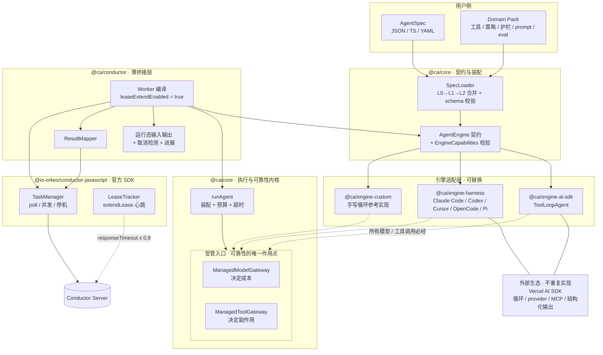

# Conductor AI Agent Worker SDK — 技术架构设计

> 状态：Draft v0.8 ｜ 语言：TypeScript (Node.js ≥ 20) ｜ 编排引擎：Conductor OSS ≥ 3.10.7
> 上游基线（实装核实）：**`ai@7.0.93`**、**`@io-orkes/conductor-javascript@4.0.0`**
>
> ## v0.8：改用 extendLease 心跳，并更正一条事实
>
> v0.7 的执行模型建立在一条**错误的核实结论**上：
>
> > 「队列有 60 秒 unack 窗口，worker 持有任务超过它会被另一个 worker 并发取走。」
>
> 复核后这是错的。`ExecutionService.poll` 的最后一行是
> `tasks.forEach(this::ackTaskReceived)` → `queueDAO.ack` → `DELETE FROM queue_message`
> —— **poll 成功之后任务已经从队列里删掉了**，那个窗口只覆盖 `pop` 到 `ack` 之间的
> 毫秒级间隙，不是 worker 持有任务时长的红线。
>
> 真正的差别在两种模式之间：
>
> | | callback | **extendLease** |
> |---|---|---|
> | 每次交还 | `postpone` **写回队列** | 不交还 |
> | 下一次谁执行 | 队列里谁先 `pop` 谁得 → **任意 worker** | **只能是当前这个** |
> | worker 崩了 | 队列消息到点被别人取走 | `responseTimeout` → `TIMED_OUT` → 消耗一次 retry → 新 taskId |
>
> 于是 v0.8 改用 **extendLease**（[ADR-0022](adr/0022-lease-extend-worker-affinity.md)）：
>
> - `execute()` 就是**把 agent 从头跑到完**，跑多久都行
> - **心跳不自己实现** —— 官方 SDK 的 `LeaseTracker` 按 `responseTimeoutSeconds × 0.8`
>   自动发 `extendLease`，我们只打开 `leaseExtendEnabled: true` 并校验取值
> - **「一次执行始终在同一 worker」是引擎保证的**，失败重试才重新分配
>
> 由此删除 v0.7 引入的：`AgentRunHost`、`RunRegistry`（内存与 Redis）、callback 协议、
> 所有权与心跳自实现、孤儿处置。**SDK 默认零外部依赖。**
>
> v0.7 保留的结论：一次运行从头跑到完成、不切片；删除 journal / 跨分片状态 / fencing；
> 运行标识就是 `taskId`；TaskDef 是只写不读的注册期契约。
>
> **实装状态**：**57 个测试**（54 通过 + 3 个端到端待真机）。
> 端到端验证清单见 [verification.md](verification.md)。

---

## 1. 目标与非目标

### 1.1 目标

让**任意技术栈构建的** AI Agent 都能作为一等公民出现在 Conductor 工作流中：
工作流里放一个 task，背后就是一次完整的、可观测、可恢复、有预算约束的 Agent 运行。

1. **不自建 Agent 能力，只做能力的宿主**。推理循环、上下文管理、工具定义、结构化输出、
   模型 provider 生态——全部由外部 Agent SDK 提供（Vercel AI SDK 为首选参考实现），
   本 SDK 通过 `AgentEngine` 适配它们。
2. **薄 core**。`@ca/core` 只有四件事：`AgentSpec` 契约、`AgentEngine` 契约、
   两个受管入口（模型 / 工具）、执行内核（runAgent / 预算 / 超时 / 能力校验）。
3. **通用配置化 + 领域定制**。`AgentSpec` 是纯数据，可来自 TS / JSON / YAML / 远程配置；
   L0 通用默认 → L1 领域包（Domain Pack）→ L2 实例，逐层覆盖。
4. **可靠性与引擎解耦**。任何引擎只要能让我们包住模型与工具两个入口，
   就自动获得崩溃恢复、effectively-once、预算治理、OTel 埋点。
5. **诚实的能力边界**。不同引擎能力不同（如 sandbox 内执行的 harness 拦截不到工具），
   用 `EngineCapabilities` 显式建模并在启动时校验，不假装统一（§4.4）。
6. **Conductor 对接**：extendLease 心跳（官方 LeaseTracker 托管）+ 运行态 I/O（§5、§6）。

### 1.2 非目标

| 不做 | 由谁做 |
|---|---|
| 推理循环 / 上下文压缩 / 停止条件 / 工具定义 DSL | Agent SDK（AI SDK 的 `ToolLoopAgent`、`stopWhen`、`prepareStep`、`pruneMessages`、`tool()`） |
| 模型 provider 适配 | Agent SDK 的 provider 生态 |
| MCP 客户端 | `@ai-sdk/mcp`（`createMCPClient` + stdio / Streamable HTTP） |
| 统一消息格式 | 引擎自己的格式；core 只把它当作**不透明可序列化载荷**（§4.5） |
| 自研 Conductor 客户端 / poll / 心跳 | 官方 `@io-orkes/conductor-javascript`（[ADR-0006](adr/0006-build-on-official-sdk.md)） |
| 编排引擎、向量库、训练评测平台 | Conductor 本身 / 用户自选 |

### 1.3 与官方 Conductor agents 层的关系

已决议不采用（[ADR-0008](adr/0008-relation-to-official-agent-layer.md)）：它把 Agent 编译成 workflow 交服务端执行，
受其 agent schema 约束，且模型凭据与上下文在服务端。本项目要的是 worker 内闭环 + 任意技术栈。
官方 SDK 的**传输层**仍全量复用。

---

## 2. 关键约束：Conductor 语义 vs. AI Agent

### 2.1 冲突与对策

| # | Conductor 的语义 | Agent 的现实 | 对策 |
|---|---|---|---|
| C1 | worker 持有任务期间 `responseTimeoutSeconds` 内无更新即判死 | 一次运行可能数十分钟 | §5 **extendLease 心跳**，由官方 `LeaseTracker` 托管 |
| C2 | **at-least-once** 投递 | LLM 花钱、工具有副作用 | extendLease 保证同一执行不被并发领取；工具幂等键 |
| C3 | 无取消推送 | Agent 还在烧 token | §6.4 CancellationWatcher → `ctx.signal` |
| C4 | payload 有体积上限（3072 KB 外置 / 10240 KB 失败） | transcript 几 MB | §6.3 Payload 外置 |
| C5 | 无流式通道 | 要看 token 流 | §10.3 旁路 StreamSink |
| C6 | 重试由 `retryCount` 决定 | 有的失败重跑无意义 | §6.2 错误分类：终局错误走 `NonRetryableException` |
| C7 | 并发由 worker 并发数决定 | 瓶颈是 LLM 配额 | §4.3 受管入口上的预算闸门 |

### 2.2 服务端语义（v3.21.21 源码核实结论）

以下每一条都读过源码。

#### 任务生命周期（extendLease 模式）

| 阶段 | 服务端行为 |
|---|---|
| 调度 | `SimpleTaskMapper` 建 `TaskModel(SCHEDULED)`，入队 `taskType[:domain][@ns][-isolation]`；`responseTimeoutSeconds` 从 TaskDef 快照到任务上 |
| **poll** | `queueDAO.pop` → 状态 `IN_PROGRESS`、`startTime`（仅首次）、`pollCount++`、`setWorkerId` → **最后 `ackTaskReceived` → `queueDAO.ack` → `DELETE FROM queue_message`** |
| **持有期** | **任务已不在队列里**，别的 worker 看不到它。唯一约束是 `responseTimeoutSeconds` 内要有更新 |
| **心跳** | `updateTask({extendLease:true})` → `if (isExtendLease) { extendLease(); return null; }` → 只 `setUpdateTime`，**不碰队列、也碰不到 `outputData`** |
| 终态回执 | 写 `outputData`、`queueDAO.remove`（幂等，已删过也无妨） |
| worker 崩了 | 无人心跳 → `isResponseTimedOut` → `timeoutTask()` → `TIMED_OUT` → **消耗一次 `retryCount`** |
| 重试 | **新 taskId**；`task.copy()` **原样携带上次 `outputData`**；`inputData` 重新求值；`startTime=0`；`retryCount+1` |

**「一次执行始终在同一 worker，失败重试才重新分配」是引擎保证的**，不需要 SDK 做任何事。

#### ⚠️ v0.8 更正：60 秒 unack 窗口不是持有时长的红线

v0.7 把下面这段当成 worker 不能长时间持有任务的证据：

```sql
-- PostgresQueueDAO.processUnacks，每 60 秒跑一次（UNACK_SCHEDULE_MS = 60_000L）
UPDATE queue_message SET popped = false
WHERE popped = true AND (current_timestamp - interval '60 seconds') > deliver_on
```

**这条推论是错的。** `poll` 在返回前就 `ack` 掉了消息（`DELETE FROM queue_message`），
所以「`popped = true` 且超期」这个条件只可能命中 `pop` 到 `ack` 之间的**毫秒级**间隙。
任务被 worker 持有期间根本不在 `queue_message` 表里。

#### callback 与 extendLease 的真实差别

| | callback | **extendLease（本 SDK 用）** |
|---|---|---|
| 每次交还 | `updateTask(IN_PROGRESS)` → 状态存为 `SCHEDULED` + `postpone` **写回队列** | 不交还 |
| 下一次谁执行 | 队列里谁先 `pop` 谁得 → **任意 worker** | **只能是当前这个** |
| 能否更新 `outputData` | 能（每次交还都写） | **不能**（`extendLease` 分支提前 return） |
| 最低服务端版本 | 3.x 全系 | **3.10.7**（`TaskResult.extendLease` 引入） |

#### 其余已核实结论

- **没有 worker 亲和机制。** 队列名只由 `taskType[:domain][@ns][-isolation]` 构成，
  `workerId` 全库只用于日志、`setWorkerId` 记录、`updateTaskLastPoll` 指标。
  亲和来自「任务不在队列里」，不是来自路由。
- `responseTimeout` 超时直接调 `timeoutTask()`，**绕过 `timeoutPolicy`**（`ALERT_ONLY` 对它无效）。
  因此 `retryCount` **不可为 0**。
- `checkTaskTimeout` 首行即 `if (… || taskDef.getTimeoutSeconds() <= 0 || …) return;`
  —— **`timeoutSeconds = 0` 时任务永不因总时长超时**，这是长任务的正确配置（§6.6）。
  它还会扣掉 `startDelayInSeconds`，且 `retry()` 会 `setStartTime(0)` → **每次 attempt 重新起算**。
- `WorkflowSweeper.unack()` 把 decider 队列的 unack 设为 `responseTimeoutSeconds + 1`
  —— 该值同时决定工作流的重扫频率，所以不宜设得过小。
- **`outputData` 是整体覆盖，不是合并**（`task.setOutputData(taskResult.getOutputData())`）。
- 官方 `LeaseTracker`：`intervalMs = task.responseTimeoutSeconds × 0.8 × 1000`，
  **`intervalMs < 1000` 时静默跳过不发心跳**（对应 `responseTimeoutSeconds < 1.25`），
  跑在独立的 100ms 定时器上，并发槽占满也照常心跳。
- `TaskDef` 的 `inputKeys` / `outputKeys` 在全库**没有任何读取点**（纯 UI 文档）；
  `inputSchema` / `outputSchema` / `enforceSchema` 只有 proto 映射、**没有校验逻辑**。
  唯一真正流到 worker 的定义态字段是 `inputTemplate`，且由服务端在调度那一刻
  `putIfAbsent` 合并进 `inputData` —— worker 看到的已经是合并后的结果。
- 输入超过 `taskInputPayloadSizeThreshold`（默认 3072 KB）会被外置：
  `externalizeInput()` 把 `inputData` **清空**只留 `externalInputPayloadStoragePath`，
  而官方 JS SDK **完全不处理这个字段**。不显式取回就会静默拿到 `{}`（§6.5）。
- ⚠️ `3.21.21` 在 Docker Hub 上**没有发布镜像**（3.21.x 只有 `3.21.24-rc.1`，
  最近的稳定版是 `3.22.x`）。本节结论均据 3.21.21 源码核实。

### 2.3 谁关注什么超时

超时是**引擎的事**，worker 一个字都不读（[ADR-0020](adr/0020-runid-is-taskid.md)）。

| 超时 | 归谁 | 来源 |
|---|---|---|
| 单次模型调用 | **worker** | `spec.limits.modelCallTimeoutMs` |
| 单次工具执行 | **worker** | `spec.limits.toolCallTimeoutMs` / `ToolPolicy.timeoutMs` |
| 一次 agent 运行的总时长 | **worker** | `spec.limits.wallClockMs` |
| 任务总时长 / 重试策略 | **引擎** | TaskDef，注册期写入，运行期不读 |
| worker 多久没心跳算死 | **引擎** | TaskDef 的 `responseTimeoutSeconds`；心跳由官方 `LeaseTracker` 自动发 |

## 3. 总体架构

### 3.1 两条核心洞察

**其一：可靠性不需要拥有循环。**

v0.3 的 core 自建了推理循环，因为「要幂等、要扣预算，就得掌控每一步」。这个前提是错的。
可靠性只依赖两个受管入口：

1. **模型调用** —— 决定成本，是预算闸门的作用点。
2. **工具执行** —— 决定副作用，是幂等契约与超时的作用点。

只要能包住这两个入口，循环归谁都无所谓。而现成 Agent SDK 恰好都提供了这两个包装点，
以 Vercel AI SDK 为例：

| 受管入口 | AI SDK 的包装点 |
|---|---|
| 模型调用 | `wrapLanguageModel({ model, middleware })` 的 `wrapGenerate` / `wrapStream` |
| 工具执行 | 包装 `tool({ execute })` 的 `execute` |

于是 core 可以变得很薄：**它不写循环，它写拦截器。**

**其二：编排引擎已经提供了「长任务独占一个 worker」，不该自己再造一遍。**

v0.6 把 agent 切片塞进 `execute()`，引入了跨分片状态持久化、journal 重放、fencing 一整条机制链。
v0.7 换成异步后台跑 + 运行注册表，又造了所有权、心跳、孤儿接管一整套。
两版都在解决同一个自找的问题。

真相很简单（§2.2）：**`poll` 成功后任务就从队列里删掉了**，只要 worker 按
`responseTimeoutSeconds × 0.8` 的节奏发一次 `extendLease`，任务就一直归它，
想跑多久跑多久。而这个心跳**官方 SDK 的 `LeaseTracker` 已经实现好了**。

于是 `execute()` 回归最朴素的形态：**把 agent 从头跑到完，然后返回**。
没有分片、没有后台宿主、没有注册表、没有 Redis。

### 3.2 分层



> 图例：实线为装配与数据流；**虚线为引擎对受管入口的调用**（引擎适配器的唯一硬性义务），
> 以及官方 `LeaseTracker` 独立于我们的调用栈、直接向服务端发心跳的那条路径。

四条结构性约束：

1. **`@ca/core` 不依赖任何 Agent SDK，也不依赖 Conductor**。它只认自己的契约。
2. **`@ca/core` 不定义统一消息格式**。引擎的消息/状态对 core 是**不透明的可序列化载荷**（§4.5）。
3. **引擎必须让模型与工具调用经过受管入口**，否则其 `EngineCapabilities` 必须如实声明能力缺失，
   core 据此降级或拒绝启动（§4.4）。
4. **Conductor 对接层（§5、§6）与引擎无关**：换引擎不影响心跳、输入输出、结果映射。
5. **心跳不自己实现**：`LeaseTracker` 是官方 SDK 的，我们只打开开关并校验取值（ADR-0022）。

### 3.3 包划分

| 包 | 职责 | v0.4 变化 |
|---|---|---|
| `@ca/core` | `AgentSpec`、`AgentEngine` 契约、两个受管入口、运行注册表与后台宿主、预算/超时、能力校验、SpecLoader | v0.7 再度变薄 |
| `@ca/engine-ai-sdk` | 适配 AI SDK `ToolLoopAgent`：模型中间件注入、工具包装、审批映射 | **新增** |
| `@ca/engine-harness` | 适配 AI SDK `HarnessAgent`（Claude Code / Codex / Cursor / OpenCode / Pi 等） | **新增** |
| `@ca/engine-custom` | 最小手写循环参考实现，兼作契约基线与一致性测试样本 | **新增** |
| `@ca/conductor` | 官方 SDK 之上的薄桥接层 | 不变 |
| `@ca/memory` | `BlobStore` / `MemoryStore` | **可选** —— 只在结果超出 outputData 预算时用得上 |
| `@ca/observability` | OTel GenAI span 与 Agent 语义指标 | 不变 |
| `@ca/testing` | 引擎一致性套件、脚本化模型、契约测试设施 | 职责扩展 |
| `@ca/cli` | 脚手架、TaskDef 注册、spec 校验与 diff、运行状态查看、插件/包列表 | 增加 spec 能力 |
| ~~`@ca/providers-anthropic`~~ / ~~`@ca/providers-openai`~~ | — | **删除**：AI SDK provider 生态已覆盖 |
| ~~`@ca/tools-mcp`~~ | — | **删除**：`@ai-sdk/mcp` 已覆盖本地 stdio / Streamable HTTP |

> 删掉三个包是本轮最实在的收益：它们都是在重复外部生态已经做好、且做得更好的事。

---

## 4. 核心抽象（`@ca/core`）

### 4.1 `AgentSpec` —— 纯数据的 Agent 描述

```ts
interface AgentSpec {
  name: string;
  version?: number;

  /** 引擎标识，如 'ai-sdk/tool-loop' | 'ai-sdk/harness' | 自定义注册名 */
  engine: string;
  /** 透传给引擎的原生配置（不透明，由引擎自行校验） */
  engineOptions?: JsonValue;

  /** 工具的**可靠性策略**（不是工具实现，实现在引擎侧） */
  toolPolicies?: Record<string, ToolPolicy>;

  limits?: AgentLimits;
  guardrails?: GuardrailRef[];
  conductor?: Partial<ConductorTaskOptions>;

  /** 领域包与预设的引用，由 SpecLoader 解析合并 */
  extends?: string[];
}
```

**为什么是纯数据**：这是「通用配置化」的地基。Spec 可以来自 TS 常量、JSON、YAML、
或远程配置中心；可以被 diff、被审计、被灰度、被非工程角色改。
引擎原生配置放在 `engineOptions` 里透传，core 不试图统一它们——统一它们就等于重新发明每个 SDK。

### 4.2 `AgentEngine` —— 一次完整运行的契约

```ts
interface AgentEngine {
  readonly id: string;
  /** 暴露给领域包的契约版本（ADR-0017），与上游 SDK 的版本号无关 */
  readonly contractVersion: number;
  readonly capabilities: EngineCapabilities;
  /** 引擎自带的内建工具名，供 §4.4 的 host-declared-only 规则校验 */
  readonly builtinTools?: readonly string[];
  /** 由 spec 构建可复用的引擎实例（进程级，跨 run 复用） */
  build(spec: AgentSpec, deps: EngineBuildDeps): Promise<BuiltAgent>;
}

interface BuiltAgent {
  /**
   * **从头跑到完成。** 返回最终输出；失败就抛。
   * 引擎必须把所有模型调用经 gateways.model、所有工具执行经 gateways.tools。
   */
  run(args: EngineRunArgs): Promise<JsonValue>;
}

interface EngineRunArgs {
  input: JsonValue;
  /**
   * 上一次 attempt 的 outputData —— Conductor 在重试时**原生携带**（§2.2）。
   * 首次执行为 undefined。要不要参考、怎么参考是**业务判断**，引擎不猜。
   */
  previousAttempt?: JsonValue;
  /** 本次运行的预算，由引擎翻译成原生停止条件 */
  budget: RunBudget;
  ctx: RunContext;
  gateways: { model: ManagedModelGateway; tools: ManagedToolGateway };
}
```

契约只有 3 个成员（`build` / `run` / `capabilities`），刻意做到「任何 Agent SDK 都能在几十行内适配」。

**v0.7 删掉了 `EngineTurn` 联合类型。** 一次 run 从头跑到完成，没有 `continue`（分片没了），
也没有 `suspended`（等待改在运行内部完成，§4.7）。只剩两种结局：返回结果，或者抛。
失败的可重试性由 `CaError.retryable` 表达 —— 桥接层据此决定走 `FAILED` 还是
`NonRetryableException`（§6.2）。

### 4.3 两个受管入口

```ts
/** 引擎的所有模型调用必须经过这里 */
interface ManagedModelGateway {
  /**
   * @param call 引擎原生的请求载荷（不透明，但必须可 JSON 序列化以便算幂等键）
   */
  guard<T>(call: JsonValue, invoke: () => Promise<{ result: T; usage: Usage }>): Promise<T>;
}

/** 引擎的所有工具执行必须经过这里 */
interface ManagedToolGateway {
  guard<T>(
    toolName: string,
    input: JsonValue,
    invoke: (opts: { idempotencyKey: string }) => Promise<T>,
  ): Promise<T>;   // 可能抛 GuardrailBlockedError / BudgetExceededError / CallTimeoutError
}
```

`guard` 内部依次做：**取消检查 → 预算闸门 → 超时闸门 → 幂等键注入 → 执行 → 记账 → 事件**。

关键在于闸门的**位置**：预算是在**调用之前**拦住，不是事后统计。
超预算时下一次模型调用根本不会发出去 —— 这是「预算」和「账单」的区别。

这就是全部。引擎作者只需要保证「调用走这两个函数」，其余可靠性机制自动获得
（[ADR-0012](adr/0012-reliability-by-interception.md)）。

以 AI SDK 为例，适配器大致是：

```ts
// @ca/engine-ai-sdk（示意）
const model = wrapLanguageModel({
  model: userModel,
  middleware: {
    wrapGenerate: ({ doGenerate, params }) =>
      gateways.model.guard(hashableParams(params), async () => {
        const r = await doGenerate();
        return { result: r, usage: toUsage(r.usage) };
      }),
  },
});

const tools = mapValues(userTools, (t, name) => ({
  ...t,
  execute: (input, opts) =>
    gateways.tools.guard(name, input, ({ idempotencyKey }) =>
      t.execute!(input, { ...opts, idempotencyKey })),
}));
```

### 4.4 `EngineCapabilities` —— 诚实的能力边界

不同引擎能力差异很大，core 显式建模而不是假装统一：

```ts
interface EngineCapabilities {
  /**
   * 成本可见性（v0.6 取代原来的 interceptModel 布尔量）：
   * 'per-call' 每次模型调用都经过受管入口 → 预算可在调用**前**拦截
   * 'per-turn' 拦不到单次调用，但每轮结束有 usage → 事后记账 + **轮间**预算闸门
   * 'none'     完全无成本可见性 → 拒绝启动
   */
  costVisibility: 'per-call' | 'per-turn' | 'none';
  /**
   * 工具拦截范围（v0.6 取代原来的 interceptTools 布尔量）：
   * 'all'                所有工具都经过受管入口
   * 'host-declared-only' 只有我们声明的工具拦得到，引擎自带的内建工具拦不到
   * 'none'               一个都拦不到 → 拒绝任何 effectful 策略
   */
  toolInterception: 'all' | 'host-declared-only' | 'none';
  /** 是否支持在运行内部完成人工审批的两段式等待（§4.7） */
  suspend: 'native-approval' | 'none';
  /** 进展反馈能到什么粒度（§10.4）。它同时是「运行还活着」的心跳来源（§5.2） */
  progress: 'step' | 'turn' | 'none';
  streaming: boolean;
  structuredOutput: boolean;
}
```

#### v0.5 的假设被推翻：harness 的模型调用**全部**拦不到

v0.5 猜测「sandbox 型 harness 的模型调用可能也在沙箱内」，列为待实测。
按 `ai@7.0.93` 核实，实际情况比猜测更彻底，而且**与沙箱无关**：

- `HarnessAgent({ harness, model: 'claude-sonnet-4-6', sandbox, ... })` 的 `model` 是一个
  **harness 专属的字符串标识符**，不是 AI SDK 的 `LanguageModel` 对象。
- 官方原话：「The AI SDK harness abstraction is **separate from the provider/model abstraction**」，
  且「Set `model` to select the model that **the harness runtime uses**」。

根本没有可供 `wrapLanguageModel` 包装的模型对象 —— **9 个适配器一律 `costVisibility: 'per-turn'`**，
连 host-process 的 Cline、Pi 也不例外。问题不在沙箱，在于**模型调用整体归 harness 所有**。

好消息是 usage 有上报：适配器会把 `result.usage` 归一化成 AI SDK 的形状，
因此 **turn 级记账与轮间预算闸门可行**（跑完一轮结账，超预算就不发起下一轮）。

#### 工具拦截按来源分，不是一个布尔量

harness 的工具有两个来源，拦截能力完全不同：

| 工具来源 | 谁执行 | 我们拦得到吗 |
|---|---|---|
| **内建工具**（读写文件、跑命令等） | harness 运行时自己执行 | ❌ |
| **host-declared 工具**（我们用 AI SDK `tool()` 传进去的） | 「`HarnessAgent` executes the tool in your host」 | ✅ |

所以 harness 一律 `toolInterception: 'host-declared-only'`：`effectful` 策略**只能声明在 host-declared 工具上**。
对内建工具的副作用防护只能依赖 harness 自己的 approval 机制与沙箱隔离——我们不提供，也不假装提供。

#### 修正后的适配器能力表（依据 `ai@7.0.93`）

| 适配器 | 工具运行位置 | `costVisibility` | `toolInterception` | 原生审批 | 结构化输出 |
|---|---|---|---|---|---|
| Cline | host process | per-turn | host-declared-only | ✅ | ✅ |
| Pi | host process | per-turn | host-declared-only | ✅ | ❌ |
| Claude Code | sandbox bridge | per-turn | host-declared-only | ✅ | ✅ |
| Deep Agents | sandbox bridge | per-turn | host-declared-only | ✅ | ✅ |
| OpenCode | sandbox bridge | per-turn | host-declared-only | ✅ | ✅ |
| **Codex** | sandbox bridge | per-turn | host-declared-only | **❌** | ✅ |
| Cursor | sandbox via ACP | per-turn | host-declared-only | ✅ | ❌ |
| fx | sandbox via ACP | per-turn | host-declared-only | ✅ | ❌ |
| Grok Build | sandbox via ACP | per-turn | host-declared-only | ✅ | ✅ |

对比：`ai-sdk/tool-loop` 是 `costVisibility: 'per-call'` + `toolInterception: 'all'`。

一致性测试各取一个代表即可：**Pi**（host process）与 **Claude Code**（sandbox）。
9 个里只有 **Codex 没有原生审批** → `suspend: 'none'`（§4.7）。

#### 能力—配置一致性校验

启动时校验，不满足则拒绝启动或显式降级并告警：

| 情况 | core 的处理 |
|---|---|
| `costVisibility: 'none'` | **拒绝启动**——完全看不见成本 |
| `costVisibility: 'per-turn'` | 允许；预算改为**轮间闸门**（跑完一轮结账，超了不发起下一轮），并告警「单轮内可能超支」 |
| `toolInterception: 'none'` 且 spec 有 `effectful` 工具 | **拒绝启动**——幂等保护不存在 |
| `toolInterception: 'host-declared-only'` 且 `effectful` 声明在**内建工具**上 | **拒绝启动**——那个工具我们碰不到 |
| `suspend: 'none'` 且 spec 声明了 `approval` | **拒绝启动**——不能让它跑到一半才发现停不下来 |
| `progress: 'none'` | 允许；但心跳只能靠固定节拍，失联判定变迟钝 → 告警建议放宽 `orphanAfterMs` |

> 这是本设计里最容易被省略、也最不该省略的部分。宣称"支持任意 SDK"而不说清能力差异，
> 会让用户在 harness 上误以为拿到了调用级成本管控与副作用保护。

### 4.5 core 不定义统一消息格式

v0.3 的 core 有一套 `Message` / `Part`（text / tool_use / tool_result / image / thinking）联合类型。
**v0.4 删除。**

core 对引擎状态与模型载荷只有两个要求：**可 JSON 序列化**、**可稳定哈希**。
`ModelCallRecord` 里的 `response` 是 `JsonValue`，core 不解释它。

理由：统一消息格式意味着为每个 provider 写双向转换、追每个新特性（thinking block、
并行 tool call、cache control、多模态），这正是 AI SDK 已经做完、且做得更好的事。
代价是 core 无法对消息做语义级操作（如通用的上下文压缩）——但那本来就该由引擎做
（AI SDK 的 `prepareStep` + `pruneMessages`）。

### 4.6 工具策略 vs 工具实现

工具**实现**用引擎的原生写法（AI SDK 的 `tool({ inputSchema, execute })`），core 不发明第二套。
core 只按名字附加**可靠性策略**：

```ts
interface ToolPolicy {
  /** 幂等契约，决定崩溃恢复时的行为（ADR-0005） */
  effect: 'pure' | 'idempotent' | 'effectful';
  onAmbiguousReplay?: 'fail' | 'retry' | 'probe';
  timeoutMs?: number;
  concurrencyKey?: string;
  /** 需要人工审批 —— 映射到引擎的原生审批或 replay-signal（§4.7） */
  approval?: 'never' | 'always' | 'policy';
  /** 返回值是否标记为不可信（提示注入防护，§9） */
  trust?: 'trusted' | 'untrusted';
}
```

未在 `toolPolicies` 中声明的工具默认按 `pure` 处理并发出运行时告警；
`strictPolicies: true` 下拒绝注册未声明策略的工具。

### 4.7 等待外部（HITL / 慢接口）：按时长分两档

extendLease 模式下 agent 独占一个 worker 直到跑完，所以「等」这件事有明确的成本边界：
等的时候占着一个并发槽。据此分两档。

**短等待（秒级到分钟级：慢接口、外部计算）→ 工具内 `await`。**

```ts
tool({
  execute: async (input, { idempotencyKey }) => {
    const job = await vendor.submit(input, idempotencyKey);
    return vendor.waitUntilDone(job);        // ← 就在这等
  },
})
```

期间受管工具入口按 `ToolPolicy.timeoutMs` 计时，官方 `LeaseTracker` 照常心跳，
任务在 Conductor UI 上一直是 `IN_PROGRESS`。

**长等待（人工审批、跨天）→ 交给工作流，别让 agent 等。**

```
agent_审核(判断该不该退款)  →  HUMAN(人工审批)  →  agent_执行退款
        ↓ COMPLETED                                      ↑
        outputData = { ok: false, awaiting: {            │
          kind: 'approval', reason: '金额超限',           │
          proposal: { orderId, amount } } } ─── SWITCH ──┘
```

SDK 提供的是「agent 能返回一个结构化的**需要人来定**结果」，复用 §6.2 已有的
「做不到但流程该继续」映射（`COMPLETED` + `ok:false`）。

为什么不让 agent 自己等几天：
- 占着一个并发槽不放
- `wallClockMs` 得设成天级，超时保护形同虚设
- worker 一挂，等待连同整次运行全丢

Conductor 原生就有 HUMAN / WAIT 任务。**该编排的事交给编排引擎，别在一个 task 里造迷你工作流。**

> 引擎级的两段式审批（`capabilities.suspend = 'native-approval'`）留到 M5，
> 那是适配器**内部**的短审批循环，桥接层不参与。M1 的 `ai-sdk/tool-loop`
> 声明 `suspend: 'none'`：spec 里写 `approval` 会在启动时被拒绝并提示改用上面两档。
>
> ⚠️ 不要试图「交还任务 + 等外部把决定写回 `inputData`」：`inputData` 在一个 task 实例的
> 生命周期内是**冻结的**（`updateTask` 从不碰它），决定根本送不进来。

### 4.8 `RunContext`

```ts
interface RunContext {
  /** 本次运行的标识 —— 就是 Conductor 的 taskId（§5.3） */
  readonly runId: string;
  /** Conductor 的 retryCount。>0 说明这是重试，previousAttempt 里有上次的输出 */
  readonly attempt: number;
  readonly tenantId?: string;
  readonly source?: ConductorSource;
  readonly startedAt: number;
  /** startedAt + limits.wallClockMs */
  readonly deadline: number;
  /** 取消 / 超时 / 工作流被终止，统一经由此 signal 传播 */
  readonly signal: AbortSignal;
  readonly logger: Logger;
  readonly budget: BudgetView;
  readonly secrets: SecretProvider;
  emit(event: AgentEvent): void;
}
```

`runKey` 与 `sliceIndex` 在 v0.7 删除：前者被 `runId`（= taskId）取代，后者随分片一起消失。

---

## 5. 执行模型

### 5.1 一次运行 = 一次完整的 agent 执行

`execute()` 就是把 agent 从头跑到完：

```
poll → 任务被 ack 从队列删除，只属于这个 worker
     → execute() 里 runAgent()，跑多久都行
       官方 LeaseTracker 同时按 responseTimeoutSeconds × 0.8 自动发 extendLease 心跳
     → 返回终态，任务结束

worker 崩了 → 没人心跳 → responseTimeout 后判 TIMED_OUT
            → 消耗一次 retryCount → 新 taskId 重新分配给别的 worker
```

`runAgent()` 装好受管入口（预算、超时、幂等键、事件），让引擎跑到完成，把结果收回来。
agent 的全部状态自始至终在这一次调用的内存里。

```ts
type RunOutcome =
  | { kind: 'done';   output: JsonValue;      budget: BudgetSnapshot }
  | { kind: 'failed'; error: SerializedError; budget: BudgetSnapshot };
```

**「一次执行始终在同一 worker」是引擎保证的**（§2.2），SDK 不需要注册表、
不需要所有权、不需要心跳实现、不需要任何外部存储。

### 5.2 心跳交给官方 LeaseTracker

我们只做两件事：

```ts
{ taskDefName, leaseExtendEnabled: true, execute }   // ① 打开开关
assertHeartbeatViable(responseTimeoutSeconds)        // ② 启动时校验取值
```

官方 `LeaseTracker` 的行为（源码核实）：

| 项 | 值 |
|---|---|
| 心跳间隔 | `task.responseTimeoutSeconds × 0.8 × 1000` ms |
| 读的值 | **运行态任务上的快照**（调度那一刻从 TaskDef 复制） |
| 定时器 | 独立的 100ms 轮询，**并发槽占满也照常心跳** |
| 请求 | v1 `updateTask({ taskId, workflowInstanceId, status: 'IN_PROGRESS', extendLease: true })` |
| ⚠️ 静默失效条件 | `intervalMs < 1000`（即 `responseTimeoutSeconds < 1.25`）→ **直接 return，不发心跳** |

最后一条是配置陷阱：设得太小不会报错，只会让任务在 `responseTimeoutSeconds` 后被判死。
`compileAgentWorker()` 在启动时就拒绝这种配置。

服务端要求 **≥ 3.10.7**（`TaskResult.extendLease` 自该版本引入），
`assertExtendLeaseSupported()` 可在装配时探测。

### 5.3 运行的身份就是 `taskId`

| 标识 | 同一次执行 | 重试（新一次执行） | 新工作流实例 |
|---|---|---|---|
| **`taskId`** | **不变** | **新生成** | 新生成 |
| `pollCount` | **恒为 1** | 重置为 0 → 1 | 1 |
| `retryCount` | 不变 | +1 | 0 |
| `retriedTaskId` | — | 指向上次 taskId | 空 |
| `outputData` | 结束时写一次 | 上次 attempt 写的（`task.copy()` 携带） | 空 |
| `inputData` | 冻结 | 重新求值 | — |

`pollCount > 1` 或 `retryCount > 0` 就意味着**发生过重新分配**（上一个 worker 崩了或超时），
这是很有用的运维信号。

`runId = task.taskId`，不需要自拼恢复锚点（[ADR-0020](adr/0020-runid-is-taskid.md)）。

### 5.4 运行期只有一个周期任务

`execute()` 内部起一个 `setInterval`，做两件与心跳无关的事：

1. 把攒下的 Task Log 推给 Conductor（§10.4 —— 运行途中唯一能看见进展的通道）
2. 查工作流是否已被终止 → `controller.abort()` → 传导到 `ctx.signal`

心跳**不在这里** —— 那是 `LeaseTracker` 的事，跑在官方 SDK 自己的定时器上。

另外还有一个一次性的 `wallClockMs` 定时器：超时就 abort，`execute()` 以终局错误返回，
不必等引擎判超时。

### 5.5 副作用与幂等

受管工具入口把 `idempotencyKey = sha256(kind|toolName|归一化输入)#出现序号` 传给工具实现，
供下游系统自己去重。用**内容**而非顺序作键，因为引擎会并发执行工具，顺序号在并发下不稳定。

`ToolPolicy.effect` 决定超时后的处置：

| `effect` | 超时时上报 | 理由 |
|---|---|---|
| `pure` / `idempotent` | `retryable: true` | 重跑安全 |
| `effectful` | **`retryable: false`** | 副作用是否已生效未知，交给工作流的补偿分支决定，不擅自重试 |

### 5.6 明确接受的两条代价

**一、运行途中无法更新 `outputData`。**

`updateTask` 的实现是 `if (taskResult.isExtendLease()) { extendLease(taskResult); return null; }`
—— 在碰 `outputData` **之前**就 return 了；而正常的 `updateTask(IN_PROGRESS)` 会把任务
`postpone` 回队列，那就破坏了亲和。

| 通道 | 运行中可见？ |
|---|---|
| `outputData.progress`（权威） | ❌ 只在结束时写一次 |
| Conductor Task Log | ✅ `addTaskLog` 不碰队列，运行途中照常写 |

「运行中就要知道进展」（§10.4）**仍然满足**，但工作流用
`${ref.output.progress.step}` 做**运行中**分支判断这条路没了。

**二、一个长跑 agent 占住一个并发槽的全程。**

`concurrency` 的含义从「每秒处理几个任务」变成「**同时最多跑几个 agent**」。
这是亲和的必然代价，也是正确的代价 —— 一次 agent 运行本来就该独占一份资源配额。

**worker 崩溃仍然是整次运行重来**（重复付费）。它现在走的是 Conductor 标准重试路径，
归因清楚；要止血需要 checkpoint 或 journal，先量数据再决定（§15.3 第 1 条）。

---

## 6. Conductor 桥接层

- **6.1 Worker 编译**：`AgentSpec` → 官方 `ConductorWorker`（`leaseExtendEnabled: true`），
  交给官方 `TaskManager` 托管。`execute()` 内就是 `runAgent()`。
- **6.2 状态映射**：
  | 运行结果 | Conductor |
  |---|---|
  | 完成 | `COMPLETED` |
  | 「做不到但流程该继续」 | `COMPLETED` + `ok:false`（走工作流的 SWITCH 分支） |
  | 可重试失败 | `FAILED`（由 `TaskDef.retryCount` 决定重试） |
  | 终局失败 | 抛 `TerminalTaskError` → 调用方转 `NonRetryableException` |
- **6.3 Payload 治理**：`outputData` 默认 256KB 预算（比服务端 3072KB 外置阈值保守），
  超出按 `payloadStrategy` 外置到 `BlobStore` 或截断。
- **6.4 CancellationWatcher**：轮询 workflow 状态 → `ctx.signal`（Conductor 不推送取消）。
  同工作流的并发查询会被合并与缓存。
- **6.5 运行态输入输出**：见下。
- **6.6 TaskDef 推导（注册期）**：见下。
- **6.7 Domain 路由**：透传官方 `domain`。

### 6.5 运行态的输入与输出

边界很硬：

- **进** —— `task.inputData` **原样**就是 agent 的输入。没有保留键、没有命名空间、没有魔法。
- **出** —— `outputData` 由桥接层在**结束时**生成一次。

```jsonc
// 工作流定义里作者要写的全部内容
"inputParameters": { "question": "${workflow.input.question}" }
```

```jsonc
// outputData（只在终态写）
{ "ok": true,  "status": "done",   "taskId": "…", "result": { … }, "progress": {…}, "usage": {…} }
{ "ok": false, "status": "failed", "taskId": "…", "error": { name, message, retryable }, … }
```

定义态的 `inputKeys` / `outputKeys` / `inputTemplate` **一概不参与**（§2.2 已核实）。

⚠️ **大输入必须显式取回。** 服务端外置输入时会把 `inputData` 清空只留
`externalInputPayloadStoragePath`，而官方 JS SDK 不处理这个字段。
`resolveInput()` 遇到它而没有配 `externalInputResolver` 时**直接判终局失败** ——
绝不静默拿着 `{}` 继续跑，那会让 agent 基于空输入烧一遍 token 并给出错误答案。

**重试时上一次 attempt 的 `outputData` 由引擎原生携带**（`retry()` 里 `task.copy()`
不重置 `outputData`），作为 `EngineRunArgs.previousAttempt` 交给 agent 做**业务判断**。
它不是恢复机制 —— 恢复机制是重跑。

### 6.6 TaskDef 推导（注册期，只写不读）

`deriveTaskDef(spec)` 的产物交给 `MetadataClient.registerTask`，**绝不出现在 `execute()` 的调用栈上**。

| 字段 | 值 | 理由 |
|---|---|---|
| `responseTimeoutSeconds` | **60** | extendLease 模式下这是**崩溃检测灵敏度**，不是运行时长上限。worker 活着就一直心跳、任务想跑多久跑多久；worker 挂了 60 秒后判 `TIMED_OUT` 并重新分配。心跳因此是每 48 秒一次。⚠️ 不能 < 1.25（官方直接跳过心跳），也不宜过小（它同时决定工作流重扫频率） |
| `timeoutSeconds` | **0** | `checkTaskTimeout` 首行即 `<= 0 → return`。长任务不设总时长上限，跑飞由 worker 的 `wallClockMs` 兜底。需要硬 SLA 上限可用 `conductor.taskTimeoutSeconds` 指定 |
| `retryCount` | 3 | **worker 崩溃会真的消耗它**，不可为 0 |
| `retryLogic` / `retryDelaySeconds` | `EXPONENTIAL_BACKOFF` / 5 | |
| `timeoutPolicy` | `RETRY` | 只对 `timeoutSeconds` 生效，对 `responseTimeout` 无效 |

`diffTaskDefs()` 在启动时比对线上定义与本地推导，**告警不阻塞**。
⚠️ 其中 `responseTimeoutSeconds` 的漂移**是要紧的**：`LeaseTracker` 读的是运行态任务上的
快照值（调度那一刻从线上 TaskDef 复制），线上被调小到 1.25 秒以下会让心跳被静默跳过。

---

## 7. 配置化与领域定制

### 7.1 三层组合

| 层 | 内容 | 提供者 |
|---|---|---|
| **L0 通用默认** | 引擎默认、限额默认、基础护栏、Conductor 参数推导 | SDK 内置 |
| **L1 领域包（Domain Pack）** | 领域工具、领域护栏、prompt 模板、spec 片段、eval 数据集、领域 schema/词表 | `@acme/ca-pack-<domain>` |
| **L2 实例** | 具体 agent 的 spec，覆盖前两层 | 使用方 |

```ts
// L1：领域包
export default definePack({
  name: '@acme/ca-pack-insurance',
  version: '2.1.0',
  tools: { lookupPolicy, checkCoverage, openClaim },   // AI SDK tool() 定义
  toolPolicies: { openClaim: { effect: 'effectful', approval: 'always' } },
  guardrails: [piiRedaction, policyNumberValidation],
  prompts: { triage: 'prompts/triage.md' },
  specs: { claimsTriageBase },
  evals: 'evals/claims-triage.jsonl',
});
```

```jsonc
// L2：实例 spec（可以是 JSON / YAML / TS）
{
  "name": "claims_triage",
  "extends": ["@acme/ca-pack-insurance#claimsTriageBase"],
  "engine": "ai-sdk/tool-loop",
  "engineOptions": { "model": "claude-sonnet-5", "stopWhen": { "isStepCount": 30 } },
  "toolPolicies": { "openClaim": { "effect": "effectful", "onAmbiguousReplay": "probe" } },
  "limits": { "maxCostUsd": 2, "wallClockMs": 900000 },
  "conductor": { "responseTimeoutSeconds": 60, "domain": "insurance" }
}
```

### 7.2 SpecLoader

合并顺序 L0 → L1（按 `extends` 顺序）→ L2，**后者覆盖前者**；数组字段的合并策略显式声明
（`guardrails` 追加、`toolPolicies` 按键覆盖）。合并后用 JSON Schema 校验，
并输出**有效配置快照**（effective spec），使「这次运行到底用的什么配置」可追溯——
配置化系统里这一条比什么都重要。

存放位置要分开，否则会撑爆 §6.3 的 `outputData` 预算：
**全文随结果写入**（超阈值按 §6.3 外置到 `BlobStore` 留 ref），
**`outputData` 里只放 `specHash`**（加可选的 `specRef`）。排查时用 hash 反查全文。

`ca spec diff` 比较两个 spec 的有效配置；`ca spec explain <field>` 说明某字段来自哪一层。

### 7.3 领域定制的扩展位

Domain Pack 可贡献：工具、工具策略、护栏、prompt、引擎预设、spec 片段、eval 数据集、领域 schema。
**不可贡献**：受管入口的实现、执行与心跳语义、Conductor 映射——这些是 core 的不变量。

> ⚠️ 信任边界：Pack 与引擎适配器都运行在 worker 进程内，具备完整权限，应按依赖审计对待（§9）。

### 7.4 引擎契约版本 —— 让领域包不被上游升级打穿

领域包里的工具用引擎的原生格式写（AI SDK 的 `tool()`），所以上游 SDK 换代时包会破。
直接让包声明 `ai@^5` 是错的：那把包和一个我们控制不了的版本号绑死了。

**每个引擎自带一个由我们维护的契约版本**，Pack 声明兼容范围，`SpecLoader` 合并时校验：

```ts
// 引擎适配器声明
export const engine: AgentEngine = { id: 'ai-sdk/tool-loop', contractVersion: 1, /* ... */ };

// 领域包声明
definePack({ name: '@acme/ca-pack-insurance', engines: { 'ai-sdk/tool-loop': '^1' }, /* ... */ });
```

契约版本只在**适配器暴露给 Pack 的形状**变化时才 +1。适配器实际只依赖上游 3 个 API 面
（`wrapLanguageModel` 中间件、`tool.execute` 包装、`stopWhen`），
上游升级只要没动这三处，契约版本不变，所有 Pack 无需跟随。

> 类比 USB：设备只认「USB 3.0」这个接口标准，不必关心主板换了什么型号。
> 详见 [ADR-0017](adr/0017-engine-contract-version.md)。

---

## 8. 状态、记忆与存储

| 抽象 | 存什么 | 生命周期 | 必需？ |
|---|---|---|---|
| `BlobStore` | 超出 `outputData` 预算的结果、工具产物 | 与审计要求一致（默认 30 天） | **可选**（不配则按 `payloadStrategy` 截断） |
| `MemoryStore` | 跨 run 的长期记忆 | 业务定义 | 待实现（M2+） |

**SDK 默认零外部依赖。** extendLease 保证一次执行始终在同一个 worker 进程内（§2.2），
agent 的状态自始至终在这一次 `execute()` 调用的内存里 —— 没有跨进程状态，
也就没有共享存储的需求。

v0.6 的 `StateStore`（journal / 租约 / fence）与 v0.7 的 `RunRegistry`（运行注册表）
都已删除：前者服务于分片模型，后者服务于异步宿主，两者的前提都不成立了。

---

## 9. 安全

- **密钥**：`SecretProvider`；禁止把密钥放进 task input。
- **提示注入**：`ToolPolicy.trust = 'untrusted'` 标记外部来源返回值；**系统指令永不由工具输出拼接而成**。
- **工具授权**：per-spec 允许清单 + per-tenant 覆盖；`approval` 策略走 §4.7。
- **多租户**：`tenantId` 贯穿 → 密钥、预算、限流、存储前缀、指标维度、Conductor domain。
- **引擎与 Pack 的信任边界**：同进程、完整权限。`ca packs list` 展示每个包贡献的扩展位。
- **sandbox 型 harness**：工具在沙箱内执行，我们的护栏与幂等**够不着**（§4.4）。
  这既是限制也是收益（隔离更强），必须在文档中写明取舍。

---

## 10. 可观测性

### 10.1 Trace

```
span: agent.run             (spec.name, engine.id, run_key, workflow_id, tenant)
 ├─ span: agent.run         ← 一次完整运行一个（runId = taskId，一次执行内恒定）
 │   ├─ span: gen_ai.chat   ← ManagedModelGateway 产生（含 replay 标记）
 │   └─ span: tool.execute  ← ManagedToolGateway 产生（tool.effect, idempotency_key）
 └─ span: agent.slice[1]
```

**两个受管入口天然就是埋点位置** —— 不需要引擎配合，换引擎不丢埋点。
引擎若另有原生回调（AI SDK 的 `onStepFinish` / `onToolExecutionStart`），适配器可补充更细的 span。

### 10.2 指标

worker 侧指标用官方 SDK 的 Prometheus 采集。本项目补 Agent 语义指标：
token & cost（按 model / tenant / spec / **engine**）、replay 命中率、工具成功率、
护栏拦截率、worker 崩溃导致的重新分配次数、预算触顶次数、能力降级次数、并发槽占用率。

进展通道自身的健康度（§10.4）：task log 写入失败率、被节流丢弃的进展条数、
`progress: 'none'` 的降级次数。

三个专门服务于 §15.3 开放问题的观测量：
**崩溃重分配次数**与**崩溃时已花费的成本**（第 1 条要的数据）、
**并发槽占用率与 P95 运行时长**（第 3 条）—— 没有数就没法判断该不该做 checkpoint、
也没法给容量规划。

### 10.3 流式

`StreamSink` 把模型 delta 与工具事件推到 Redis Stream / SSE 网关，
channel key = `taskId`（一次执行内恒定，就是 runId）。
AI SDK 的 `streamText` / `useChat` 流可直接桥接到这里。

### 10.4 进展反馈：让编排引擎在运行中就知道进度

**要解决的问题**：一个 Agent task 可能跑十几分钟。如果只有跑完才回写结果，
运维在 Conductor UI 上看到的就是一个"卡了十几分钟"的任务，无法区分「正常在跑」与「卡死了」；
工作流里的其他环节也无从知道它到哪一步了。

**必须先划清三种输出**，它们的通道、频率、可靠性要求完全不同：

| | 内容 | 通道 | 频率 |
|---|---|---|---|
| 实时输出 | token delta、工具入参出参全文 | `StreamSink`（Redis Stream / SSE，§10.3） | 高频、无界 |
| **进展** ← 本节 | 到第几步、当前在做什么、累计 token 与成本 | **`outputData.progress` + Conductor Task Log** | 低频、有界 |
| 最终结果 | 结构化输出 | `outputData` | 一次 |

**进展不是把实时输出流转发给 Conductor。** 把 token 流写进 task log 会瞬间打爆服务端，
而且那不是编排引擎该消费的东西——编排引擎要的是「它还活着、走到哪了」，不是「它说了什么」。

#### 进展的内容

```ts
interface ProgressReport {
  /** 语义化阶段名，由引擎适配器映射（如 'planning' | 'tool:lookupPolicy' | 'finalizing'） */
  phase: string;
  /** 已完成的受管调用数 */
  step: number;
  /** 若可预知（plan-execute 类引擎）才有 */
  totalSteps?: number;
  usage: { tokens: number; costUsd: number };
  updatedAt: number;
}
```

产生源就是已有的两个受管入口，**不需要引擎额外配合**；
引擎若有更语义化的原生回调（AI SDK 的 `onStepFinish`、harness 的 lifecycle callbacks），
适配器可以把 `phase` 填得更好。`capabilities.progress` 声明能到 `'step'` 还是只有 `'turn'`。

#### 两条通道，可靠性不同

⚠️ **extendLease 模式把两条通道的角色调换了**（§5.6）：`extendLease` 心跳碰不到
`outputData`，而正常的 `updateTask(IN_PROGRESS)` 会把任务写回队列、破坏亲和。
所以运行途中**只有 Task Log 能看见进展**。

**通道一：`outputData.progress`（权威，但只在终态）**

任务结束时随结果写一次，**零额外请求**。工作流可以读
`${agent_ref.output.progress}` 与 `${agent_ref.output.usage}` 做事后分支或成本归集。
运行**中**读不到 —— 那部分交给通道二。

**通道二：Conductor Task Log（运行中唯一可见，尽力而为）**

`POST /api/tasks/{taskId}/log`（官方 SDK 的 `TaskClient.addTaskLog`），
**`addTaskLog` 不碰队列**，所以运行途中随时可写，不影响亲和。
由 `execute()` 内的周期任务（§5.4）批量推出去。
但源码核实发现三条硬约束，必须按它们设计：

| 约束（v3.21.21 源码） | 影响 |
|---|---|
| `ExecutionDAOFacade.addTaskExecLog()` 先判 `isTaskExecLogIndexingEnabled()`，再写 `indexDAO` | 部署若用 `NoopIndexDAO`（`conductor.indexing.enabled=false`，无 ES/OpenSearch 的常见 OSS 配置），**日志被静默丢弃** |
| `taskExecLogSizeLimit` 默认 **10** | **单次调用**超过 10 条会被静默截断（只保留前 10 条），不是每任务上限 |
| `asyncIndexingEnabled` 默认 `false` | 索引写在请求路径上，写太频会拖慢服务端 |

**所以 task log 是运行中唯一可见的通道，但它是尽力而为的。**
如果部署没启用索引，运行中就看不到进展 —— 我们会在启动时探测并**告警一次**，
而不是让用户以为写了、其实什么都没有。终态的 `outputData.progress` 始终可靠。

#### 写入策略

- **节流**：默认 `progressIntervalMs = 15_000`；阶段变化（`phase` 变了）立即写一次（leading edge），
  两者取或。窗口内的多次进展合并成最后一条。
- **批量**：单次 `addLog` 调用**不超过 10 条**（上表约束 2），超出的丢弃前面的、保留最新的。
- **总量上限**：单个 run 默认最多 200 条 task log，超限后只写阶段变化。
- **异步 fire-and-forget**：写失败只记本地日志，不影响主流程，不重试到底。
- **内容规范**：一行结构化文本，截断到 512 字符，**不放 payload、不放工具入参出参、不放任何密钥**。
  例：`[3/12] tool:lookupPolicy · 12.4k tok / $0.031 · slice 2`
- **启动自检**：探测部署是否启用了 task log 索引；未启用则**告警一次**并自动关闭通道二，
  避免用户以为写了其实什么都没有。

#### 跨重试的连续性

task log 挂在 `taskId` 上。extendLease 期间 `taskId` 不变，所以一次执行的日志是连续的；
但 worker 崩溃 → `TIMED_OUT` → 重试会换新 `taskId`，日志就断了。上一次 attempt 的进展
由 Conductor 原生带在 `task.outputData.progress` 里（§2.2），新 `taskId` 的第一条 log
据此输出一句「↻ 上次 attempt 停在第 N 步（累计 X tokens / $Y），本次重新开始」把断点接上。

---

## 11. 测试策略

| 层次 | 手段 |
|---|---|
| **引擎一致性套件** | `@ca/testing` 导出，对**每个** `AgentEngine`（含用户自建）跑同一套契约测试：受管入口是否真的被全部调用、预算是否在调用前拦住、取消信号是否被尊重、声明的 `capabilities` 是否与实际行为一致 |
| 单元 | 脚本化模型 + 假工具（**不需要装任何 Agent SDK**） |
| **execute 契约** | `leaseExtendEnabled` 恒开 / 长任务不被打断 / 失败按可重试性分类 / `wallClockMs` 超时 / 工作流终止即中止 |
| **心跳配置校验** | `responseTimeoutSeconds < 1.25` 启动即拒绝（官方会静默跳过心跳）；服务端 < 3.10.7 拒绝 |
| 运行态 I/O | `inputData` 原样透传 / 重试拿得到上次 `outputData` / 外置输入不静默变空 |
| Spec | 合并语义快照测试；effective spec 的黄金文件 |
| 进展 | 断言节流生效、单次 `addLog` ≤ 10 条、task log 索引关闭时自动降级且只告警一次（§10.4） |
| 集成 | docker-compose 起真实 Conductor OSS；**不需要 Redis**；没有 Conductor 就**跳过而不是失败** |

**引擎一致性套件是最重要的测试资产**。它写成**返回违规列表的纯函数**而不是
`describe/it`，这样才能反过来测「套件本身抓不抓得住一个说谎的引擎」——
基线样本里就包含故意绕开受管入口、和无视取消信号的假引擎。

端到端最要紧的一条断言是：**运行时长明显超过 `responseTimeoutSeconds`，任务却是 `COMPLETED`
而不是 `TIMED_OUT`，且 `pollCount == 1` / `retryCount == 0`** —— 这同时证明了
心跳生效和「从头到尾同一个 worker」。示例里 `responseTimeoutSeconds = 5s` 而模型第一步
故意跑 12s，就是为了让这条断言有意义。

#### 上游 SDK 版本：用契约测试，不用版本矩阵

适配器实际只依赖 AI SDK 的 **3 个 API 面**：`wrapLanguageModel` 中间件、包装 `tool.execute`、
`stopWhen` 自定义停止条件——都是上游最底层、最稳定的部分。

因此**不建多版本 CI 矩阵**（组合爆炸、维护成本高、收益低）。做法是：

1. CI 只跑两个版本：`latest` 与 `peerDependencies` 声明的下界。
2. 引擎一致性套件充当 canary —— 上游一旦动了那 3 个面，它先红。
3. 适配器 README 里显式列出「我们用到的 API 面」，升级时知道该盯什么。
4. 依赖机器人盯 `ai` 的 minor 版本，一致性套件绿了才合。

---

## 12. 目录结构

```
.
├── docs/
│   ├── architecture.md          ← 本文
│   └── adr/                     ← 决策记录 0001-0013
├── packages/
│   ├── core/                    @ca/core            薄契约层 + 可靠性内核
│   ├── engine-ai-sdk/           AI SDK ToolLoopAgent 适配
│   ├── engine-harness/          AI SDK HarnessAgent 适配（Claude Code / Codex / …）
│   ├── engine-custom/           手写循环参考实现 + 契约基线
│   ├── conductor/               官方 Conductor SDK 之上的薄桥接层
│   ├── memory/
│   ├── observability/
│   ├── testing/                 引擎一致性套件 + 脚本化模型 + 契约测试设施
│   └── cli/
├── examples/
│   ├── minimal-agent/           ai-sdk/tool-loop + extendLease 心跳
│   ├── hitl-approval/           native-approval → Conductor callback 的同构映射
│   └── domain-pack/             L1 领域包 + L2 实例 spec
├── pnpm-workspace.yaml
└── tsconfig.base.json
```

---

## 13. 路线图

| 里程碑 | 内容 | 出口标准 |
|---|---|---|
| **M1** 最小可用 ✅ 代码完成 | extendLease 执行模型 · 受管入口与预算/超时 · engine-ai-sdk 适配 · 运行态 I/O · 进展反馈 · minimal-agent 示例 | 54 个离线测试通过；3 个端到端用例待真机执行（[verification.md](verification.md)） |
| **M2** 可靠性加固 | worker 崩溃注入与重新分配验证 · 大输入取回（`externalInputResolver`）· 长任务压测（心跳在并发槽占满时的表现）· checkpoint / journal 的取舍决策 | 崩溃重分配测试全绿；量出「崩溃时已花费的成本」再决定要不要加 checkpoint |
| **M3** 多引擎 | `@ca/engine-harness`（`per-turn` 预算闸门 + `host-declared-only` 工具保护）+ `@ca/engine-custom` + 能力校验 | 同一个 spec 换引擎跑通；`effectful` 声明在内建工具上被正确拒绝；轮间预算闸门生效 |
| **M4** 配置化与领域定制 | `AgentSpec` 全量 + SpecLoader 三层合并 + Domain Pack 机制 + `ca spec diff/explain` | `domain-pack` 示例跑通；effective spec 可追溯 |
| **M5** 生态与交互 | 长等待编排模式（agent 返回 `awaiting` + HUMAN 任务）、引擎级两段式审批、ConductorWorkflowTool、MCP 接线、StreamSink | `hitl-approval` 示例跑通 |
| **M6** 生产化 | OTel、Agent 语义指标、预算治理、多租户、CLI 完善、文档站 | 压测报告 + 运维手册 |

M1 只做一个引擎（AI SDK ToolLoopAgent）。**多引擎推迟到 M3**：
先用一个真实引擎把契约打磨对，再谈通用——反过来做必然设计出架空的抽象。

---

## 14. 决策记录

| ADR | 主题 | 状态 |
|---|---|---|
| [0001](adr/0001-worker-closed-loop.md) | Worker 内闭环 vs. Conductor 全编排 | Accepted |
| [0002](adr/0002-own-rest-client.md) | 自持 REST 客户端 | **Superseded by 0006** |
| [0003](adr/0003-journaled-replay.md) | Journaled Replay | **Superseded by 0019** |
| [0004](adr/0004-lease-strategy.md) | 双租约策略 | **结论在 0022 中被重新采纳** |
| [0005](adr/0005-effectful-tool-default.md) | `effectful` 工具默认 `fail` | **Amended by 0019**（作用点改为「超时上报」） |
| [0006](adr/0006-build-on-official-sdk.md) | 构建在官方 Conductor SDK 之上 | Accepted |
| [0007](adr/0007-lease-strategies-revised.md) | 三租约策略 | **由 0022 收敛为单一 extendLease** |
| [0008](adr/0008-relation-to-official-agent-layer.md) | 与官方 agents 层的边界 | Resolved：不采用 |
| [0009](adr/0009-default-callback-strategy.md) | 默认 `callback` 策略 | **Superseded by 0022**（决定与理由都是错的） |
| [0010](adr/0010-pluggable-agent-strategy.md) | 可插拔 `AgentStrategy` | **Superseded by 0011** |
| [0011](adr/0011-agent-engine-over-strategy.md) | `AgentEngine` 取代自研 `AgentStrategy` | Accepted |
| [0012](adr/0012-reliability-by-interception.md) | 可靠性通过拦截实现，而非拥有循环 | Accepted（受管入口的作用由 0019 收窄） |
| [0013](adr/0013-agent-spec-and-domain-packs.md) | `AgentSpec` 与 L0/L1/L2 领域定制 | Accepted |
| [0014](adr/0014-native-approval-only-suspension.md) | 挂起只走引擎原生审批 | **Superseded by 0019** |
| [0015](adr/0015-slice-budget-negotiation.md) | 分片边界：core 给预算、引擎翻译 | **Superseded by 0019**（分片已删除） |
| [0016](adr/0016-resume-decision-from-journal.md) | 用 journal 终态区分崩溃与业务失败 | **Superseded by 0019/0021** |
| [0017](adr/0017-engine-contract-version.md) | 引擎契约版本与领域包兼容 | Accepted |
| [0018](adr/0018-progress-reporting.md) | 进展反馈双通道 | Accepted（两条通道的角色在 0022 中调换） |
| [0019](adr/0019-async-agent-execution.md) | 一次运行从头跑到完成；删除分片、journal、fencing | **部分被 0022 取代；其第一条论据经复核不成立** |
| [0020](adr/0020-runid-is-taskid.md) | 运行标识就是 `taskId`；TaskDef 只写不读 | Accepted |
| [0021](adr/0021-orphan-run-policy.md) | 孤儿运行接管重跑 | **Superseded by 0022**（概念本身消失） |
| **[0022](adr/0022-lease-extend-worker-affinity.md)** | **用 extendLease 心跳保证「一次执行始终在同一 worker」** | **Accepted** |

---

## 15. 遗留问题

### 15.1 已关闭

| 原问题 | 结论 | 出处 |
|---|---|---|
| **worker 亲和：同一次执行会不会换 worker** | **extendLease 下不会** —— `poll` 结尾 `ack` 把任务从队列删除，持有期间别人看不到它。callback 才会（每次交还都 `postpone` 写回队列） | §2.2、ADR-0022 |
| **60 秒 unack 窗口是不是持有时长的红线** | **不是**（v0.7 的错误结论）。它只覆盖 `pop` 到 `ack` 之间的毫秒级间隙 | §2.2 |
| `retryCount` 分不清租约超时重试与业务重试 | 不再需要区分：worker 崩溃走的就是标准 `TIMED_OUT → retryCount` 路径，语义统一 | §2.2 |
| `WorkflowSweeper` 实际扫描周期未知 | 检测延迟 ≈ `responseTimeoutSeconds + 1s`；该值同时决定工作流重扫频率 | §2.2 |
| sandbox 型 harness 的工具拦截能力 | 按**工具来源**分：host-declared 拦得到、内建工具拦不到 | §4.4 |
| harness 的 `interceptModel` | **全部拦不到，且与沙箱无关** —— 改用 `costVisibility: 'per-turn'` + 轮间预算闸门 | §4.4 |
| 挂起路径是否可靠 | 短等待在工具内 `await`；长等待交给工作流的 HUMAN 任务 | §4.7 |
| `EngineTurn.continue` 的切分时机 / journal 写放大 / `sliceControl: 'none'` 的长 turn | **问题消失**：没有分片、没有 journal、`timeoutSeconds = 0` | ADR-0019 |
| 多实例部署要不要共享存储 | **不要**。extendLease 保证同一执行在同一进程，SDK 默认零外部依赖 | §8、ADR-0022 |

### 15.2 已定方案、随里程碑落地的

| 问题 | 方案 | 何时 |
|---|---|---|
| 上游 AI SDK 演进快，适配器易碎 | 只依赖 3 个稳定 API 面；CI 只跑 `latest` + peerDep 下界（现为 `ai@^7.0.0`）；一致性套件当 canary | M2 |
| 领域包被引擎升级打穿 | 引擎契约版本（我们自己维护的版本号），Pack 声明兼容范围 | M4 |
| 长等待的编排形状 | agent 返回 `awaiting` 结构 + 工作流接 HUMAN 任务 | M5 |

### 15.3 仍然开放的（3 条）

1. **worker 崩溃时的重复付费成本有多大**。
   崩溃 → `TIMED_OUT` → 新 taskId → 整次运行重来，已完成的模型调用要重新付钱。
   缓解手段是把会话状态 checkpoint 到 `outputData`（跨 attempt 由 `task.copy()` 原生携带），
   但受 3072 KB 外置阈值限制，且需要引擎支持导出/导入状态。
   需要在 M2 量出「崩溃频率 × 崩溃时已花费」再决定值不值得做。**在有数据之前不做。**

2. **`costVisibility: 'per-turn'` 下的超支敞口有多大**。
   轮间闸门只能在**一轮结束后**结账，单轮内烧掉多少不可控。
   需要在 M3 用真实 harness 量出「单轮成本分布」，再决定是否要求这类 spec 必须设更保守的
   `maxCostUsd`，或干脆禁止把 harness 用在成本敏感场景。

3. **并发槽的容量规划**。
   一个长跑 agent 占住一个槽的全程，`concurrency` 从吞吐参数变成了并行度参数。
   需要给出选型指引：按「P95 运行时长 × 期望并发」估算实例数，以及队列积压时的表现。
   M2 压测中给出数据与经验公式。
