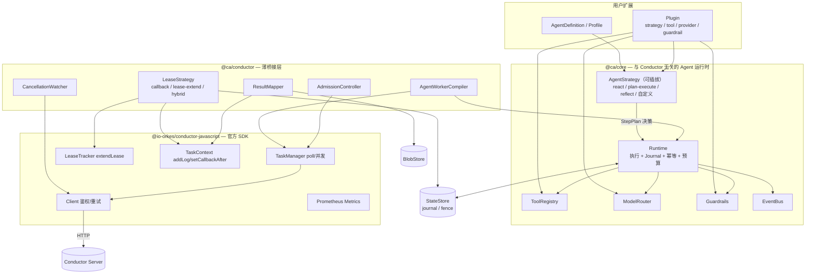

# Conductor AI Agent Worker SDK — 技术架构设计

> 状态：Draft v0.3 ｜ 语言：TypeScript (Node.js ≥ 20) ｜ 编排引擎：Conductor OSS ≥ 3.x
>
> **v0.3 变更**
> 1. 选型卡点关闭：官方 agents 层不满足需求，本项目继续，并把「通用 / 可扩展」提升为一等目标（§1.4、§4.3）。
> 2. 默认租约策略改为 **`callback`**；`lease-extend` 降为可选优化（[ADR-0009](adr/0009-default-callback-strategy.md)）。
> 3. 按 Conductor **v3.21.21 服务端源码**核实并修正了租约/超时语义（§2.2），v0.2 有两处描述不准确。
> 4. 新增可插拔的 `AgentStrategy`（[ADR-0010](adr/0010-pluggable-agent-strategy.md)）。

---

## 1. 目标与非目标

### 1.1 目标

让**任意场景**的 AI Agent 都能作为一等公民出现在 Conductor 工作流中：工作流里放一个 task，
背后就是一次完整的、可观测、可恢复、有预算约束的 Agent 运行。

1. **通用 + 可扩展**：不绑定单一 Agent 范式。推理循环本身是可替换的扩展点（§4.3 L3），
   内置 `react` / `plan-execute` / `reflect` / `single-shot` / `router`，用户可注册自己的。
2. **声明式定义**：一个 `AgentDefinition`（策略 + 指令 + 模型 + 工具 + 限额 + 护栏）即可注册为 Conductor task worker。
3. **Worker 内闭环**：循环在 **worker 进程内**完成，一个 Conductor task = 一次完整 Agent 运行。
   模型凭据、对话上下文、工具执行全部留在自己进程里。
4. **长时任务安全**：解决租约、重复投递、进程崩溃恢复三件事。
5. **副作用可控**：at-least-once 语义下不重复下单、不重复发邮件、不重复扣费。
6. **站在官方 SDK 上**：传输、鉴权、poll 循环、worker 指标复用 `@io-orkes/conductor-javascript`。
7. **可观测 / 可测试**：OTel GenAI 语义约定；不连真实 Conductor、不连真实 LLM 也能跑完整回归。

### 1.2 非目标

| 不做 | 原因 / 替代方案 |
|---|---|
| 自研 Conductor 客户端 / poll 循环 | 官方 SDK 已提供（[ADR-0006](adr/0006-build-on-official-sdk.md)） |
| 自研编排引擎、状态机 DSL | Conductor 已经是编排层 |
| 内置某个"全能"Agent 范式 | 提供 `AgentStrategy` 扩展点，范式由使用方选 |
| 向量库 / RAG 的实现 | 只定义 `MemoryStore` / `Retriever` 接口 |
| 训练、微调、评测平台 | 超出 worker SDK 范畴 |

### 1.3 白盒模式的位置

核心循环把每一步建模成显式的 `Step`，`StepExecutor` 接口预留了「把 step 下沉为 Conductor task」的可能（§5.4、路线图 M5）。
v1 不实现。

### 1.4 与官方 agents 层的关系 —— 选型已决议

官方 `@io-orkes/conductor-javascript/agents` 提供的是**服务端 durable agent**：
`plan()` 把 Agent 编译成 workflow definition 交 Conductor 服务端执行，本地只跑工具 worker，
Agent 行为受其 agent schema 约束。

**决议（2026-09-05）：不采用，本项目继续。** 理由：本项目要交付的是**通用、可扩展、面向多场景**的 Agent 运行时——
推理循环必须能被任意 TypeScript 替换，工具与上下文必须留在本地进程。这两点是官方 schema 化方案的结构性限制，
不是配置能绕过的。详见 [ADR-0008](adr/0008-relation-to-official-agent-layer.md)。

保留的借鉴：官方 SDK 的**传输层**仍然全量复用（ADR-0006 不受影响）；
`tool()` 的 secrets 注入与断路器等实现细节值得参考。

---

## 2. 关键约束：Conductor 语义 vs. AI Agent 的天然冲突

### 2.1 七条冲突

| # | Conductor 的语义 | Agent 的现实 | 冲突 | 对策 |
|---|---|---|---|---|
| C1 | 任务被 poll 后，`responseTimeoutSeconds` 内无 update 就判 `TIMED_OUT` 并消耗一次重试 | 一次运行可能跑数十分钟 | 租约到期 → 同一次运行被重复执行、重试被白白吃掉 | §5.3 租约策略 + Fencing Token |
| C2 | 投递语义是 **at-least-once** | LLM 调用花钱、工具有副作用 | 重复执行 = 重复花钱 / 重复下单 | §5.1 Journaled Replay + 工具幂等契约 |
| C3 | 无「取消推送」通道 | Agent 可能还在烧 token | 已终止的工作流仍在消耗成本 | §6.4 CancellationWatcher |
| C4 | task input/output 是 JSON 且有体积上限 | 完整 transcript 轻松几 MB | 输出写不进去 / 拖垮 Conductor 存储 | §6.3 Payload 外置 |
| C5 | 无流式输出通道 | 用户要看 token 流 | 无法在 Conductor 内做 streaming UI | §10.3 旁路 StreamSink |
| C6 | 重试由 `retryCount` / `retryLogic` 决定 | 有的失败该重跑，有的重跑毫无意义 | 无脑重试放大成本 | §6.2 错误分类 |
| C7 | 并发由 poll `count` 与 worker 并发数决定 | 真正的瓶颈是 LLM 的 RPM / TPM 配额 | 拉了任务却卡在限流上 | §6.5 令牌预算反压 |

### 2.2 服务端语义核实（依据 Conductor OSS v3.21.21 源码）

以下结论来自直接阅读服务端源码，**修正了 v0.2 的两处不准确描述**。

**`DeciderService.isResponseTimedOut()`**（`core/.../execution/DeciderService.java`）：

```java
long callbackTime = 1000L * task.getCallbackAfterSeconds();
long referenceTime = task.getUpdateTime() > 0 ? task.getUpdateTime() : task.getScheduledTime();
// ...
if (!task.getStatus().equals(IN_PROGRESS) || taskDefinition.getResponseTimeoutSeconds() == 0) return false;
long responseTimeout         = 1000L * taskDefinition.getResponseTimeoutSeconds();
long adjustedResponseTimeout = responseTimeout + callbackTime;   // ← 关键
long noResponseTime          = now - task.getUpdateTime();
if (noResponseTime < adjustedResponseTimeout) return false;
// 超时 → timeoutTask(): task.setStatus(TIMED_OUT)
```

| 事实 | v0.2 的说法 | 修正 |
|---|---|---|
| **超时后果** | 「重新入队」 | ❌ 实际是 `task.setStatus(TIMED_OUT)`，随后走 `retryCount` / `retryLogic` 生成**新的 task 实例**。因此**每次租约超时都会消耗一次重试配额**；`retryCount: 0` 时任务直接失败、工作流失败 |
| **timeoutPolicy 的保护** | 未提及 | responseTimeout 路径直接调 `timeoutTask()`，**绕过 `timeoutPolicy`**。`ALERT_ONLY` 对它无效（只对 `timeoutSeconds` 生效） |
| **callbackAfterSeconds 与 responseTimeoutSeconds** | 未提及 | 服务端做 `responseTimeout + callbackTime`，即 **callback 的等待时间会被加进容忍窗口**。所以 `callbackAfterSeconds` **不需要**小于 `responseTimeoutSeconds` |
| **callbackAfterSeconds 与 timeoutSeconds** | 「callbackAfterSeconds 不得超过 timeoutSeconds」 | ⚠️ 不精确。`checkTaskTimeout()` 用 `elapsedTime = now - startTime` 比对 `timeoutSeconds`，**不加 callbackTime**。真正的约束是：**Σ(所有 callback 等待 + 所有执行时间) < `timeoutSeconds`** |
| **检测时机** | 未提及 | 检查发生在 `decide()` 内，由 `WorkflowSweeper` 周期性触发 → 超时检测有 sweeper 周期的粒度延迟，不是精确到秒 |
| **前置条件** | 未提及 | 仅当 `status == IN_PROGRESS` 才检查（poll 后即为 IN_PROGRESS） |

**`extendLease` 心跳可用性**（`WorkflowExecutorOps.updateTask` → `extendLease()` → `ExecutionDAOFacade.extendLease()`）：

```java
} else if (taskResult.isExtendLease()) {
    extendLease(taskResult);
    return null;                    // ← 直接返回，从不触碰 queueDAO
}
// ExecutionDAOFacade.extendLease:
taskModel.setUpdateTime(System.currentTimeMillis());
executionDAO.updateTask(taskModel);
```

只刷新 `updateTime`（正是 `noResponseTime` 的基准），且**不把任务放回队列** —— 确认是真心跳。

**版本可用范围（源码抽样 git tag 得出）**：

| 版本 | `TaskResult.extendLease` 字段 | 服务端处理 |
|---|---|---|
| v3.0.0 / v3.5.0 / v3.9.0 / v3.10.0–**v3.10.6** | ❌ 无 | ❌ 无 |
| **v3.10.7** 及之后（3.11 / 3.13 / 3.15 / 3.17 / 3.19 / 3.20 / 3.21 / main 均已抽样确认） | ✅ | ✅ |

> **回答「3.21.21 是否支持」：支持。** 字段与服务端处理逻辑都在。最低要求是 **v3.10.7**。
> 但「支持」不等于「应该用」——见 §5.3 与 [ADR-0009](adr/0009-default-callback-strategy.md)，默认策略仍选 `callback`。

---

## 3. 总体架构

### 3.1 分层



三条结构性约束：

1. **`@ca/core` 不依赖 `@ca/conductor`**，也不依赖官方 SDK。可脱离编排引擎独立运行。
2. **`@ca/conductor` 不重复实现官方 SDK 已有的能力**。
3. **`AgentStrategy` 只做决策，不做执行**（§4.3 L3）。执行、journal、幂等、预算、护栏统一由 Runtime 负责，
   因此**任何自定义策略都自动获得崩溃恢复与 effectively-once**——这是本 SDK 相对「自己写个 while 循环」的核心价值。

### 3.2 包划分（pnpm monorepo）

| 包 | 职责 |
|---|---|
| `@ca/core` | Agent 定义、Runtime、Journal、Strategy 契约与内置策略、工具注册、护栏、预算、事件 |
| `@ca/conductor` | 薄桥接层：Worker 编译、租约策略、结果映射、取消检测、TaskDef 推导 |
| `@ca/providers-anthropic` | Claude 适配（默认推荐 `claude-opus-5` / `claude-sonnet-5`） |
| `@ca/providers-openai` | OpenAI 兼容适配（含自建网关） |
| `@ca/tools-mcp` | **本地** MCP 客户端 → Tool |
| `@ca/memory` | `StateStore` / `BlobStore` / `MemoryStore` 接口与实现 |
| `@ca/observability` | OTel GenAI span 与 Agent 语义指标 |
| `@ca/testing` | 脚本化模型、崩溃注入、Journal 断言、策略一致性测试套件 |
| `@ca/cli` | 脚手架、TaskDef 注册、本地跑 Agent、Journal 查看、插件列表 |

---

## 4. 核心抽象

### 4.1 Agent 定义

```ts
interface AgentDefinition<I = unknown, O = unknown> {
  name: string;                        // 默认映射为 task type `agent_<name>`
  version?: number;

  /** 推理策略。字符串取内置策略，或直接传自定义实现。默认 'react' */
  strategy?: BuiltinStrategyId | AgentStrategy;

  /** 场景 Profile：预置 strategy/limits/guardrails/lease 的组合，字段级覆盖 */
  profile?: AgentProfile;

  instructions: string | ((input: I, ctx: RunContext) => string | Promise<string>);
  model: ModelRef | ModelRef[];
  tools?: ToolRef[];
  input?: Schema<I>;
  output?: Schema<O>;
  limits?: AgentLimits;
  guardrails?: Guardrail[];
  conductor?: Partial<ConductorTaskOptions>;
}
```

`RunContext` / `Tool` / `ModelProvider` / `Guardrail` / `AgentEvent` 的签名见 `packages/core/src/*.ts`。

### 4.2 与官方 SDK 的类型边界

`@ca/core` 的类型**不引用**官方 SDK 类型；`@ca/conductor` 负责两侧互转。
好处：核心单测与本地运行不需要装官方 SDK，也避免官方 OpenAPI 生成类型（随服务端 spec 变动）渗入核心抽象。

### 4.3 扩展架构 —— 三层扩展面

这是「通用 / 可扩展」的落地方式。扩展点按**介入深度**分三层，越往下越少人用、契约越谨慎。

#### L1 — 替换实现（Provider SPI）：换后端，不改行为

| 扩展点 | 用途 |
|---|---|
| `ModelProvider` | 接入任意模型 / 自建网关 / 私有模型 |
| `ToolProvider` | 批量提供工具（本地 MCP、OpenAPI、内部服务目录） |
| `StateStore` / `BlobStore` / `MemoryStore` | journal / 大对象 / 长期记忆的存储后端 |
| `SecretProvider` | env / 文件 / Vault |
| `EventSink` / `StreamSink` | 可观测性与流式输出去向 |

契约稳定，遵循 semver。

#### L2 — 改变行为（Behavior SPI）：介入循环，但不重写循环

| 扩展点 | 用途 | 为什么必须可扩展 |
|---|---|---|
| `Guardrail` | 5 个 stage 的允许/改写/拦截 | 合规要求因行业而异 |
| `ContextPolicy` | 上下文裁剪 / 摘要 / 分段 | 长对话与长文档场景的成败关键，没有通用最优解 |
| `ToolSelector` | 每步向模型暴露哪些工具 | 工具超过几十个时必须做检索式收窄 |
| `OutputParser` / `OutputRepairer` | 结构化输出解析与修复 | 不同模型的失败模式不同 |
| `ErrorClassifier` | 瞬时 vs 终局错误判定 | 自建网关的错误码是私有的 |
| `BudgetPolicy` | 预算耗尽时降级还是失败 | 业务权衡 |
| `PromptSource` | 提示词来源与版本 | 对接内部 prompt 管理平台 |

#### L3 — 替换循环（`AgentStrategy`）：最深的扩展点

```ts
interface AgentStrategy<S = unknown> {
  name: string;
  init(def: AgentDefinition, input: unknown, ctx: RunContext): Promise<S>;
  /** 只做决策：下一步该干什么 */
  next(state: S, ctx: RunContext): Promise<StepPlan>;
  /** 把运行时执行后的结果并回状态；必须是纯函数（见下） */
  reduce(state: S, outcome: StepOutcome): S;
  finalize(state: S, ctx: RunContext): Promise<unknown>;
}

type StepPlan =
  | { kind: 'model';   request: ModelRequest }
  | { kind: 'tools';   calls: ToolCall[]; parallel?: boolean }
  | { kind: 'suspend'; req: SuspendRequest }
  | { kind: 'done';    output: unknown };
```

**决策与执行分离**是这里唯一重要的设计：策略返回 `StepPlan`，由 Runtime 去执行、写 journal、
做幂等、扣预算、跑护栏、记 span。策略作者不需要——也不允许——自己调用 LLM 或工具。
代价是策略作者要习惯"返回意图而不是 await 结果"，收益是**自定义策略零成本继承全部可靠性机制**。

**状态恢复的两种模式**（跨 `callback` 交还与崩溃恢复都要用）：

| 模式 | 要求 | 适用 |
|---|---|---|
| `replay`（默认） | `init` / `reduce` 是纯函数，状态由 journal 重放重建 | 绝大多数策略；与 [ADR-0003](adr/0003-journaled-replay.md) 一致，无额外存储 |
| `snapshot` | 状态可 JSON 序列化，每步写一条 `snapshot` journal entry | `reduce` 昂贵（如维护大索引）时 |

内置策略：

| id | 形态 | 典型场景 |
|---|---|---|
| `react`（默认） | 思考 → 工具 → 观察 循环 | 通用助理、运维排障 |
| `plan-execute` | 先出计划，再按依赖图执行 | 多步数据管道、报告生成 |
| `reflect` | 产出 → 自评 → 修订 | 文案、代码生成 |
| `single-shot` | 一次调用 + 强制结构化输出，无工具 | 抽取、分类、打标（最低成本） |
| `router` | 分类后转交子 Agent | 多场景入口分流 |

#### 场景 Profile

把一组「策略 + 限额 + 护栏 + 租约 + payload 策略」打包复用：

```ts
const opsRunbook = defineProfile({
  name: 'ops-runbook',
  strategy: 'plan-execute',
  limits: { maxSteps: 30, wallClockMs: 30 * 60_000, maxCostUsd: 5 },
  conductor: { leaseStrategy: 'hybrid', payloadStrategy: 'externalize' },
  guardrails: [requireApprovalForEffectfulTools()],
});

const agent = defineAgent({ profile: opsRunbook, name: 'db_failover', tools: [...] });
```

内置参考 profile：`data-extraction`（single-shot + 严格 schema + 低预算）、
`research`（react + 高步数 + callback）、`ops-runbook`（如上，含 HITL）。

#### 插件打包

```ts
export default definePlugin({
  name: '@acme/ca-plugin-finance',
  version: '1.0.0',
  strategies: [dualApprovalStrategy],
  tools: [ledgerTool, riskCheckTool],
  guardrails: [pciRedaction],
  profiles: [tradeReconciliation],
});
```

约定 `@ca/plugin-*` / `<scope>/ca-plugin-*` 命名，`ca plugins list` 查看已装插件与其贡献的扩展点。

#### 稳定性分级

每个扩展点标注 `@stability stable | experimental`。`experimental` 允许在 minor 版本破坏，
并在类型与运行时各给一次告警。L1 全部 stable；L3 的 `AgentStrategy` 在 v1 期间为 `experimental`。

---

## 5. 执行模型

### 5.1 Journaled Replay

Runtime 把策略返回的每个 `StepPlan` 执行掉，并写一条 append-only `JournalEntry`。
**恢复 = 重放**：重跑循环，每到一步先查 journal——命中则直接取历史结果（不再调 LLM、不再调工具），未命中才真正执行。

`stepId = sha256(runKey | seq | kind | 归一化输入)`：journal 主键 + 工具幂等键 + 模型响应缓存键。

正确性依赖「所有非确定性都经由受管入口」（`ModelRouter` / `ToolRegistry` / `ctx.now()` / `ctx.random()`），
由 lint 规则 + 运行时告警约束，不做沙箱。`AgentStrategy` 的决策与执行分离（§4.3 L3）让这一条更容易守住。

### 5.2 runKey：恢复的锚点

```
runKey = `${workflowInstanceId}:${taskReferenceName}:${epoch}`
```

| resumePolicy | epoch | 效果 |
|---|---|---|
| `on-lease-loss`（默认） | 恒为 `0` | 任何形式的重投递都接着上次跑，不重复付费 |
| `fresh-per-retry` | `task.retryCount` | Conductor 的业务重试 = 从头重跑 |
| `never` | — | 不落 journal，崩溃即失败（`callback` 策略下不可用） |

> 已知模糊点：Conductor 对「responseTimeout 判 TIMED_OUT 后的重试」与「业务失败重试」都会推进 `retryCount`，
> worker 侧不可严格区分。默认值优先保护成本与副作用。

### 5.3 租约策略 —— v0.3 默认改为 `callback`

#### (a) `callback` —— **默认**

每完成一个 step（或累计运行超过 `leaseSliceMs`，默认 60s），把 journal 持久化，
然后 `IN_PROGRESS + callbackAfterSeconds` 交还任务、**释放并发槽位**；
下次 poll（可能是另一个 worker）从 journal 继续。

```ts
getTaskContext()?.setCallbackAfter(n);
return { status: 'IN_PROGRESS', callbackAfterSeconds: n };
```

**为什么默认选它**（[ADR-0009](adr/0009-default-callback-strategy.md)）：

1. **兼容性最好**：`callbackAfterSeconds` 是 Conductor 3.x 全系可用；`extendLease` 要求 ≥ v3.10.7。
2. **恢复路径被高频验证**：callback 让「从 journal 恢复」变成**每次运行都要走的主路径**，
   而不是只在崩溃时才跑的旁路。只在故障时才执行的代码就是不可靠的代码——这是选它做默认值最强的理由。
3. **不霸占槽位**：长时 Agent 不会长期占着 worker 并发位，等待外部信号时更是零占用。
4. **服务端会把等待时间计入容忍窗口**（§2.2：`adjustedResponseTimeout = responseTimeout + callbackTime`），
   所以 `callbackAfterSeconds` 不必小于 `responseTimeoutSeconds`，配置心智负担低。

代价：`StateStore` 从可选变为**必需**；每片一次 journal 写入（写放大由 `leaseSliceMs` 调节）。

#### (b) `lease-extend` —— 可选优化

开启官方 SDK 的 `leaseExtendEnabled: true`，整个循环在一次 `execute()` 内跑完，靠心跳续租。

- **前提：Conductor ≥ v3.10.7**（§2.2）。SDK 启动时探测服务端版本，不满足则拒绝启动并提示改用 `callback`。
- 适用：step 之间状态难以序列化、或对单次运行延迟极敏感（省掉每片的排队往返）。
- 注意：心跳只刷新 `responseTimeoutSeconds`，**不延长 `timeoutSeconds`**。

#### (c) `hybrid` —— 长时 + 有等待的场景

计算期按 `lease-extend`（省掉每片的 journal 写入与排队），一旦进入等待态
（`ctx.suspend()`、`conductorWorkflowTool`、人工审批）切 `callback` 交还任务。同样要求 ≥ v3.10.7。

| | callback（默认） | lease-extend | hybrid |
|---|---|---|---|
| 最低 Conductor 版本 | 3.x | **3.10.7** | **3.10.7** |
| 长时计算 | ✅ 分片 | ✅ 槽位常驻 | ✅ |
| 长时等待 | ✅ 让出槽位 | ❌ 白占槽位 | ✅ |
| StateStore | **必需** | 可选 | 必需 |
| journal 写放大 | 中（`leaseSliceMs` 调节） | 无 | 低 |
| 恢复路径覆盖率 | **每次运行** | 仅崩溃时 | 部分 |

#### Fencing Token（三种模式都启用）

`callback` 交还后任务可被任意 worker poll，`lease-extend` 也可能因网络分区或心跳连续失败而重复投递。
`StateStore` 为每个 `runKey` 维护 `{ owner, fenceToken, expiresAt }`：

1. worker 拿到任务后 CAS 抢占，`fenceToken += 1`。
2. 每次写 journal、每次回写 Conductor 都携带 `fenceToken`，落后者被拒绝。
3. 抢占失败或 fence 落后 → 立即放弃，不回写 Conductor。

把「同一 runKey 并发执行」的后果从「重复副作用」降级为「浪费一次 LLM 调用后自我放弃」，
配合工具幂等契约（§5.5）达到实际意义上的 effectively-once。

### 5.4 为白盒模式预留

`StepExecutor` 接口把「执行一步」抽象出来。v1 只有 `InProcessStepExecutor`（路线图 M5）。

### 5.5 副作用与幂等

| `Tool.effect` | 重放时 | 说明 |
|---|---|---|
| `pure` | 自由重放 | 查询类 |
| `idempotent` | 重跑，注入 `ctx.idempotencyKey = stepId` | 下游用它去重 |
| `effectful` | 见 `onAmbiguousReplay` | 发邮件、支付、写外部单据 |

`effectful` 工具恢复时若只有 `tool.intent` 而无 `tool.result`：
`'fail'`（默认）→ `FAILED_WITH_TERMINAL_ERROR` 交给补偿分支；`'retry'`；`'probe'`（查询是否已生效）。

---

## 6. Conductor 桥接层（`@ca/conductor`）

### 6.1 Worker 编译与装配

```ts
const worker = createAgentWorker({
  agents: [researchAgent],
  // 连接配置复用官方 SDK 约定：CONDUCTOR_SERVER_URL / CONDUCTOR_AUTH_KEY / CONDUCTOR_AUTH_SECRET
  stateStore: redisStateStore({ url: process.env.REDIS_URL! }),   // callback 默认策略下必填
});
await worker.start();
```

`createAgentWorker` 做的事：

1. 校验配置：默认 `callback` 策略必须有持久化 `StateStore`，否则**拒绝启动**；
   若选了 `lease-extend` / `hybrid`，探测服务端版本 < 3.10.7 则拒绝启动并提示改用 `callback`。
2. 每个 `AgentDefinition` 编译为官方 `ConductorWorker`。
3. `execute` 内部依次接上：runKey 计算 → fence 抢占 → journal 载入 → 策略驱动的 Runtime →
   结果映射 → payload 外置 → fence 校验 → 返回官方 `TaskResult`（`COMPLETED` 或 `IN_PROGRESS + callbackAfterSeconds`）。
4. 交给官方 `TaskManager` / `TaskHandler` 托管 poll、并发、指标、优雅停机。

### 6.2 状态映射（ResultMapper）

| Agent 结果 | Conductor status |
|---|---|
| 正常产出结构化输出 | `COMPLETED`，`outputData = { ok: true, result, usage, steps, traceId, transcriptRef }` |
| Agent 判定「做不到 / 需要人」但流程该继续 | `COMPLETED` + `ok: false, reason` → 工作流用 `SWITCH` 分支处理，**不是**失败 |
| 瞬时错误（429 / 5xx / 网络 / 租约丢失） | `FAILED` |
| 终局错误（schema 非法、护栏拦截、预算硬上限、模糊副作用） | 官方 `NonRetryableException` → `FAILED_WITH_TERMINAL_ERROR` |
| 本片做完但整体未完成 / 等待外部信号 | `IN_PROGRESS` + `callbackAfterSeconds` |

失败都填 `reasonForIncompletion`，并用 `getTaskContext()?.addLog()` 写一条 Task Log。

### 6.3 Payload 治理（对应 C4）

- **入参**：支持 `externalInputPayloadStoragePath`，自动拉取。
- **出参**：`outputData` 硬预算默认 256KB。`externalize`（默认）/ `truncate` / `fail`。
- transcript **始终**外置：它是审计与调试的主要材料，不该挤占编排存储。
- **`callback` 策略下尤其重要**：中间片的 `outputData` 应保持最小（只放进度摘要），
  真实中间状态在 `StateStore` 的 journal 里，不要塞进 Conductor。

### 6.4 CancellationWatcher（对应 C3）

Conductor 不推送取消，官方 SDK 也不提供，这部分自持：

- 运行超过阈值（默认 20s）才启用；每 15s 查一次 workflow 状态；按 `workflowInstanceId` 去重合并。
- 命中 `TERMINATED / TIMED_OUT / FAILED / COMPLETED` → `abort()`，signal 传到 `ModelProvider` 与 `Tool`。
- `callback` 策略额外有一条便宜的检查点：每次重新 poll 到任务时先确认工作流仍在运行。

### 6.5 准入控制（对应 C7）

官方 `TaskManager` 的并发是静态 `concurrency`；本层在其上动态调节：

```
目标并发 = min(maxConcurrentRuns, 模型限流器可承诺的并发, 进程资源闸门)
```

令牌预算耗尽时把 concurrency 调到 0，让 poll 自然停拉。

### 6.6 TaskDef 推导：限额是唯一真相源

```
# callback（默认）
responseTimeoutSeconds = ceil(leaseSliceMs/1000 × 3)     # 单片无响应的容忍窗口
                                                          # 服务端另加 callbackAfterSeconds，无需为等待留余量
timeoutSeconds         = ceil(wallClockMs/1000 × 1.2)     # ⚠️ 必须覆盖「所有分片执行 + 所有等待」的总和

# lease-extend / hybrid（要求 Conductor ≥ 3.10.7）
responseTimeoutSeconds = 60                               # 故意设短 = 崩溃检测灵敏度；且必须 ≥ 1.25
timeoutSeconds         = ceil(wallClockMs/1000 × 1.2)

retryCount = 3, retryLogic = EXPONENTIAL_BACKOFF          # ⚠️ 租约超时会消耗重试配额（§2.2），不可设 0
timeoutPolicy = RETRY                                     # 注意：对 responseTimeout 无效，仅作用于 timeoutSeconds
concurrentExecLimit / rateLimitPerFrequency ← 由模型配额推导
```

两条来自 §2.2 源码核实的硬约束：

1. **`timeoutSeconds` 必须覆盖总墙钟**（`now - startTime`，含所有 callback 等待）。
   HITL 场景等一天，`timeoutSeconds` 就得按一天配。
2. **`retryCount` 不能为 0**：租约超时会把任务判 `TIMED_OUT` 并消耗一次重试；没有重试配额时任务直接失败。

`ca register` 做 diff-and-apply，启动时校验线上 TaskDef 漂移（默认告警不阻塞）。

### 6.7 Task Domain 路由

透传官方 `domain` 配置：按租户、按模型能力、按环境（canary）路由到不同 worker 池。

---

## 7. 工具体系

### 7.1 注册与命名

`ToolRegistry` 负责命名空间、schema 双向校验、超时与重试、并发闸门、工具级护栏。
工具集较大时由 `ToolSelector`（§4.3 L2）决定每步暴露哪些。

### 7.2 本地 MCP（`@ca/tools-mcp`）

官方 `mcpTool` 是 serverTool——由 Conductor **服务端**连接，够不着内网 MCP、本地文件系统、本地凭据。
本包提供本地 MCP 客户端：stdio / streamable HTTP，连接池绑定进程生命周期，命名空间化 `<server>.<tool>`，
会话不跨 run 复用，返回值统一标记 `trust: 'untrusted'`。

### 7.3 ConductorWorkflowTool —— 黑盒里的编排出口

```ts
conductorWorkflowTool({ name: 'run_credit_check', workflowName: 'credit_check', version: 2, waitMode: 'callback' })
```

用官方 `WorkflowClient` 启动子工作流，把 `subWorkflowId` 写入 journal：

- `callback`（默认策略下天然可用）：立即交还任务，恢复时查子工作流状态；未完成则再交还。**不占用槽位。**
- `poll`：run 内阻塞轮询（仅适合秒级子流程）。
- `fire-and-forget`：只返回 id。

### 7.4 人工介入（HITL）

`humanApprovalTool()` 走 `ctx.suspend()` → 策略返回 `{ kind: 'suspend' }` → Runtime 写 suspend entry
+ `resumeToken` → `setCallbackAfter(n)` + `IN_PROGRESS` → 审批系统回调写 `StateStore` → 下次 poll 命中 resume entry 继续。

`resumeToken` 是签名的、带过期时间的字符串，含 `runKey + seq + fenceToken`，防伪造与重放。

> ⚠️ 长审批要相应放大 `timeoutSeconds`（§6.6 约束 1）。

---

## 8. 模型层

- 统一消息与工具调用格式，provider 差异（thinking block、并行 tool call、cache control、stop reason）在适配器内消化。
- `ModelRouter`：主备链；按错误类别决定重试同一个还是切下一个（429 → 退避后同一个；5xx/超时 → 切换；400 → 终局失败）。
- per-model RPM/TPM 令牌桶，同时作为 §6.5 准入控制的输入。
- 成本核算：价格表可配置，`usage → cost` 进 `BudgetGovernor` 与指标。
- 缓存：透传 provider 的 prompt cache 提示；可选响应缓存（键 = `stepId`），主要服务测试与重放。
- 结构化输出：`output` schema 存在时强制走 tool-calling / structured output，由 `OutputRepairer`（L2）处理修复。

---

## 9. 状态、记忆与存储

| 抽象 | 存什么 | 生命周期 | 实现 |
|---|---|---|---|
| `StateStore` | Journal、租约/fence、resume 记录 | 一次 run（排障 TTL 默认 7 天） | memory（仅本地开发）/ redis / postgres |
| `BlobStore` | Transcript、大 payload、工具产物 | 与审计要求一致（默认 30 天） | fs / s3 |
| `MemoryStore` | 跨 run 的长期记忆 | 业务定义 | 接口 + 参考实现，不内置向量库 |

**默认 `callback` 策略下 `StateStore` 必须是持久化实现**，SDK 启动时校验并拒绝启动。
`memory` 实现仅供本地单进程开发。

---

## 10. 可观测性

### 10.1 Trace

```
span: agent.run            (agent.name, strategy, run_key, workflow_id, task_id, tenant)
 ├─ span: agent.slice[0]   ← callback 策略下每个分片一个 span，通过 run_key 串联
 │   ├─ span: agent.step[0]
 │   │   └─ span: gen_ai.chat  (gen_ai.system, gen_ai.request.model, usage tokens, cost_usd)
 │   └─ span: agent.step[1]
 │       └─ span: tool.execute (tool.name, tool.effect, idempotency_key)
 └─ span: agent.slice[1]
```

trace context 从任务输入的 `_traceparent` 继承并**在 journal 中保存**，
使 `callback` 的多个分片能挂到同一条 trace 上——这是分片执行模型下的必要处理。

### 10.2 指标

worker 侧指标（poll 延迟、执行时长、队列滞留）用官方 SDK 的 Prometheus 采集，不重复实现。
本项目只补 Agent 语义指标：token & cost（按 model/tenant/agent/strategy）、步数与分片数分布、
工具成功率与延迟、护栏拦截率、恢复次数、fence 抢占次数、预算触顶次数、**平均分片数**（callback 写放大的直接观测量）。

### 10.3 流式与进度

- Conductor 侧：每个分片用 `getTaskContext()?.addLog()` 写进度（步数、当前工具、累计 token）。
- 用户侧：`StreamSink` 把 `model.delta` / `tool.started` 推到 Redis Stream 或 SSE 网关，
  channel key = `workflowInstanceId:taskReferenceName`（跨分片稳定）。

---

## 11. 安全

- **密钥**：`SecretProvider` 抽象，禁止把密钥放进 task input。
- **提示注入**：工具返回值与外部检索内容标记 `untrusted`；**系统指令永不由工具输出拼接而成**。
- **工具授权**：per-agent 允许清单 + per-tenant 覆盖；敏感工具强制走 §7.4 审批。
- **输出过滤**：`afterRun` 护栏做 PII / 敏感词 / schema 校验。
- **多租户**：`tenantId` 贯穿 RunContext → 密钥、预算、限流、存储前缀、指标维度、Conductor domain。
- **插件信任边界**：第三方插件运行在同一进程，具备完整权限。`ca plugins list` 展示每个插件贡献的扩展点，
  文档明确要求按依赖审计对待。
- **沙箱**：本地代码执行类工具不在 v1 内置，要求下沉到独立进程/容器。

---

## 12. 测试策略

| 层次 | 手段 |
|---|---|
| 单元 | 纯函数状态机 + `ScriptedModelProvider` + 假工具（**不需要官方 SDK**） |
| 策略一致性 | 对**每个** `AgentStrategy`（含用户自定义）跑同一套契约测试：`reduce` 纯函数性、replay 幂等、suspend/resume 正确性 |
| 契约 | Provider 适配器录制/回放（真实 wire format 快照） |
| 恢复 | 崩溃注入：第 N 条 journal entry 后杀进程 → 恢复 → 断言无重复副作用、最终输出一致 |
| 并发 | 双 worker 抢同一 runKey → 断言 fence 生效、只有一次成功回写 |
| 分片 | `leaseSliceMs` 设为极小值，强制产生大量分片 → 断言结果与单片执行一致 |
| 集成 | docker-compose 起真实 Conductor OSS（含 3.10.6 与 3.21.x 两个版本，验证版本探测与降级） |

「恢复」「并发」「分片」三类是核心资产，必须在 M2 之前建立。
`@ca/testing` 导出的**策略一致性测试套件**同时是插件作者的验收工具。

---

## 13. 目录结构

```
.
├── docs/
│   ├── architecture.md          ← 本文
│   └── adr/                     ← 决策记录 0001-0010
├── packages/
│   ├── core/                    @ca/core          运行时 + Strategy 契约与内置策略
│   ├── conductor/               @ca/conductor     官方 SDK 之上的薄桥接层
│   ├── providers-anthropic/
│   ├── providers-openai/
│   ├── tools-mcp/               本地 MCP
│   ├── memory/
│   ├── observability/
│   ├── testing/
│   └── cli/
├── examples/
│   ├── minimal-agent/           react + callback（默认路径）
│   └── hitl-approval/           plan-execute + 人工审批 + 子工作流工具
├── pnpm-workspace.yaml
└── tsconfig.base.json
```

工程约定：pnpm workspace ｜ tsup（ESM + CJS）｜ vitest ｜ Node ≥ 20 ｜ changesets ｜ `sideEffects: false`。

---

## 14. 路线图

| 里程碑 | 内容 | 出口标准 |
|---|---|---|
| **M0** 骨架 | monorepo、构建、CI、本文档 | `pnpm build` 通过 |
| **M1** 最小可用 | Runtime + `react` 策略 + Journal + StateStore(redis) + **`callback` 租约** + Anthropic provider + 桥接层 | 示例在 Conductor OSS **3.21.21** 上端到端跑通，含跨分片恢复 |
| **M2** 可靠性 | Fencing + 错误分类 + 取消检测 + 崩溃/并发/分片三类测试 + `lease-extend` 与版本探测 | 三类测试全绿；3.10.6 上正确降级 |
| **M3** 扩展面 | `AgentStrategy` 公开 + 内置 5 策略 + L2 扩展点 + Profile + 插件机制 + 策略一致性测试套件 | 第三方能用文档写出一个自定义策略并通过一致性测试 |
| **M4** 生态 | 本地 MCP、ConductorWorkflowTool、HITL/suspend、Payload 外置 | `hitl-approval` 示例跑通 |
| **M5** 生产化 | OTel、Agent 语义指标、预算治理、多租户、CLI、文档站 | 压测报告 + 运维手册 |
| **M6** 白盒（可选） | `ConductorStepExecutor`：step 下沉为 Conductor task | 同一 Agent 定义可在两种模式间切换 |

M1 直接锁定 `callback`，`lease-extend` 推迟到 M2——先把恢复主路径打磨扎实，再谈优化。

---

## 15. 决策记录与遗留问题

| ADR | 主题 | 状态 |
|---|---|---|
| [0001](adr/0001-worker-closed-loop.md) | Worker 内闭环 vs. Conductor 全编排 | Accepted（前提收敛至 ADR-0008） |
| [0002](adr/0002-own-rest-client.md) | 自持 REST 客户端 | **Superseded by 0006** |
| [0003](adr/0003-journaled-replay.md) | Journaled Replay 作为恢复机制 | Accepted |
| [0004](adr/0004-lease-strategy.md) | 双租约策略 | **Revised by 0007** |
| [0005](adr/0005-effectful-tool-default.md) | `effectful` 工具默认 `fail` | Accepted |
| [0006](adr/0006-build-on-official-sdk.md) | 构建在官方 SDK 之上 | Accepted |
| [0007](adr/0007-lease-strategies-revised.md) | 三租约策略 | Accepted（默认值由 0009 改写） |
| [0008](adr/0008-relation-to-official-agent-layer.md) | 与官方 agents 层的定位边界 | **Resolved：不采用，本项目继续** |
| [0009](adr/0009-default-callback-strategy.md) | 默认租约策略选 `callback` | Accepted |
| [0010](adr/0010-pluggable-agent-strategy.md) | 可插拔 `AgentStrategy` | Accepted |

**待验证 / 待决**

1. **`WorkflowSweeper` 的实际扫描周期**决定了 responseTimeout 的检测粒度，需在目标部署上测量——
   它直接影响 `leaseSliceMs` 与 `responseTimeoutSeconds` 的合理取值。
2. `callbackAfterSeconds` 是否有服务端上限（未在源码中找到显式约束，需实测）。
3. `retryCount` 无法区分「租约超时重试」与「业务重试」，`resumePolicy` 默认值需真实业务验证。
4. `callback` 分片带来的 journal 写放大与 Redis 成本，需在 M2 压测中按 `leaseSliceMs` 量化，给出选型表。
5. `AgentStrategy` 的 `experimental` 期需要至少 2 个真实第三方策略验证接口是否够用，再转 stable。
6. 分片执行下的 OTel trace 串联在各 APM 后端的兼容性（跨进程续接同一 trace）需实测。
